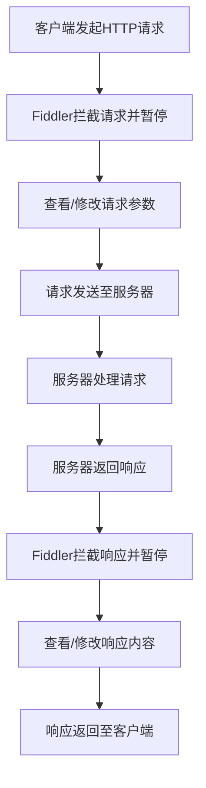

# Fiddler 断点（拦截）功能详解

## 一、断点介绍

### 图示说明

#### 请求后断点（拦截）



> 提示：要在本文档中正常显示流程图，请确保您的Hexo站点已启用Mermaid支持。在您的主题配置文件 `_config.fluid.yml` 中，确认 `post: mermaid: enable` 设置为 `true`。

### 简单介绍

Fiddler 是客户端和服务器之间的代理工具，通过打断点可以在请求和响应过程中查看或篡改数据。在测试时可以绕过前端，直接测试后端的反应。主要分为两种断点类型：请求后拦截和响应前拦截。


### 详细介绍

**Fiddler 的断点功能**允许开发者在 HTTP 请求和响应的生命周期中暂停流量，以便查看和修改内容，帮助调试和分析 Web 流量。

1. **请求断点**（Break on Request）：
   - 在 HTTP 请求发送到服务器之前暂停。
   - 允许你查看和修改请求内容（如 URL、请求头、参数等）。
2. **响应断点**（Break on Response）：
   - 在服务器返回的响应到达客户端之前暂停。
   - 允许你查看和修改响应内容（如响应头、响应体等）。
3. **用途**：
   - 调试 API 请求、模拟不同的请求/响应场景。
   - 修改请求/响应数据，进行功能测试或模拟错误。

通过这些断点功能，Fiddler 帮助开发者精确调试和优化 Web 应用与服务器的通信。

## 二、操作步骤

### （一）设置要抓包的地址

设置要抓包的地址后，Fiddler 就不会抓取各种网站的包了，这样查找自己需要的内容会更方便。只需设置想要抓取的包地址即可。

> 1. Filters
>
> 2. 勾选 Use Filters
>
> 3. 第二个框选择 Show only the following Hosts
>
> 4. 框内输入要抓包的地址（多个地址可用分号 `;` 分隔）
>
> 5. 点击 Actions
>
> 6. 选择 Run Filterset now


### （二）全局拦截（断点）

> 全局拦截是指开启请求后或响应前的设置后，所有被抓包的请求或响应数据都会被拦截下来。

#### 1. 请求后拦截（Before Request） 

**1.** 在 Fiddler 中**设置开启请求后拦截**：Rules → Automatic Breakpoints → Before Requests


**2.** 然后前往要验证的网站尝试登录，输入账号密码并点击登录

> 提示：会发现无法登录（因为客户端发送到服务器的请求已被拦截）

```cobol
http://192.168.xx.xx:8080/cms/manage/login.do
AI写代码
```


**3.** 再打开 Fiddler，就可以看到这个登录请求已被拦截。

> 提示：可以篡改请求参数


**4.** 篡改请求的参数，然后点击发送

> 示例：将原有密码 123456 改为 66666666


**5.** 得到篡改后的响应结果


#### 解开拦截

 

 

#### 2. 响应前拦截（After Responses）

**1.** 在 Fiddler 中设置开启响应前拦截：Rules → Automatic Breakpoints → After Responses


 

**2.** 然后前往要验证的网站尝试登录，输入账号密码并点击登录。

> 提示：会发现无法登录（因为服务器响应回传到客户端的数据已被拦截）

```cobol
http://192.168.xx.xx:8080/cms/manage/login.do
```


**3.** 打开 Fiddler，发现响应回来的数据已获取到，但被拦截了，没有返回给客户端


**4.** 篡改服务器响应回传给客户端的数据

 

**5.** 请求响应通道畅通无阻，但响应回传给客户端的数据被篡改为登录失败，因此页面仍然无法登录


#### 解开拦截

 

### （三）局部拦截（断点）

#### 3. 拦截单个请求

##### 获取目标接口

**1.** 首先关闭全局请求和响应拦截，将其设置为 Disabled


**2.** 登录系统，计划仅对用户管理模块进行断点操作，点击该模块，让 Fiddler 抓取相关数据

 

**3.** 根据绿色标识找到查询用户的接口链接

 

##### 设置拦截

在 Fiddler 中使用 `bpu` 命令拦截单个目标接口

**4.** 在左下角输入命令并按回车

```cobol
bpu http://192.168.xx.xx:8080/cms/manage/queryUserList.do
```

> 语法：
>
> `bpu` + 空格 + 要拦截的指定单个接口 URL
>
> 注：此接口即为上述获取到的查询用户接口

 

**5.** 退出被测试系统的登录，重新登录后点击被拦截的用户管理系统接口，发现页面无法打开，资源已被拦截。


##### 修改或放行

**6.** 对拦截的请求进行修改后再发送，如果不对请求进行修改而直接发送，被拦截的资源将被放行，页面可正常显示。

 

##### 页面验证

**7.** 不修改任何参数，直接点击 Run to Completion 运行，则页面可以正常显示查询到的用户


#### 解开拦截

由于之前对用户管理接口设置了拦截，即使退出登录并重新进入，访问该接口仍会被拦截，现在我们来解除该接口的拦截。

**1.** 在 Fiddler 左下角输入接口命令并按回车

```bash
bpu
```

> 语法：`bpu` + 空格


##### 验证

**2.** 退出登录页面，再重新进入用户管理页面，发现已不再被拦截


 

#### 4. 拦截单个响应

##### 设置拦截

**1.** 使用命令拦截登录响应前的接口，然后按回车

```cobol
bpafter http://192.168.xx.xx:8080/cms/manage/loginJump.do
```

> 语法：
>
> `bpafter` + 空格 + 要拦截的接口 URL，然后按回车


##### 验证

**2.** 输入账号密码并点击登录，发现无法登录，这是因为响应回传的数据被拦截了


##### 修改或放行

**3.** 打开 Fiddler 可以看到登录的响应数据已被拦截，可以对响应回传的数据进行修改，然后点击运行；如果不对数据进行修改就运行，则本次拦截将被解除


##### 页面验证

**4.** 不修改响应回传的数据，直接点击 Run to Completion 运行，则页面将成功登录


 

#### 解开拦截

**1.** 在 Fiddler 中输入命令 `bpafter` + 空格并按回车，即可解除该登录接口响应的拦截

```bash
bpafter
```

 

**2.** 退出系统并重新登录，发现已不再被拦截


 