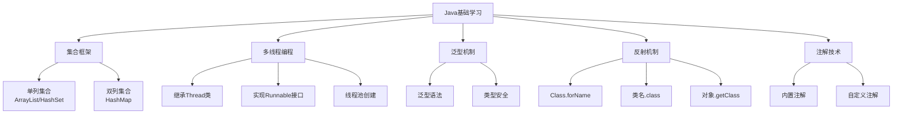

> Java 作为世界上最流行的编程语言之一，拥有丰富的特性和强大的生态系统。本文总结了 Java 基础学习中的核心知识点，包括集合框架、多线程编程、泛型、反射和注解等关键概念。这些知识点是每个 Java 开发者都必须熟练掌握的基础技能，无论是面试准备还是实际项目开发，都具有重要的参考价值。

<!-- more -->

## 📚 学习路线图




本文针对 Java 初学者和希望巩固基础的开发者，提供了核心知识点的系统梳理。建议结合实际编程练习，加深理解。


---

# 📦 集合框架 (Collections Framework)

集合框架是 Java 中最重要的基础知识之一，提供了一套完整的数据结构实现。

## 🔢 单列集合：ArrayList/HashSet

### ArrayList - 动态数组
**特点**：
- ✅ 有序集合，元素按插入顺序排列
- ✅ 允许重复元素
- ✅ 基于数组实现，查询效率高 O(1)
- ❌ 插入和删除效率相对较低 O(n)

```java
ArrayList<String> list = new ArrayList<>();
list.add("Java");
list.add("Python");
list.add("JavaScript");
System.out.println(list.get(0)); // Java
```

### HashSet - 哈希集合
**特点**：
- ✅ 无序集合，元素无固定顺序
- ✅ 不允许重复元素
- ✅ 基于哈希表实现，增删查效率都很高 O(1)

```java
HashSet<Integer> set = new HashSet<>();
set.add(1);
set.add(2);
set.add(1); // 重复元素，不会被添加
System.out.println(set.size()); // 2
```

## 🗂️ 双列集合：HashMap

### HashMap - 哈希映射
**特点**：
- 🔑 以键值对(Key-Value)形式存储数据
- ✅ 键不允许重复，值可以重复
- ✅ 基于哈希表实现，查询效率高 O(1)

```java
HashMap<String, Integer> map = new HashMap<>();
map.put("Java", 25);
map.put("Python", 30);
map.put("JavaScript", 28);
System.out.println(map.get("Java")); // 25
```

---

# 🧵 多线程编程

## 🛠️ 线程创建的三种常用方式

### 1. 继承 Thread 类
```java
class MyThread extends Thread {
    @Override
    public void run() {
        System.out.println("线程执行中: " + Thread.currentThread().getName());
    }
}
// 使用
MyThread thread = new MyThread();
thread.start();
```

### 2. 实现 Runnable 接口 ⭐ 推荐
```java
class MyRunnable implements Runnable {
    @Override
    public void run() {
        System.out.println("任务执行中: " + Thread.currentThread().getName());
    }
}
// 使用
Thread thread = new Thread(new MyRunnable());
thread.start();
```

### 3. 创建线程池 ⭐ 企业级推荐
```java
ExecutorService pool = Executors.newFixedThreadPool(5);
pool.execute(() -> {
    System.out.println("线程池任务执行");
});
pool.shutdown();
```

---

# 🔤 泛型 (Generics)

## 📝 基本语法
**格式**：`<泛型的类型>` 例如：`ArrayList<String>`


**重要限制**：泛型只能使用引用类型（包装类）
- ✅ 正确：`ArrayList<Integer>`
- ❌ 错误：`ArrayList<int>`


## 常用包装类
| 基本类型 | 包装类 | 示例 |
|:---|:---|:---|
| `int` | `Integer` | `ArrayList<Integer>` |
| `double` | `Double` | `List<Double>` |
| `boolean` | `Boolean` | `Set<Boolean>` |
| `char` | `Character` | `List<Character>` |

---

# 🔍 反射机制

## 📚 获取 Class 对象的三种方式

### 1. Class.forName() ⭐ 最常用
```java
Class<?> clazz = Class.forName("java.lang.String");
```

### 2. 类名.class
```java
Class<String> clazz = String.class;
```

### 3. 对象.getClass()
```java
String str = "Hello";
Class<?> clazz = str.getClass();
```

---

# 🏷️ 注解 (Annotations)

## 🔖 常用内置注解

### @Override - 重写标记
```java
class Child extends Parent {
    @Override
    public void show() {
        System.out.println("子类重写方法");
    }
}
```

### @Deprecated - 过时标记
```java
@Deprecated
public int oldMethod() {
    return 0;
}
```

### @SuppressWarnings - 抑制警告
```java
@SuppressWarnings("unchecked")
public void method() {
    List list = new ArrayList();
}
```

---

## 🎯 学习建议

| 知识点 | 重要程度 | 学习建议 |
|:---|:---:|:---|
| **集合框架** | ⭐⭐⭐⭐⭐ | 必须熟练掌握，是基础中的基础 |
| **多线程** | ⭐⭐⭐⭐ | 理解概念，掌握基本用法 |
| **泛型** | ⭐⭐⭐⭐ | 理解类型安全的重要性 |
| **反射** | ⭐⭐⭐ | 了解原理，知道应用场景 |
| **注解** | ⭐⭐⭐ | 熟悉内置注解，了解自定义 |


**总结**：这五大知识点是 Java 开发的核心基础，掌握它们将为后续的框架学习和项目开发打下坚实的基础。建议通过大量的代码练习来加深理解和掌握。
