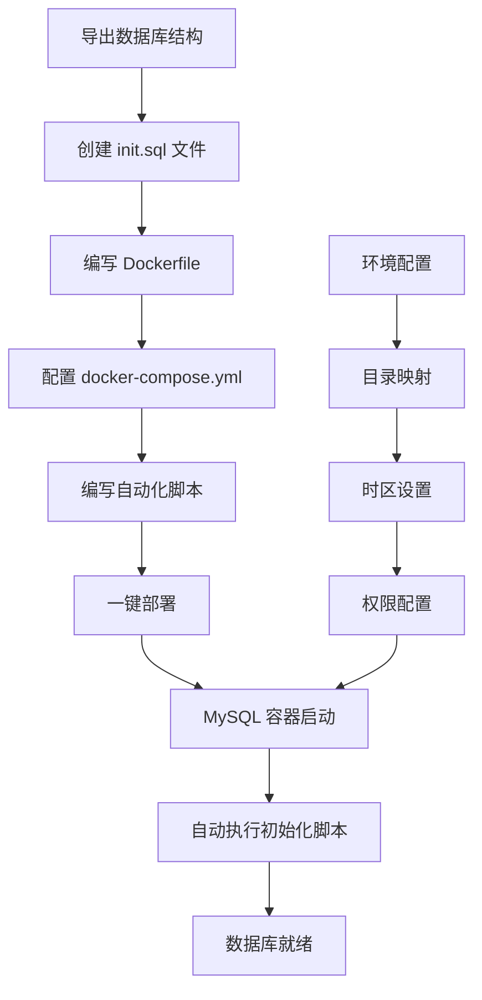

> 在现代 DevOps 实践中，数据库的快速部署和环境一致性至关重要。本文将介绍如何通过 Docker 实现 MySQL 数据库的自动化部署，包括表结构初始化、配置管理等完整流程。无论是开发环境搭建还是生产环境迁移，这套方案都能大大提升您的工作效率。

<!-- more -->

## 项目背景

在日常开发工作中，我们经常遇到这样的场景：在测试机器上精心配置了一套 MySQL 环境，手工设计、配置、调整得到了几个数据表，现在希望能够将这些表结构和数据库配置方便地移植到任意服务器上。

传统的手工部署方式不仅繁琐易错，而且难以保证环境的一致性。为了解决这些问题，本文记录了一套完整的 MySQL Docker 自动化部署流程。


通过 Docker 容器化技术，我们可以实现「一次配置，处处运行」的理想状态，大大提升开发和运维效率。


## 环境准备

### 系统要求

- **操作系统**：Ubuntu 22.04（或其他支持 Docker 的 Linux 发行版）
- **Docker**：已安装并正常运行
- **Docker Compose**：已安装并配置
- **MySQL 镜像**：mysql:8.0.38

### 技术选型说明

| 组件 | 版本 | 用途 |
|:---|:---|:---|
| MySQL | 8.0.38 | 数据库服务 |
| Docker | 最新稳定版 | 容器化平台 |
| Docker Compose | V2 | 容器编排 |
| Shell Script | Bash | 自动化脚本 |

## 实现思路

本方案采用分层设计，通过以下步骤实现自动化部署：



### 核心流程

1. **📄 数据导出**：将现有数据表结构导出为 `init.sql` 文件
2. **🐳 镜像构建**：通过 Dockerfile 将 SQL 文件集成到镜像中
3. **⚙️ 服务编排**：使用 Docker Compose 管理容器配置
4. **🔧 环境配置**：通过 Shell 脚本处理目录创建、时区设置等
5. **🚀 一键部署**：执行脚本即可完成整个部署流程


MySQL 容器在启动时会自动执行 `/docker-entrypoint-initdb.d/` 目录下的 SQL 脚本，这是我们实现自动初始化的关键机制。


## 数据库结构导出

### init.sql 文件生成

首先，我们需要将现有的数据库结构导出为 SQL 文件。这里使用 `mysqldump` 工具实现。

### 导出命令

#### 单个数据库导出
```bash
mysqldump -h [hostname] -u [username] -p --port=[port] [databasename] --no-data > init.sql
```

#### 所有数据库导出
```bash
mysqldump -h [hostname] -u [username] -p --port=[port] --no-data --all-databases > init.sql
```

### 命令参数说明

| 参数 | 说明 |
|:---|:---|
| `-h [hostname]` | 数据库服务器地址 |
| `-u [username]` | 数据库用户名 |
| `-p` | 提示输入密码 |
| `--port=[port]` | 数据库端口 |
| `--no-data` | 只导出表结构，不导出数据 |
| `--all-databases` | 导出所有数据库 |

### 生成的 SQL 文件示例

导出的 `init.sql` 文件内容示例：

```sql
-- MySQL dump 10.13  Distrib 5.7.24, for Linux (x86_64)
--
-- Host: 192.168.10.116    Database: test
-- ------------------------------------------------------
-- Server version	8.0.38

/*!40101 SET @OLD_CHARACTER_SET_CLIENT=@@CHARACTER_SET_CLIENT */;
/*!40101 SET @OLD_CHARACTER_SET_RESULTS=@@CHARACTER_SET_RESULTS */;
/*!40101 SET @OLD_COLLATION_CONNECTION=@@COLLATION_CONNECTION */;
/*!40101 SET NAMES utf8 */;
/*!40103 SET @OLD_TIME_ZONE=@@TIME_ZONE */;
/*!40103 SET TIME_ZONE='+00:00' */;
/*!40014 SET @OLD_UNIQUE_CHECKS=@@UNIQUE_CHECKS, UNIQUE_CHECKS=0 */;
/*!40014 SET @OLD_FOREIGN_KEY_CHECKS=@@FOREIGN_KEY_CHECKS, FOREIGN_KEY_CHECKS=0 */;
/*!40101 SET @OLD_SQL_MODE=@@SQL_MODE, SQL_MODE='NO_AUTO_VALUE_ON_ZERO' */;
/*!40111 SET @OLD_SQL_NOTES=@@SQL_NOTES, SQL_NOTES=0 */;

--
-- Table structure for table `foobar_info`
--

CREATE DATABASE IF NOT EXISTS test;
USE test;

DROP TABLE IF EXISTS `foobar_info`;
/*!40101 SET @saved_cs_client     = @@character_set_client */;
/*!40101 SET character_set_client = utf8 */;
CREATE TABLE `foobar_info` (
  `id` char(32) NOT NULL,
  `model` varchar(128) NOT NULL,
  `desc` varchar(256) DEFAULT NULL,
  `lat` decimal(16,12) NOT NULL,
  `lon` decimal(16,12) NOT NULL,
  `alt` decimal(16,12) NOT NULL,
  `project_id` int NOT NULL,
  `time` datetime(3) NOT NULL DEFAULT CURRENT_TIMESTAMP(3) COMMENT 'VARCHAR(256)',
  PRIMARY KEY (`id`),
  UNIQUE KEY `id_UNIQUE` (`id`)
) ENGINE=InnoDB DEFAULT CHARSET=utf8mb4 COLLATE=utf8mb4_0900_ai_ci;
/*!40101 SET character_set_client = @saved_cs_client */;
```

### 用户权限配置

在 SQL 文件中，您可以添加用户创建和权限设置：

```sql
-- 创建新用户
CREATE USER 'username'@'%' IDENTIFIED BY 'passwd';
-- 授予数据库权限
GRANT ALL PRIVILEGES ON test.* TO 'username'@'%';
-- 刷新权限
FLUSH PRIVILEGES;
```


**重要提示**：在使用 Dockerfile 构建镜像时，会将临时结果保存在 Docker images 中。如果更新了 `init.sql` 文件，需要删除对应的 Docker 镜像，否则默认会使用之前缓存的内容。


## Docker 配置文件

### Dockerfile 编写

创建 `Dockerfile` 文件，将初始化脚本集成到 MySQL 镜像中：

```dockerfile
# 使用官方 MySQL 8.0.38 版本作为基础镜像
FROM mysql:8.0.38

# 设置时区
ENV TZ=Asia/Shanghai

# 将初始化脚本复制到容器中
COPY init.sql /docker-entrypoint-initdb.d/
```

### Dockerfile 配置说明

| 指令 | 说明 |
|:---|:---|
| `FROM mysql:8.0.38` | 使用官方 MySQL 8.0.38 镜像作为基础 |
| `ENV TZ=Asia/Shanghai` | 设置容器时区为上海时区 |
| `COPY init.sql` | 将 SQL 文件复制到初始化目录 |


`/docker-entrypoint-initdb.d/` 是 MySQL 官方镜像的特殊目录，容器启动时会自动执行该目录下的 `.sql` 和 `.sh` 文件。


### Docker Compose 配置

创建 `docker-compose.yml` 文件，配置服务参数：

```yaml
version: '3.8'
services:
  mysql:
    build:
      context: .
      dockerfile: Dockerfile
    container_name: mysql8
    ports:
      - "33306:3306"
    restart: always
    environment:
      - TZ=Asia/Shanghai
      - SET_CONTAINER_TIMEZONE=true
      - CONTAINER_TIMEZONE=Asia/Shanghai
      - MYSQL_ROOT_PASSWORD=123456
    volumes:
      - /etc/localtime:/etc/localtime:ro
      - /data/mysql/data:/var/lib/mysql
      - /data/mysql/conf:/etc/mysql/conf.d
      - /data/mysql/log:/var/log
      - /data/mysql/share:/share
```

### 配置参数详解

#### 端口映射
- **宿主机端口**: `33306`
- **容器端口**: `3306`
- **说明**: 避免与宿主机现有 MySQL 服务冲突

#### 环境变量

| 变量名 | 值 | 说明 |
|:---|:---|:---|
| `TZ` | `Asia/Shanghai` | 容器时区设置 |
| `SET_CONTAINER_TIMEZONE` | `true` | 启用容器时区配置 |
| `MYSQL_ROOT_PASSWORD` | `123456` | MySQL root 用户密码 |

#### 数据卷映射

| 宿主机路径 | 容器路径 | 用途 |
|:---|:---|:---|
| `/etc/localtime` | `/etc/localtime` | 时区文件（只读）|
| `/data/mysql/data` | `/var/lib/mysql` | 数据库数据目录 |
| `/data/mysql/conf` | `/etc/mysql/conf.d` | 配置文件目录 |
| `/data/mysql/log` | `/var/log` | 日志文件目录 |
| `/data/mysql/share` | `/share` | 共享文件目录 |


**注意事项**：
1. 确保宿主机目录具有正确的权限（通常需要 mysql 用户权限）
2. 生产环境中应使用更安全的密码
3. 建议对敏感目录进行定期备份


## 自动化部署脚本

### Shell 脚本编写

创建 `mysql_deploy.sh` 脚本，实现一键部署：

```bash
#!/bin/bash

# MySQL Docker 自动部署脚本
set -e

# 颜色定义
RED='\033[0;31m'
GREEN='\033[0;32m'
YELLOW='\033[1;33m'
NC='\033[0m'

log_info() {
    echo -e "${GREEN}[INFO]${NC} $1"
}

log_error() {
    echo -e "${RED}[ERROR]${NC} $1"
}

# 检查当前用户是否是root
if [ "$(id -u)" -ne 0 ]; then
   log_error "此脚本需要以root用户运行，请使用sudo运行此脚本。"
   exit 1
fi

# 定义目录创建函数
create_dir_if_not_exists() {
  local dir_path="$1"
  if [ ! -d "$dir_path" ]; then
    mkdir -p "$dir_path"
    log_info "目录 '$dir_path' 已创建。"
  else
    log_info "目录 '$dir_path' 已存在，无需创建。"
  fi
}

# 创建MySQL相关目录
make_mysql_dirs(){
   local root_dir="$1"
   local data_dir=$root_dir"/data"
   create_dir_if_not_exists $data_dir
   local conf_dir=$root_dir"/conf"
   create_dir_if_not_exists $conf_dir
   local share_dir=$root_dir"/share"
   create_dir_if_not_exists $share_dir
   local log_dir=$root_dir"/log"
   create_dir_if_not_exists $log_dir
}

# 使用函数创建目录
make_mysql_dirs /data/mysql

log_info "Shanghai 时区同步"
sudo ln -sf /usr/share/zoneinfo/Asia/Shanghai /etc/localtime

log_info "同步时钟"
sudo hwclock --systohc

# 启动容器
log_info "启动 MySQL 容器..."
docker-compose -f docker-compose.yml up -d

log_info "MySQL 服务部署完成！"
```

## 使用方法

### 文件准备

将以下文件放到同一个文件夹中：

```
mysql-docker/
├── docker-compose.yml    # Docker Compose 配置文件
├── Dockerfile           # Docker 镜像构建文件
├── init.sql             # 数据库初始化 SQL 文件
└── mysql_deploy.sh      # 自动部署脚本
```

### 执行部署

```bash
# 赋予执行权限
chmod +x mysql_deploy.sh

# 执行部署
sudo ./mysql_deploy.sh
```

### 验证部署

```bash
# 检查容器状态
docker ps | grep mysql8

# 连接数据库测试
mysql -h localhost -P 33306 -u root -p123456
```

## 注意事项

### 重要提醒


1. **镜像缓存**：更新 `init.sql` 后需删除对应 Docker 镜像，否则会使用缓存内容
2. **权限设置**：确保 `/data/mysql` 目录具有正确的读写权限
3. **端口冲突**：如有端口冲突，请修改 `docker-compose.yml` 中的端口映射
4. **生产环境**：生产环境请使用更强的密码和安全配置


### 常用管理命令

```bash
# 停止服务
docker-compose down

# 重启服务
docker-compose restart

# 查看日志
docker logs mysql8

# 进入容器
docker exec -it mysql8 bash

# 备份数据库
docker exec mysql8 mysqldump -u root -p123456 --all-databases > backup.sql
```

## 总结

本文介绍的 MySQL Docker 自动化部署方案具有以下优势：

- ✅ **一键部署**：通过 Shell 脚本实现完全自动化
- ✅ **环境一致性**：容器化保证跨平台环境一致
- ✅ **快速迁移**：打包即可在任意支持 Docker 的环境部署
- ✅ **配置灵活**：支持自定义配置和扩展
- ✅ **易于维护**：标准化的目录结构和配置管理


通过这套方案，您可以在几分钟内在任何服务器上快速部署一个功能完整的 MySQL 数据库服务，大大提升开发和运维效率。


## 相关资源

- [Docker 官方文档](https://docs.docker.com/)
- [MySQL Docker 镜像](https://hub.docker.com/_/mysql)
- [Docker Compose 文档](https://docs.docker.com/compose/)
- [MySQL 8.0 参考手册](https://dev.mysql.com/doc/refman/8.0/en/)

