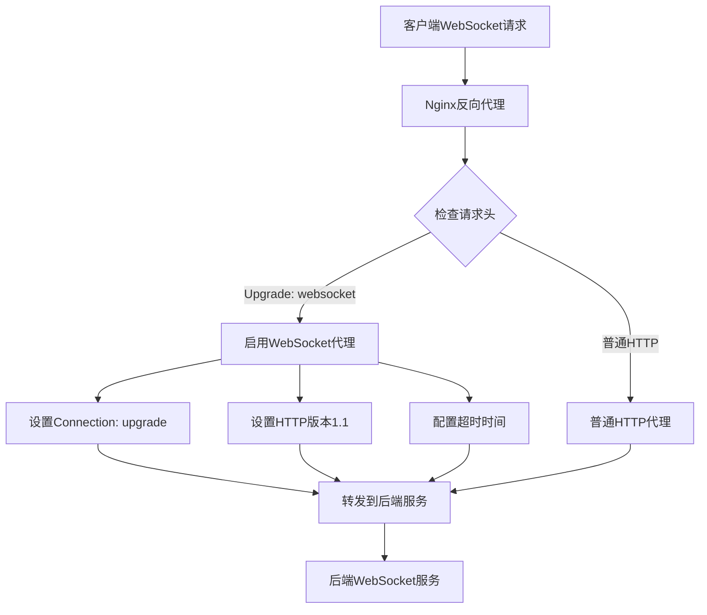
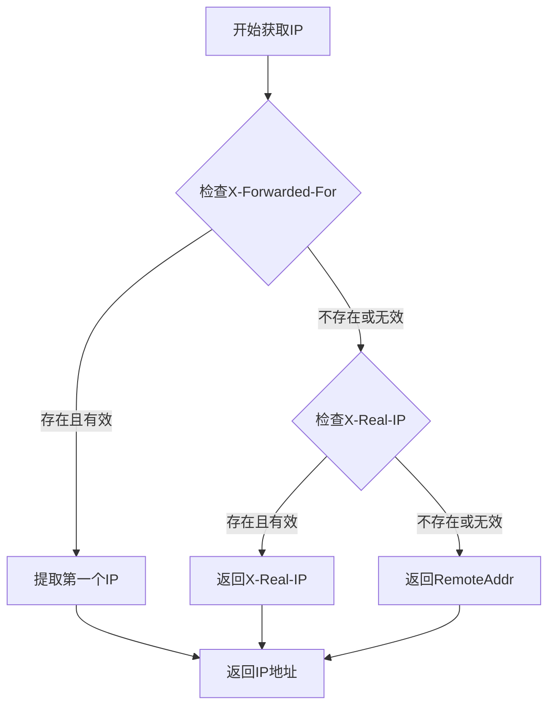

> 🔌 在现代Web应用中，WebSocket技术为实时通信提供了强大的支持。本文将详细介绍如何在Nginx中正确配置WebSocket反向代理，包括配置方法、常见问题解决以及获取真实IP的方法。

<!-- more -->

## 📋 配置前的准备工作

在开始配置WebSocket代理之前，需要确保你的环境具备以下条件：

- Nginx已正确安装并运行
- 具有管理员权限或sudo访问权限
- WebSocket后端服务已部署并正常运行
- 了解基本的Nginx配置语法

## 🔍 查找Nginx配置文件

首先，我们需要找到Nginx的配置文件位置：

```bash
# 查找nginx.conf文件位置
find / -name nginx.conf 2>/dev/null

# 或者使用locate命令（如果已安装）
locate nginx.conf

# 查看Nginx进程信息
ps aux | grep nginx
```


**常见的Nginx配置文件位置**：
- `/etc/nginx/nginx.conf`（系统包管理器安装）
- `/usr/local/nginx/conf/nginx.conf`（源码编译安装）
- `/opt/nginx/conf/nginx.conf`（自定义安装）


## ⚙️ WebSocket代理配置

### 基本配置结构

编辑Nginx配置文件：

```bash
# 编辑配置文件（根据实际路径调整）
vim /usr/local/nginx/conf/nginx.conf
```

在`http`块内添加以下完整的server配置：

```nginx
server {
    listen 80;
    server_name robotchat.lukeewin.top;  # 替换为你的域名
    
    # 普通HTTP请求代理
    location / {
        proxy_pass http://127.0.0.1:9090;  # 后端服务地址和端口
        proxy_set_header Host $host;
        proxy_set_header X-Real-IP $remote_addr;
        proxy_set_header X-Forwarded-For $proxy_add_x_forwarded_for;
        proxy_set_header X-Forwarded-Proto $scheme;
    }
    
    # WebSocket专用配置
    location /onlineCount {  # WebSocket访问路径
        proxy_redirect off;
        proxy_pass http://127.0.0.1:9090;
        
        # 基础代理头信息
        proxy_set_header Host $host;
        proxy_set_header X-Real-IP $remote_addr;
        proxy_set_header X-Forwarded-For $proxy_add_x_forwarded_for;
        proxy_set_header X-Forwarded-Proto $scheme;
        
        # WebSocket关键配置
        proxy_http_version 1.1;
        proxy_set_header Upgrade $http_upgrade;
        proxy_set_header Connection "upgrade";
        
        # 超时设置（重要！）
        proxy_read_timeout 36000s;
        proxy_send_timeout 36000s;
        proxy_connect_timeout 60s;
    }
}
```

### 关键配置解析



### 配置参数详细说明

| 配置项 | 作用 | 必需性 |
|:---|:---|:---|
| `proxy_http_version 1.1` | 启用HTTP/1.1协议 | **必需** |
| `proxy_set_header Upgrade $http_upgrade` | 转发协议升级头 | **必需** |
| `proxy_set_header Connection "upgrade"` | 设置连接升级 | **必需** |
| `proxy_read_timeout 36000s` | 读取超时时间 | **重要** |
| `proxy_send_timeout 36000s` | 发送超时时间 | **重要** |
| `proxy_connect_timeout 60s` | 连接超时时间 | 推荐 |


**重要提醒**：如果不设置 `proxy_read_timeout` 和 `proxy_send_timeout`，WebSocket连接可能会因超时而报 `EOFException` 错误。


## 🌐 获取客户端真实IP

### 必要的代理头配置

为了在后端服务中获取客户端的真实IP地址，必须添加以下三个代理头：

```nginx
proxy_set_header Host $host;
proxy_set_header X-Real-IP $remote_addr;
proxy_set_header X-Forwarded-For $proxy_add_x_forwarded_for;
```

### Java后端获取真实IP的代码实现

```java
/**
 * 获取客户端真实IP地址
 * @param request HTTP请求对象
 * @return 客户端真实IP
 */
public String getRealIp(HttpServletRequest request) {
    // 优先从X-Forwarded-For获取
    String ip = request.getHeader("X-Forwarded-For");
    if (StringUtils.isNotEmpty(ip) && !"unknown".equalsIgnoreCase(ip)) {
        // X-Forwarded-For可能包含多个IP，取第一个
        int index = ip.indexOf(",");
        if (index != -1) {
            return ip.substring(0, index).trim();
        } else {
            return ip.trim();
        }
    }
    
    // 从X-Real-IP获取
    ip = request.getHeader("X-Real-IP");
    if (StringUtils.isNotEmpty(ip) && !"unknown".equalsIgnoreCase(ip)) {
        return ip.trim();
    }
    
    // 从X-Forwarded-For再次尝试
    ip = request.getHeader("X-Forwarded-For");
    if (StringUtils.isNotEmpty(ip) && !"unknown".equalsIgnoreCase(ip)) {
        return ip.split(",")[0].trim();
    }
    
    // 最后从远程地址获取
    return request.getRemoteAddr();
}
```

### IP获取优先级说明



## 🔧 高级配置选项

### SSL/HTTPS配置

如果你的网站使用HTTPS，需要额外配置：

```nginx
server {
    listen 443 ssl http2;
    server_name your-domain.com;
    
    ssl_certificate /path/to/your/cert.pem;
    ssl_certificate_key /path/to/your/key.pem;
    
    location /ws {
        proxy_pass http://127.0.0.1:9090;
        
        # 基础头信息
        proxy_set_header Host $host;
        proxy_set_header X-Real-IP $remote_addr;
        proxy_set_header X-Forwarded-For $proxy_add_x_forwarded_for;
        proxy_set_header X-Forwarded-Proto $scheme;
        
        # WebSocket配置
        proxy_http_version 1.1;
        proxy_set_header Upgrade $http_upgrade;
        proxy_set_header Connection "upgrade";
        
        # 超时配置
        proxy_read_timeout 36000s;
        proxy_send_timeout 36000s;
        proxy_connect_timeout 60s;
    }
}
```

### 负载均衡配置

对于高可用场景，可以配置多个后端服务：

```nginx
upstream websocket_backend {
    ip_hash;  # 保持会话粘性
    server 127.0.0.1:9090;
    server 127.0.0.1:9091;
    server 127.0.0.1:9092;
}

server {
    listen 80;
    server_name your-domain.com;
    
    location /ws {
        proxy_pass http://websocket_backend;
        
        # WebSocket配置...
    }
}
```

## 📝 配置验证和重启

### 检查配置语法

```bash
# 检查Nginx配置文件语法
nginx -t

# 如果配置正确，重新加载配置
nginx -s reload

# 或者重启Nginx服务
systemctl restart nginx
```

### 测试WebSocket连接

可以使用以下方法测试WebSocket连接：

```javascript
// 前端JavaScript测试代码
const ws = new WebSocket('ws://your-domain.com/onlineCount');

ws.onopen = function(event) {
    console.log('WebSocket连接已建立');
};

ws.onmessage = function(event) {
    console.log('收到消息：', event.data);
};

ws.onerror = function(error) {
    console.error('WebSocket错误：', error);
};

ws.onclose = function(event) {
    console.log('WebSocket连接已关闭');
};
```

## 🚨 常见问题及解决方案

### 1. EOFException错误

**原因**：未设置适当的超时时间

**解决方案**：
```nginx
proxy_read_timeout 36000s;
proxy_send_timeout 36000s;
```

### 2. 连接被意外关闭

**原因**：缺少WebSocket升级头

**解决方案**：
```nginx
proxy_http_version 1.1;
proxy_set_header Upgrade $http_upgrade;
proxy_set_header Connection "upgrade";
```

### 3. 无法获取真实IP

**原因**：缺少代理头配置

**解决方案**：
```nginx
proxy_set_header Host $host;
proxy_set_header X-Real-IP $remote_addr;
proxy_set_header X-Forwarded-For $proxy_add_x_forwarded_for;
```

### 4. 502 Bad Gateway

**可能原因**：
- 后端服务未启动
- 端口配置错误
- 防火墙阻止连接

**检查方法**：
```bash
# 检查后端服务状态
netstat -tlnp | grep 9090

# 检查Nginx日志
tail -f /var/log/nginx/error.log
```

## 📊 性能优化建议

1. **合理设置超时时间**：根据业务需求调整超时参数
2. **启用gzip压缩**：对于文本消息可以减少带宽使用
3. **使用ip_hash**：在负载均衡中保持会话粘性
4. **监控连接数**：防止连接数过多导致服务器压力


```nginx
# 上游服务器配置
upstream websocket_backend {
    ip_hash;
    server 127.0.0.1:9090 weight=1 max_fails=3 fail_timeout=30s;
    server 127.0.0.1:9091 weight=1 max_fails=3 fail_timeout=30s;
}

server {
    listen 80;
    server_name your-domain.com;
    
    # 重定向到HTTPS
    return 301 https://$server_name$request_uri;
}

server {
    listen 443 ssl http2;
    server_name your-domain.com;
    
    # SSL配置
    ssl_certificate /path/to/cert.pem;
    ssl_certificate_key /path/to/key.pem;
    ssl_protocols TLSv1.2 TLSv1.3;
    ssl_ciphers ECDHE-RSA-AES128-GCM-SHA256:ECDHE-RSA-AES256-GCM-SHA384;
    
    # 静态文件处理
    location / {
        proxy_pass http://websocket_backend;
        proxy_set_header Host $host;
        proxy_set_header X-Real-IP $remote_addr;
        proxy_set_header X-Forwarded-For $proxy_add_x_forwarded_for;
        proxy_set_header X-Forwarded-Proto $scheme;
    }
    
    # WebSocket代理
    location /ws {
        proxy_pass http://websocket_backend;
        
        # 代理头
        proxy_set_header Host $host;
        proxy_set_header X-Real-IP $remote_addr;
        proxy_set_header X-Forwarded-For $proxy_add_x_forwarded_for;
        proxy_set_header X-Forwarded-Proto $scheme;
        
        # WebSocket升级
        proxy_http_version 1.1;
        proxy_set_header Upgrade $http_upgrade;
        proxy_set_header Connection "upgrade";
        
        # 超时设置
        proxy_connect_timeout 60s;
        proxy_read_timeout 36000s;
        proxy_send_timeout 36000s;
        
        # 缓冲设置
        proxy_buffering off;
    }
    
    # 日志配置
    access_log /var/log/nginx/websocket_access.log;
    error_log /var/log/nginx/websocket_error.log;
}
```


## 📝 总结

通过本文的配置指南，你应该能够成功在Nginx中配置WebSocket反向代理。关键要点包括：

1. **必需的WebSocket头**：`Upgrade`、`Connection`、HTTP版本1.1
2. **合适的超时设置**：防止连接意外断开
3. **真实IP获取**：正确配置代理头信息
4. **错误排查**：了解常见问题及解决方法

正确的Nginx WebSocket配置不仅能确保实时通信的稳定性，还能为你的Web应用提供更好的用户体验。记住在生产环境中要进行充分的测试，并根据实际负载情况调整相关参数。