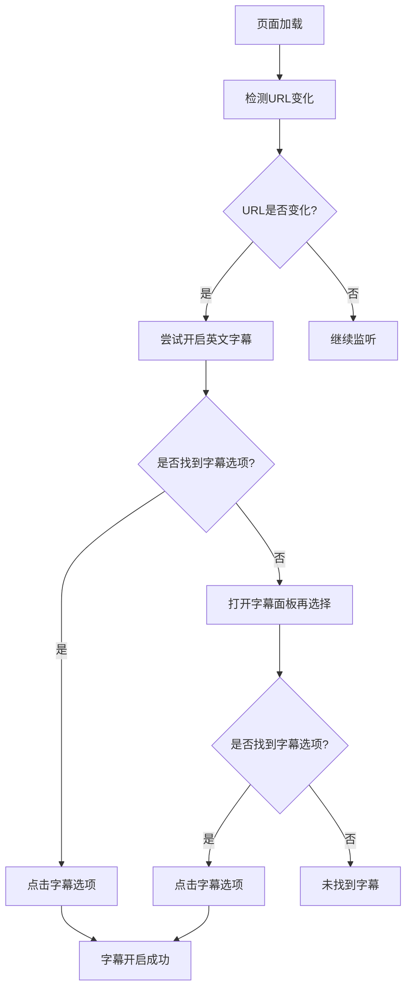

> 在观看Bilibili视频时，我们经常需要手动开启字幕功能，特别是对于外语学习者来说，每次都要点击字幕按钮确实有些繁琐。本文将介绍一款实用的油猴脚本，能够自动为Bilibili视频开启英文字幕，提升观看体验。

<!-- more -->

## 📋 项目背景

在日常使用Bilibili观看视频的过程中，我们经常遇到以下场景：

- 🌍 **外语学习**：观看英文视频时需要开启英文字幕辅助理解
- 🎧 **听力训练**：通过字幕提升听力理解和词汇积累
- 🎯 **高效观看**：避免每次手动开启字幕的重复操作
- 👨‍💻 **技术学习**：观看技术类视频时需要对照字幕理解内容

传统的观看方式需要我们每次手动点击字幕按钮，对于频繁观看视频的用户来说，这个操作显得有些繁琐。通过油猴脚本，我们可以实现字幕的自动开启功能。


本脚本基于Tampermonkey浏览器扩展开发，专门针对Bilibili网站设计，能够自动检测页面变化并在视频播放时自动开启英文字幕。


## 🔧 脚本功能

### 核心特性

- ✅ **自动开启字幕**：页面加载完成后自动开启英文字幕
- ✅ **页面切换支持**：支持在不同视频页面间切换时自动开启字幕
- ✅ **智能检测**：能够检测DOM变化并重新尝试开启字幕
- ✅ **多页面适配**：支持Bilibili的多种页面类型（视频页、番剧页、专栏等）

### 适配页面

脚本支持以下Bilibili页面类型：

- 视频播放页：`https://www.bilibili.com/video/*`
- 番剧播放页：`https://www.bilibili.com/bangumi/play/*`
- 动态页面：`https://t.bilibili.com/*`
- 专栏页面：`https://www.bilibili.com/opus/*`
- 个人空间：`https://space.bilibili.com/*`
- 话题页面：`https://www.bilibili.com/v/topic/detail/*`
- 课堂页面：`https://www.bilibili.com/cheese/play/*`

## 📝 脚本代码

### 完整脚本

```javascript
// ==UserScript==
// @name         哔哩哔哩自动打开字幕
// @namespace    http://tampermonkey.net/
// @version      2024-03-10
// @description  bilibili b站 哔哩哔哩 播放视频时自动打开网站字幕
// @author       You
// @match        https://www.bilibili.com/video/*
// @match        https://www.bilibili.com/list/*
// @match        https://www.bilibili.com/bangumi/play/*
// @match        https://t.bilibili.com/*
// @match        https://www.bilibili.com/opus/*
// @match        https://space.bilibili.com/*
// @match        https://www.bilibili.com/v/topic/detail/*
// @match        https://www.bilibili.com/cheese/play/*
// @match        https://www.bilibili.com/festival/*
// @match        https://www.bilibili.com/blackboard/*
// @match        https://www.bilibili.com/blackroom/ban/*
// @match        https://www.bilibili.com/read/*
// @match        https://manga.bilibili.com/detail/*
// @match        https://www.bilibili.com/v/topic/detail*
// @icon         https://www.google.com/s2/favicons?sz=64&domain=bilibili.com
// @grant        none
// @downloadURL https://update.greasyfork.org/scripts/489403/%E5%93%94%E5%93%A9%E5%93%94%E5%93%A9%E8%87%AA%E5%8A%A8%E6%89%93%E5%BC%80%E5%AD%97%E5%B9%95.user.js
// @updateURL https://update.greasyfork.org/scripts/489403/%E5%93%94%E5%93%A9%E5%93%94%E5%93%A9%E8%87%AA%E5%8A%A8%E6%89%93%E5%BC%80%E5%AD%97%E5%B9%95.meta.js
// ==/UserScript==

(function() {
    'use strict';

    let queryValue = '';
    // 定时检测URL是否发生变化
    let timer = setInterval(function() {
        // 获取URL中的查询字符串部分
        const queryString = window.location.search;
        // 解析查询字符串，将参数以对象的形式存储
        const params = new URLSearchParams(queryString);
        // 获取特定参数的值
        const value = params.get('p');
        if (queryValue !== value) {
            selectEnglishSubtitle();
            queryValue = value;
        }
    }, 2000);

    window.addEventListener('unload', function(_event) {
        clearInterval(timer)
    });

    function selectEnglishSubtitle(){
        setTimeout(() => {
            // 方法1：直接通过data-lan属性选择English字幕项
            const englishSubtitle = document.querySelector('.bpx-player-ctrl-subtitle-language-item[data-lan="ai-en"]');
            if (englishSubtitle) {
                englishSubtitle.click();
                console.log('English字幕已选择');
            } else {
                // 方法2：如果直接选择失败，先打开字幕面板再选择
                openSubtitleAndSelect();
            }
        }, 1000);
    }

    function openSubtitleAndSelect() {
        // 先点击字幕按钮打开面板
        const subtitleBtn = document.querySelector('.bpx-player-ctrl-btn[aria-label="字幕"] .bpx-common-svg-icon');
        if (subtitleBtn) {
            subtitleBtn.click();

            // 等待面板打开后选择English字幕
            setTimeout(() => {
                const englishSubtitle = document.querySelector('.bpx-player-ctrl-subtitle-language-item[data-lan="ai-en"]');
                if (englishSubtitle) {
                    englishSubtitle.click();
                    console.log('English字幕已选择');
                } else {
                    console.log('未找到English字幕选项');
                }
            }, 500);
        }
    }

    // 页面加载后也尝试选择English字幕
    document.addEventListener('DOMContentLoaded', function() {
        setTimeout(selectEnglishSubtitle, 3000);
    });

    // 监听DOM变化，动态选择字幕
    const observer = new MutationObserver(function(mutations) {
        mutations.forEach(function(mutation) {
            if (mutation.type === 'childList') {
                mutation.addedNodes.forEach(function(node) {
                    if (node.nodeType === 1 && node.querySelector && node.querySelector('.bpx-player-ctrl-subtitle-language-item[data-lan="ai-en"]')) {
                        setTimeout(() => {
                            selectEnglishSubtitle();
                        }, 1000);
                    }
                });
            }
        });
    });

    observer.observe(document.body, {
        childList: true,
        subtree: true
    });

    window.addEventListener('unload', function() {
        observer.disconnect();
        clearInterval(timer);
    });
})();
```

## 🛠️ 安装与使用

### 安装步骤

1. 🌐 安装Tampermonkey浏览器扩展
   - Chrome/Edge浏览器访问[Chrome商店](https://chrome.google.com/webstore/detail/tampermonkey/dhdgffkkebhmkfjojejmpbldmpobfkfo)
   - Firefox浏览器访问[Firefox附加组件](https://addons.mozilla.org/firefox/addon/tampermonkey/)

2. 📥 安装脚本
   - 访问[Greasy Fork脚本页面](https://greasyfork.org/zh-CN/scripts/489403)
   - 点击"安装此脚本"按钮
   - 在弹出的确认页面点击"安装"

3. ✅ 验证安装
   - 访问任意Bilibili视频页面
   - 检查视频播放器右下角是否自动开启了英文字幕


**使用提示**：
- 脚本会自动检测页面中的英文字幕选项（data-lan="ai-en"）
- 如果视频没有英文字幕，脚本不会执行任何操作
- 脚本支持页面切换时自动重新检测字幕


## 🔄 工作原理

### 脚本工作机制



### 技术实现细节

#### 1. URL变化检测

脚本通过定时器（setInterval）每2秒检测一次URL变化，主要检测视频页面的分P参数变化。

#### 2. 字幕选择策略

脚本采用双重策略确保字幕开启成功：
- **直接选择**：通过CSS选择器直接查找并点击英文字幕选项
- **间接选择**：如果直接选择失败，则先点击字幕按钮打开面板，再选择英文字幕

#### 3. DOM变化监听

通过MutationObserver监听DOM变化，当页面动态加载新内容时重新尝试开启字幕。

## ⚙️ 高级配置

### 自定义字幕语言

如果需要修改默认的字幕语言，可以修改脚本中的以下代码：

```javascript
// 修改此行代码中的语言代码来选择不同的字幕
const englishSubtitle = document.querySelector('.bpx-player-ctrl-subtitle-language-item[data-lan="ai-en"]');
```

常见的字幕语言代码：
- `ai-en`：英文字幕
- `ai-zh`：中文字幕
- `ai-ja`：日文字幕

### 调整检测间隔

可以修改定时器间隔来调整检测频率：

```javascript
// 修改第二个参数（单位：毫秒）来调整检测间隔
let timer = setInterval(function() {
    // ...
}, 2000); // 当前为2秒
```

## ⚠️ 注意事项

### 兼容性说明


**兼容性提醒**：
1. 脚本依赖Bilibili页面的特定CSS类名，如果B站更新页面结构可能导致脚本失效
2. 仅支持包含英文字幕的视频，无字幕视频不会有任何效果
3. 部分特殊页面可能不支持字幕功能


### 使用限制

| 限制项 | 说明 |
|:---|:---|
| 字幕类型 | 仅支持AI生成字幕，不支持UP主上传的字幕 |
| 语言支持 | 默认仅开启英文字幕 |
| 页面支持 | 仅支持脚本中指定的Bilibili页面 |
| 浏览器 | 需要安装Tampermonkey扩展 |

### 故障排除

#### 常见问题

1. **字幕未自动开启**
   - 检查视频是否包含英文字幕
   - 确认脚本是否正常运行
   - 尝试刷新页面

2. **脚本不生效**
   - 确认Tampermonkey扩展已启用
   - 检查脚本是否在Bilibili域名下运行
   - 查看浏览器控制台是否有错误信息

3. **字幕显示异常**
   - 检查浏览器字幕设置
   - 确认Bilibili播放器设置
   - 尝试手动切换字幕后再使用脚本

## 🎯 总结

这款Bilibili自动开启字幕的油猴脚本为经常观看外语视频的用户提供了极大的便利。通过自动化的方式，减少了重复的手动操作，提升了观看体验。

### 核心优势

- 🚀 **自动化操作**：无需手动点击，自动开启字幕
- 🌐 **广泛兼容**：支持Bilibili多种页面类型
- 🔧 **智能检测**：能够适应页面动态变化
- 💰 **完全免费**：开源脚本，无任何费用

### 使用建议


**最佳实践**：
1. 定期检查脚本更新，确保兼容性
2. 根据个人需求调整检测间隔
3. 结合其他Bilibili增强脚本使用效果更佳
4. 注意保护个人隐私，避免安装来源不明的脚本


## 📚 相关资源

- [Tampermonkey官方文档](https://www.tampermonkey.net/documentation.php)
- [Greasy Fork脚本平台](https://greasyfork.org/)
- [Bilibili官方帮助文档](https://www.bilibili.com/blackboard/help.html)
- [JavaScript DOM操作指南](https://developer.mozilla.org/zh-CN/docs/Web/API/Document_Object_Model)

---

通过这款脚本，您可以更加高效地观看Bilibili视频，特别是在学习外语时能够获得更好的体验。如果您有其他需求，也可以基于此脚本进行二次开发定制。