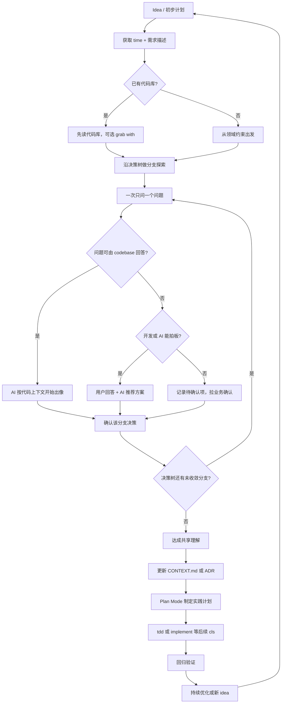

一直在好几个真实项目里用 Claude Code、Cursor 这类 AI 编码代理。过去三个月，模型确实在不断变强，但对我帮助最大的反而是 `/grill-me` 这个 skill。它会在你动手之前，不断拷问你，帮你省掉很多写一版、再改一版的循环。

## 为什么需要「被拷问」？

平时的用法是我们把需求丢给 AI：描述功能、举例子、列边界情况。AI 点头答应，写起来才发现它根本没理解——漏了业务约束、跟现有架构对不上，或者把复杂度想简单了。然后就开始来回改，token 和时间都烧掉了。

`/grill-me` 把方向反过来了：AI 来提问，沿着决策树一个分支一个分支往下走，直到双方对计划有共识。核心指令就这几行：

```md
---
name: grilling
description: Interview the user relentlessly about a plan or design. Use when the user wants to stress-test a plan before building, or uses any 'grill' trigger phrases.
---

Interview me relentlessly about every aspect of this plan until we reach a shared understanding. Walk down each branch of the design tree, resolving dependencies between decisions one-by-one. For each question, provide your recommended answer.

Ask the questions one at a time, waiting for feedback on each question before continuing. Asking multiple questions at once is bewildering.

If a question can be answered by exploring the codebase, explore the codebase instead.
```


它逼你把那些没说出口的假设摊开，风险也会提前冒出来。

## 快速上手

在项目目录运行：

```none
npx skills add https://github.com/mattpocock/skills --skill grill-me
```


然后在 coding agent 里输入 `/grill-me` 加上你的初步计划。

## 真实项目里怎么用

用法很简单：`/grill-me` 加上你的需求描述。注意，代理不会对着空白文档连环发问——它会先读代码库，边探索边提问。我喜欢配合 Cursor 的 Plan Mode 使用，先通过 `/grill-me` 构建一个计划然后再实现计划。

下面两个例子来自同一个多租户中后台项目，一个做新功能，一个改老逻辑。

### 新功能：批量导入

最初想法：加个批量导入，支持 Excel 和 API。
直接扔给 AI，第一版就翻车——审计日志没考虑、事务一致性没想清楚、配额和大文件处理也漏了。

换成 `/grill-me` 后，代理先翻了现有导入模块和权限模型，然后才开口：

「批量导入是谁触发的？手动上传、定时任务，还是第三方 webhook？」答完接着问：「成功和失败怎么通知？要不要异步？失败重试几次？」每答一个，它会给推荐方案，并确认依赖，比如「这会动到现有权限模型吗？」

几轮下来，功能边界清楚了，跟领域模型的冲突也提前暴露（比如 materialization cascade）。最终实现基本一次过。

### 已有功能迭代：订单支持部分取消

这次是改一条老链路：已发货订单原先只能整单取消，产品要求支持部分取消。

代理没有先写方案。它顺着 `OrderService` 的状态机往下追，发现取消会触发退款、库存回滚和仓库 webhook；又追到 `PromoEngine`，看到满减是按整单算的。然后才开始问：

- 部分取消后，满减要不要重算？代码里三种算法，注释只写了『按运营规则』——你定哪一种？
- 混合支付（余额 + 微信）时，退款按什么比例拆？现有 `RefundService` 只处理整单，没有部分退的路径。
- 仓库 webhook 是 fire-and-forget，没有幂等键。部分取消如果重试，会不会重复通知？

这些问题里，有些能从代码推断出推荐答案；有些连开发都说不准！历史上运营改过口径，文档没更新。这种场景只能拉业务确认，有时候你自己做不了决定，AI 更替你做不了决定，这种情况下的决定往往是错的。grill-me 的价值恰恰是把它们提前拎出来，而不是写完了才发现。

如果直接改，我大概率只会动 `OrderService` 的状态判断，漏掉 bundle 重算、混合支付拆账和 webhook 幂等。上线后就是「取消成功但退款不对」或者「仓库收到两次取消通知」这类 bug。grill-me 逼我把这些分支走一遍，该写 ADR 的写 ADR，该找运营确认的当场记下来。改完跑回归，没有冒出新的边角问题。

### 修遗留 bug

我仍然这么用！先 grill-me + plan mode 代理先复现代码路径，再问你影响范围和回归点，少踩修好一个冒出三个的坑。

### 流程长什么样




对齐放在实现前面，形成一个闭环。如果项目已经有代码库，可以用 grill-with-docs，边问边把 ubiquitous language 和 ADR 建起来。

## 为什么这三个月它一直在用

最大的感受是少返工。很多误解在写代码之前就暴露了，不用等到实现阶段才发现。对话本身也能沉淀成文档，后面查起来方便。而且这个 skill 不绑特定模型，换代理、团队共享都省事。它逼我自己想清楚，而不是把坑留给 AI 去填。用久了，这点比省下来的 token 更值。

Matt Pocock 的 skills 仓库整体偏向真实工程，不是 vibe coding。grill-me 核心就几行，但能跟别的 skill 组合着用。

## grill-me 和 superpowers 那些工具有什么不同

我试过不少 AI 增强工具，包括各种 superpowers 插件——预设模板多、自动化流程全、领域知识也齐。grill-me 不一样，它不替你定方案，而是把你的意图和约束挖出来。复杂、定制化的项目里，这点特别管用。

superpowers 适合快速套模式，比如某个框架的最佳实践。grill-me 更像元技能：先想清楚问题，再决定用什么模式。我自己加上 frontend-design 或 review 这几个 skill 就够用了，不用堆一堆配置。

跟仅仅使用 Plan Mode 比，grill-me 更主动。它不会一次吐一篇长计划，而是一个问题一个问题地问，确认完再往下走。


## 总结

如果你也被 AI 编码里的反复迭代搞烦了，可以试试，它会让你想得更清楚。这三个月它帮我绕了不少弯路，包括迭代核心业务代码也让我更有信心。

## 相关链接

- https://github.com/mattpocock/skills
- https://www.skills.sh/mattpocock/skills/grill-me