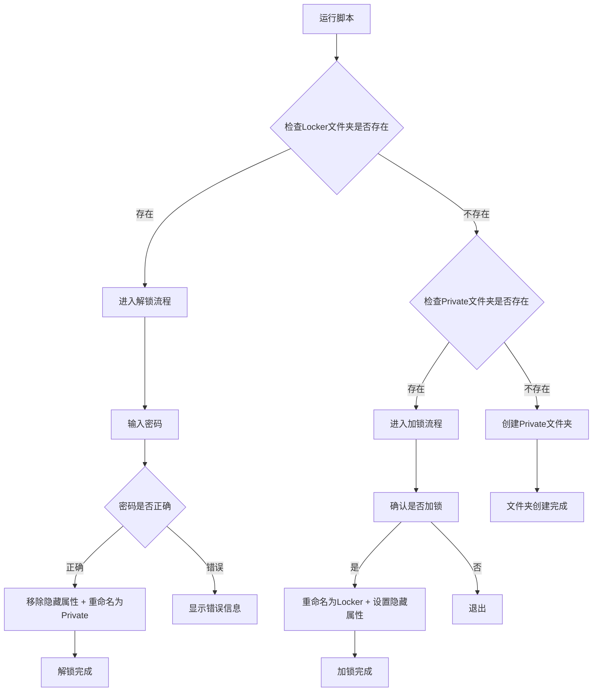

> 在日常工作中，我们经常需要保护重要文件的隐私和安全。本文将介绍一个简单而实用的 Windows 批处理脚本，能够快速实现文件夹的加密隐藏功能。通过设置密码保护，只有输入正确密码才能访问文件夹内容，为您的重要数据提供基础的安全保障。

<!-- more -->

## 📋 项目背景

在个人电脑使用过程中，我们经常遇到以下场景：

- 💼 **工作文档保护**：需要隐藏重要的工作文件和项目资料
- 🔒 **个人隐私保护**：保护个人照片、视频等隐私文件
- 👨‍👩‍👧‍👦 **家庭共享电脑**：在家庭共用电脑上保护个人文件
- 🎯 **临时文件保护**：快速隐藏不希望他人看到的文件夹

传统的文件夹隐藏方法操作复杂，而且容易被发现。本脚本提供了一种简单有效的解决方案。


本脚本基于 Windows 系统的文件属性和批处理命令，实现了文件夹的快速加密隐藏功能。虽然不是专业级加密，但对于日常使用已经足够。


## 🔧 脚本代码

### 完整脚本

将以下代码保存为 `.bat` 文件即可使用：

```batch
cls
@ECHO OFF
title Folder Private
if EXIST "Locker" goto UNLOCK
if NOT EXIST Private goto MDLOCKER
:CONFIRM
echo Are you sure you want to lock the folder(Y/N)
set/p "cho=>"
if %cho%==Y goto LOCK
if %cho%==y goto LOCK
if %cho%==n goto END
if %cho%==N goto END
echo Invalid choice.
goto CONFIRM
:LOCK
ren Private "Locker"
attrib +h +s "Locker"
echo Folder locked
goto End
:UNLOCK
echo Enter password to unlock folder
set/p "pass=>"
if NOT %pass%== 你的密码 goto FAIL
attrib -h -s "Locker"
ren "Locker" Private
echo Folder Unlocked successfully
goto End
:FAIL
echo Invalid password
goto end
:MDLOCKER
md Private
echo Private created successfully
goto End
:End
```

### 脚本代码解析

| 关键命令 | 功能说明 |
|:---|:---|
| `@ECHO OFF` | 关闭命令回显，让界面更简洁 |
| `title Folder Private` | 设置命令窗口标题 |
| `ren Private "Locker"` | 将文件夹重命名为 Locker |
| `attrib +h +s "Locker"` | 设置文件夹为隐藏和系统属性 |
| `attrib -h -s "Locker"` | 移除隐藏和系统属性 |
| `set/p "pass=>"` | 获取用户输入的密码 |

## 📝 使用步骤

### 第一步：创建脚本文件

1. 🖊️ 打开记事本或任意文本编辑器（如 Editplus、Notepad++）
2. 📋 复制上述脚本代码到编辑器中
3. 🔑 **重要**：将代码中的 `你的密码` 替换为您想要设置的密码
4. 💾 保存文件，文件名可以是 `folder_lock.bat`


**密码设置注意事项**：
- 密码区分大小写
- 不建议使用包含空格的密码
- 请牢记密码，忘记密码将无法解锁文件夹


### 第二步：运行脚本

### 操作演示

#### 首次运行效果

第一次运行脚本时，系统会自动创建一个名为 `Private` 的文件夹：


#### 文件夹加锁过程

当您选择加锁时，脚本会询问确认并执行加锁操作：


加锁成功后，`Private` 文件夹将被重命名为 `Locker` 并设置为隐藏：


#### 文件夹解锁过程

再次运行脚本时，系统会要求输入密码：


输入正确密码后，文件夹将恢复可见状态：


## 🔄 工作原理

### 脚本工作流程



### 技术实现细节

#### 文件属性控制

脚本通过 `attrib` 命令控制文件夹属性：

| 参数 | 功能 | 说明 |
|:---|:---|:---|
| `+h` | 添加隐藏属性 | 文件夹在资源管理器中不可见 |
| `+s` | 添加系统属性 | 进一步隐藏文件夹 |
| `-h` | 移除隐藏属性 | 恢复文件夹可见性 |
| `-s` | 移除系统属性 | 恢复正常文件夹状态 |

#### 安全机制

1. **双重隐藏**：同时使用隐藏属性和系统属性
2. **文件夹重命名**：改变文件夹名称增加隐蔽性
3. **密码验证**：简单的密码保护机制


**查看隐藏文件的方法**：
- 在资源管理器中，点击「查看」→「隐藏的项目」
- 或者在文件夹选项中设置显示隐藏文件


## ⚡ 高级用法

### 脚本改进建议

#### 1. 增强密码安全性

```batch
:UNLOCK
echo Enter password to unlock folder
set/p "pass=>"
:: 使用更复杂的密码验证
if NOT "%pass%"=="your_complex_password_123" goto FAIL
```

#### 2. 添加错误次数限制

```batch
:: 在脚本开头添加
set attempt=0

:UNLOCK
set /a attempt+=1
if %attempt% GTR 3 (
    echo Too many failed attempts!
    timeout /t 60
    exit
)
echo Enter password to unlock folder (Attempt %attempt%/3)
```

#### 3. 自定义文件夹名称

```batch
:: 将 Private 和 Locker 替换为自定义名称
set FOLDER_NAME=MySecretFolder
set LOCKED_NAME=.system_temp
```

### 使用技巧

#### 🔒 最佳实践

1. **定期备份重要文件**：脚本只是基础保护，重要文件请做好备份
2. **选择合适的文件夹位置**：建议放在不常用的目录下
3. **密码管理**：使用密码管理器记录脚本密码
4. **测试验证**：首次使用时先用测试文件验证功能

#### ⚠️ 注意事项

| 情况 | 解决方案 |
|:---|:---|
| 忘记密码 | 可以手动显示隐藏文件，然后重命名文件夹 |
| 脚本文件丢失 | 重新创建脚本，文件夹可通过显示隐藏文件恢复 |
| 系统重装 | 提前备份重要文件，重装后重新配置 |
| 权限问题 | 确保在有管理员权限的目录下运行 |

## 🛡️ 安全性说明

### 安全等级评估


**安全性声明**：此脚本提供的是基础级别的文件隐藏功能，主要用于防止普通用户的误操作或简单的文件保护需求。对于高敏感数据，建议使用专业的加密软件。


#### 适用场景

✅ **推荐使用**：
- 家庭电脑的简单文件保护
- 防止他人误删重要文件
- 临时隐藏文件夹
- 学习批处理脚本编程

❌ **不推荐使用**：
- 企业级数据保护
- 高价值机密文件
- 需要防范专业攻击的场景
- 对安全性要求极高的环境

### 专业加密方案推荐

如果您需要更高级别的安全保护，推荐以下解决方案：

| 工具 | 特点 | 适用场景 |
|:---|:---|:---|
| **BitLocker** | Windows 内置，硬件加密 | 整盘加密 |
| **7-Zip** | 开源免费，AES-256加密 | 文件压缩加密 |
| **VeraCrypt** | 开源，强加密算法 | 专业级文件加密 |
| **AxCrypt** | 简单易用，AES-256 | 个人文件加密 |

## 🎯 总结

这个 Windows 文件夹加密脚本为我们提供了一个简单实用的文件保护方案。虽然安全等级不高，但在日常使用中已经能够满足基本的隐私保护需求。

### 核心优势

- 🚀 **操作简单**：双击运行，一键加锁/解锁
- 💰 **完全免费**：无需安装任何第三方软件
- 🔧 **易于定制**：可根据需求修改脚本功能
- 📚 **学习价值**：了解批处理脚本和文件属性操作

### 改进方向

未来可以考虑添加以下功能：
- 图形界面支持
- 多文件夹管理
- 日志记录功能
- 更强的加密算法


**使用建议**：将此脚本作为文件管理的辅助工具，结合其他安全措施，为您的数据提供多层保护。记住，数据安全永远是一个系统工程，单一的保护措施是不够的。


## 📚 相关资源

- [Windows 批处理脚本编程指南](https://docs.microsoft.com/zh-cn/windows-server/administration/windows-commands/)
- [文件系统安全最佳实践](https://docs.microsoft.com/zh-cn/windows/security/)
- [数据加密解决方案对比](https://www.microsoft.com/zh-cn/security/)

---

通过这个简单的脚本，您已经掌握了基础的文件夹保护方法。在实际使用中，请根据自己的安全需求选择合适的保护方案，确保重要数据的安全。