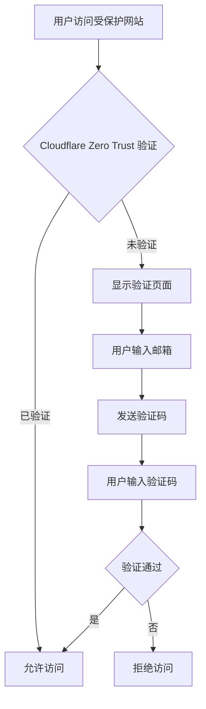

> 在当今的互联网环境中，我们经常需要将某些页面部署到公网上以便随时访问，但又不希望被无关人员看到。Cloudflare Zero Trust 提供了一种简单而有效的解决方案，通过身份验证机制为个人网站添加访问保护。本文将详细介绍如何使用 Cloudflare Zero Trust 为您的个人网站配置访问验证。

<!-- more -->

## 📋 项目背景

在个人网站或项目部署中，我们经常会遇到以下场景：

- 🔐 **私有文档保护**：需要保护个人笔记、技术文档等敏感信息
- 🏢 **内部系统访问**：为团队内部系统添加访问控制
- 🎯 **临时页面保护**：为测试页面或临时展示页面添加访问限制
- 📱 **远程访问安全**：确保远程访问个人服务的安全性

传统的网站保护方式通常需要复杂的认证系统或服务器配置，而 Cloudflare Zero Trust 提供了一种零代码、零基础设施的解决方案。


Cloudflare Zero Trust 是一种基于零信任安全模型的解决方案，它假设网络内外都存在威胁，因此需要对每一次访问进行验证，而不仅仅依赖网络边界防护。


## 🛠️ 配置步骤

### 第一步：进入 Cloudflare Zero Trust 控制台

1. 登录 [Cloudflare 控制台](https://dash.cloudflare.com/)
2. 选择您的域名
3. 在左侧导航栏中找到并点击 **Zero Trust**
4. 进入 Zero Trust 控制台后，依次点击 **Access** → **Applications**

### 第二步：创建应用程序

1. 点击 **Add an application** 按钮
2. 选择类型为 **Self-hosted**（自托管应用）
3. 进入设置页面

在设置页面中，大部分配置可以保持默认值，需要重点关注以下几项：

- **Application name**：设置一个便于区分的名称
- **Application domain**：根据实际情况填写需要保护的域名或具体路径
- **Additional domains**：如果需要保护多个域名或路径，可以点击 "add domain" 继续添加

### 第三步：配置访问策略

1. 点击页面最下方的 **Next**，进入 Policy 设置页面
2. 设置 **Policy name**：填写一个便于区分的策略名称
3. 配置 **Action**：
   - **Allow**：白名单规则，只有符合条件的用户才能访问
   - **Block**：黑名单规则，符合条件的用户将被阻止访问

### 第四步：配置身份验证规则

在 **Config rules** 中配置身份认证规则：

- **Include rules**：白名单规则，允许访问的用户
- **Exclude rules**：黑名单规则，禁止访问的用户

可选的规则匹配方式包括：
- 邮箱地址
- 国家/地区
- IP 地址范围
- 企业身份提供商等

一般情况下，我们使用邮箱地址进行验证即可：
1. 在 Include 规则中选择 **Email**
2. 填入您希望允许访问的邮箱地址

### 第五步：完成配置

1. 继续点击 **Next**
2. 可以额外配置 CORS 和 Cookie 等选项，一般保持默认即可
3. 点击右下角的 **Add application** 完成设置

## 🔍 验证效果

配置完成后，重新访问您的网站，将会看到验证页面。用户需要输入配置的邮箱地址，然后接收验证码进行登录，从而实现对个人网站的访问控制。

## ⚙️ 高级配置选项

### 多重身份验证

为了进一步提升安全性，您可以配置多重身份验证（MFA）：

1. 在 Zero Trust 控制台中进入 **Access** → **Authentication**
2. 配置身份提供商（如 Google、GitHub 等）
3. 启用多重验证选项

### 访问日志监控

Cloudflare Zero Trust 还提供了详细的访问日志：

1. 进入 **Access** → **Logs**
2. 查看所有访问记录
3. 监控异常访问行为

### 会话管理

可以配置会话超时时间：

- **Session duration**：设置用户登录后的有效时间
- **Cookie duration**：设置 Cookie 的有效期

## 🛡️ 安全性说明

### 优势

1. **零代码实现**：无需修改网站代码即可添加访问控制
2. **全球 CDN 加速**：Cloudflare 的全球网络提供加速服务
3. **多重验证支持**：支持多种身份验证方式
4. **详细日志记录**：提供完整的访问日志用于审计

### 注意事项


**重要提醒**：
- 请确保正确配置邮箱地址，避免将自己锁定在外
- 定期检查访问日志，监控异常访问行为
- 对于重要系统，建议启用多重身份验证
- 了解 Cloudflare 的服务条款和隐私政策


## 🔄 工作原理

## 📚 相关资源

- [Cloudflare Zero Trust 官方文档](https://developers.cloudflare.com/cloudflare-one/)
- [Cloudflare Access 配置指南](https://developers.cloudflare.com/cloudflare-one/applications/)
- [身份验证最佳实践](https://developers.cloudflare.com/cloudflare-one/identity/)

---

通过以上配置，您可以轻松为个人网站添加访问验证保护，无需复杂的服务器配置或代码修改。Cloudflare Zero Trust 提供了一种现代化的安全解决方案，帮助您在享受便捷访问的同时确保网站内容的安全性。

