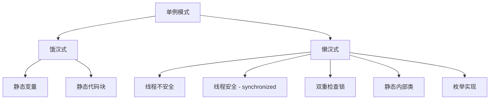

> 🎯 单例模式是面试和实际开发中最常见的设计模式之一。本文将详细介绍单例模式的概念、使用场景，以及六种不同的实现方式，包括饿汉式、懒汉式、双重检查锁等，帮助你彻底掌握这一重要的设计模式。

<!-- more -->

## 🤔 为什么需要单例模式？

在软件开发中，有些对象我们只需要一个实例，例如：

- **计数器**：整个应用中如果存在多个计数器实例，会产生数据混乱
- **配置管理器**：应用配置信息应该全局统一
- **线程池**：避免重复创建，节省系统资源
- **日志管理器**：确保日志写入的一致性
- **数据库连接池**：管理数据库连接的复用


**单例模式定义**：确保一个类只有一个实例，并提供一个全局访问点来获取该实例。


## 📊 单例模式的分类

单例模式的实现方式大体上可以分为两种：



## 🍽️ 饿汉式实现

饿汉式在类加载时就完成实例化，因此是线程安全的。

### 方式一：静态代码块

当我们想到类加载时完成实例化操作，很容易想到 `static` 关键字，可以使用静态代码块来实例化：

```java
public class Demo01 {
    private static Demo01 instance;
    
    // 私有构造函数，防止外部实例化
    private Demo01() {
    }
 
    static {
        instance = new Demo01();
    }
 
    // 对外提供一个public的方法来获取实例
    public static Demo01 getInstance() {
        return instance;
    }
    
    public static void main(String[] args) {
        Demo01 instance = Demo01.getInstance();
        Demo01 instance1 = Demo01.getInstance();
        System.out.println(instance == instance1);
        System.out.println(instance.hashCode());
        System.out.println(instance1.hashCode());
    }
}
```

**运行结果：**
```
true
1265094477
1265094477
```

### 方式二：静态变量

我们还可以使用静态变量方式来实例化：

```java
public class Demo02 {
    // 在类加载时就完成实例化
    private static Demo02 instance = new Demo02();
    
    private Demo02() {
    }
 
    // 对外提供一个public方法来获取实例
    public static Demo02 getInstance() {
        return instance;
    }
 
    public static void main(String[] args) {
        Demo02 instance = Demo02.getInstance();
        Demo02 instance1 = Demo02.getInstance();
        System.out.println(instance == instance1);
        System.out.println(instance.hashCode());
        System.out.println(instance1.hashCode());
    }
}
```


**饿汉式优点**：
- 线程安全，无需考虑多线程问题
- 实现简单，代码清晰

**饿汉式缺点**：
- 无论是否使用都会创建实例，可能造成内存浪费


## 😴 懒汉式实现

懒汉式表示在第一次需要创建实例时才会创建，可以避免内存浪费。

### 方式一：线程不安全

最基础的懒汉式实现：

```java
class Demo03 {
    private static Demo03 instance;
    
    private Demo03() {
    }
 
    // 对外提供一个获取实例的方法
    public static Demo03 getInstance() {
        // 判断该实例是否已经存在了
        // 如果存在了，就直接返回当前实例
        if (instance == null) {
            instance = new Demo03();
        }
        return instance;
    }
}
 
class Main {
    public static void main(String[] args) {
        Demo03 instance = Demo03.getInstance();
        Demo03 instance1 = Demo03.getInstance();
        System.out.println(instance == instance1);
        System.out.println(instance.hashCode());
        System.out.println(instance1.hashCode());
    }
}
```


**线程安全问题**：在多线程环境下，可能会创建多个实例！


**多线程测试代码：**

```java
class Demo03 {
    private static Demo03 instance;
    
    private Demo03() {
    }
 
    public static Demo03 getInstance() {
        if (instance == null) {
            instance = new Demo03();
        }
        return instance;
    }
}
 
class Thread01 extends Thread {
    @Override
    public void run() {
        Demo03 instance = Demo03.getInstance();
        System.out.println(instance);
    }
}
 
class Thread02 extends Thread {
    @Override
    public void run() {
        Demo03 instance = Demo03.getInstance();
        System.out.println(instance);
    }
}
 
class Main {
    public static void main(String[] args) {
        Thread01 thread01 = new Thread01();
        Thread02 thread02 = new Thread02();
        thread01.start();
        thread02.start();
    }
}
```

**运行结果：**
```
top.lukeewin.basics.demo07.Demo03@5f1db1c2
top.lukeewin.basics.demo07.Demo03@ddbeecd
```

可以看到创建了两个不同的实例！

### 方式二：线程安全 - synchronized同步锁

使用 `synchronized` 关键字解决线程安全问题：

```java
class Demo03 {
    private static Demo03 instance;
    
    private Demo03() {
    }
 
    // 使用synchronized关键字保证线程安全
    public static synchronized Demo03 getInstance() {
        if (instance == null) {
            instance = new Demo03();
        }
        return instance;
    }
}
```


**性能问题**：synchronized会降低性能，每次调用getInstance()都需要同步。


### 方式三：双重检查锁（推荐）

优化同步性能的最佳实践：

```java
class Demo03 {
    // 注意：必须使用volatile关键字
    private static volatile Demo03 instance;
    
    private Demo03() {
    }
 
    // 双重检查锁
    public static Demo03 getInstance() {
        // 第一次检查
        if (instance == null) {
            synchronized (Demo03.class) {
                // 第二次检查
                if (instance == null) {
                    instance = new Demo03();
                }
            }
        }
        return instance;
    }
}
```


**双重检查锁解释**：
1. 第一次检查：避免不必要的同步
2. 同步块：保证线程安全
3. 第二次检查：防止重复创建
4. `volatile` 关键字：防止指令重排序


### 方式四：静态内部类（推荐）

利用类加载机制保证线程安全：

```java
public class Singleton01 {
    private Singleton01() {
    }
 
    // 静态内部类
    private static class SingletonHolder {
        private static final Singleton01 INSTANCE = new Singleton01();
    }
 
    public static Singleton01 getInstance() {
        return SingletonHolder.INSTANCE;
    }
}
 
class Main03 {
    public static void main(String[] args) {
        Singleton01 instance = Singleton01.getInstance();
        Singleton01 instance1 = Singleton01.getInstance();
        System.out.println(instance == instance1);
        System.out.println(instance.hashCode());
        System.out.println(instance1.hashCode());
    }
}
```


**静态内部类优点**：
- 线程安全（由JVM保证）
- 懒加载（只有调用getInstance()时才加载内部类）
- 性能高（无需同步）


### 方式五：枚举实现（最优雅）

使用枚举类型创建单例，这是《Effective Java》推荐的方法：

```java
public enum Singleton {
    INSTANCE;
    
    // 可以添加其他方法
    public void doSomething() {
        System.out.println("执行业务逻辑");
    }
}
 
class Main02 {
    public static void main(String[] args) {
        Singleton instance = Singleton.INSTANCE;
        Singleton instance1 = Singleton.INSTANCE;
        System.out.println(instance == instance1);
        
        // 调用业务方法
        instance.doSomething();
    }
}
```


**枚举实现优点**：
- 代码简洁
- 线程安全
- 防止反射攻击
- 防止序列化破坏单例


## 🗂️ 高级实现：容器式单例

### 方式六：使用Map集合管理多个单例

当需要管理多个不同类型的单例时，可以使用容器模式：

```java
public class SingletonManager {
    // 定义一个静态Map集合存储单例
    private static Map<String, Object> objectMap = new HashMap<>();
 
    private SingletonManager() {
    }
 
    // 注册单例
    public static void registerSingleton(String singletonName, Object instance) {
        if (!objectMap.containsKey(singletonName)) {
            objectMap.put(singletonName, instance);
        }
    }
 
    // 获取单例
    public static Object getInstance(String singletonName) {
        return objectMap.get(singletonName);
    }
}
 
class Student {
    private String name;
    private int age;
    
    public Student(String name, int age) {
        this.name = name;
        this.age = age;
    }
    
    // getter和setter方法省略
}
 
class Main04 {
    public static void main(String[] args) {
        // 注册单例
        SingletonManager.registerSingleton("student", new Student("张三", 18));
        
        // 获取单例
        Object bean01 = SingletonManager.getInstance("student");
        Object bean02 = SingletonManager.getInstance("student");
        
        System.out.println(bean01 == bean02); // true
        System.out.println(bean01.hashCode());
        System.out.println(bean02.hashCode());
    }
}
```

## 📋 各种实现方式对比

| 实现方式 | 线程安全 | 懒加载 | 性能 | 推荐度 | 适用场景 |
|:---|:---:|:---:|:---:|:---:|:---|
| 饿汉式-静态变量 | ✅ | ❌ | 高 | ⭐⭐⭐ | 确定会使用的场景 |
| 饿汉式-静态代码块 | ✅ | ❌ | 高 | ⭐⭐⭐ | 需要复杂初始化逻辑 |
| 懒汉式-线程不安全 | ❌ | ✅ | 高 | ⭐ | 单线程环境 |
| 懒汉式-synchronized | ✅ | ✅ | 低 | ⭐⭐ | 不推荐使用 |
| 双重检查锁 | ✅ | ✅ | 高 | ⭐⭐⭐⭐ | 高并发环境 |
| 静态内部类 | ✅ | ✅ | 高 | ⭐⭐⭐⭐⭐ | 大多数场景 |
| 枚举实现 | ✅ | ❌ | 高 | ⭐⭐⭐⭐⭐ | 最安全的实现 |

## 🛡️ 单例模式的安全问题

### 反射攻击

```java
// 反射破坏单例
Constructor<Singleton01> constructor = Singleton01.class.getDeclaredConstructor();
constructor.setAccessible(true);
Singleton01 instance1 = constructor.newInstance();
Singleton01 instance2 = Singleton01.getInstance();
System.out.println(instance1 == instance2); // false
```

**防护措施**：在构造函数中添加检查

```java
private Singleton01() {
    if (SingletonHolder.INSTANCE != null) {
        throw new RuntimeException("不允许创建多个实例");
    }
}
```

### 序列化问题

序列化和反序列化会破坏单例，解决方法是添加 `readResolve()` 方法：

```java
private Object readResolve() {
    return getInstance();
}
```


**枚举实现天然防护**：枚举类型天然防止反射和序列化攻击，这也是推荐使用枚举的重要原因。


## 🎯 最佳实践建议

1. **首选枚举实现**：最安全、最简洁
2. **次选静态内部类**：性能好、懒加载
3. **避免synchronized方法**：性能差
4. **注意volatile关键字**：双重检查锁必须使用
5. **考虑序列化安全**：实现readResolve()方法


```java
/**
 * 生产级单例实现 - 静态内部类方式
 */
public class ProductionSingleton implements Serializable {
    private static final long serialVersionUID = 1L;
    
    private ProductionSingleton() {
        // 防止反射攻击
        if (SingletonHolder.INSTANCE != null) {
            throw new RuntimeException("单例类不允许创建多个实例");
        }
    }
    
    private static class SingletonHolder {
        private static final ProductionSingleton INSTANCE = new ProductionSingleton();
    }
    
    public static ProductionSingleton getInstance() {
        return SingletonHolder.INSTANCE;
    }
    
    // 防止序列化破坏单例
    private Object readResolve() {
        return getInstance();
    }
    
    // 业务方法
    public void doSomething() {
        System.out.println("执行业务逻辑...");
    }
}
```


## 📝 总结

单例模式是一个看似简单但实则复杂的设计模式。在实际开发中，需要根据具体场景选择合适的实现方式：

- 对于一般场景，推荐使用**静态内部类**实现
- 对于安全要求较高的场景，推荐使用**枚举**实现
- 对于高并发场景，可以考虑**双重检查锁**实现

掌握单例模式不仅有助于面试，更重要的是能够在实际项目中正确使用，避免常见的线程安全问题和性能陷阱。

希望这篇文章能够帮助你彻底理解单例模式的各种实现方式和使用场景！ 💪