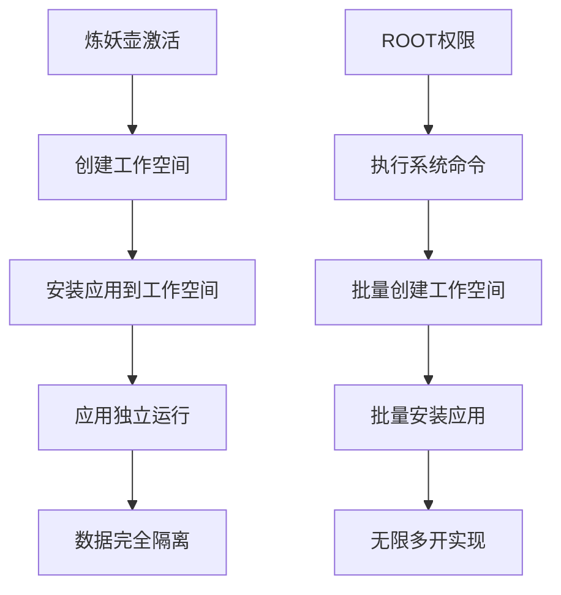
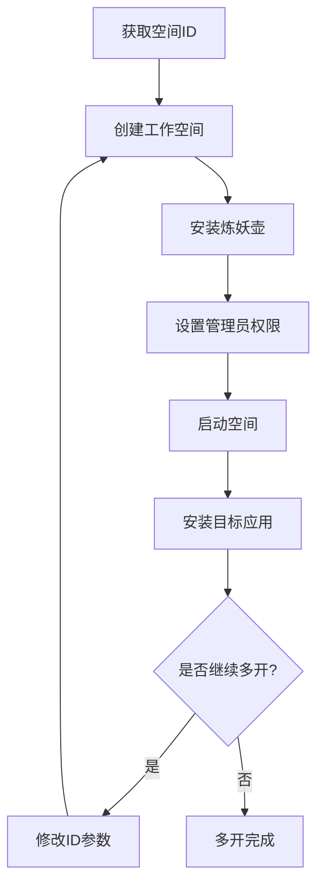

> 在安卓设备上实现应用多开一直是用户关注的热点话题。本文将详细介绍如何使用炼妖壶（Island）实现安卓应用的无限多开，通过ROOT权限和系统命令，让你的手机实现真正的应用无限分身功能。

<!-- more -->

## 📋 项目背景

在日常使用安卓手机的过程中，我们经常遇到需要同时运行多个相同应用的场景：

- 📱 **社交应用**：同时登录多个微信、QQ账号
- 💼 **游戏应用**：同时运行多个游戏副本
- 🛒 **购物应用**：同时使用多个购物账号
- 🎯 **工作生活分离**：工作和生活账号分开管理

传统的双开功能通常只能实现有限的分身，而通过炼妖壶配合ROOT权限，我们可以实现真正的无限多开。


本教程基于炼妖壶（Island）实现安卓应用无限多开，需要设备已获取ROOT权限。对于未ROOT设备，可考虑使用虚拟机替代方案。


## 🛠️ 实现原理

### 炼妖壶工作原理

炼妖壶（Island）是一款基于Android for Work机制的应用，其工作原理如下：



### 核心技术要点

1. **Android for Work**：利用系统的工作资料功能创建隔离环境
2. **PM命令**：通过Package Manager命令管理应用安装
3. **DPM命令**：通过Device Policy Manager设置设备管理员权限
4. **用户管理**：通过系统用户管理实现空间隔离

## 📝 具体实现步骤

### 第一步：激活炼妖壶

1. 📲 下载并安装炼妖壶应用
2. 🔓 打开应用并激活，同意所有权限请求
3. ✅ 激活成功后，桌面上会出现工作文件夹图标（橘黄色小提包）


首次激活时，系统会自动创建第一个工作空间（ID通常为10或14），后续操作将基于此空间进行扩展。


### 第二步：获取应用包名

1. 📁 打开MT管理器或其他文件管理工具
2. 🔍 点击左上角菜单，选择"安装包提取"
3. 🔎 搜索需要多开的应用（如EDGE浏览器）
4. 📋 复制应用的包名（如：com.microsoft.emmx）

### 第三步：获取工作空间ID

在终端中执行以下命令获取当前工作空间ID：

```bash
# 获取超级用户权限
su

# 列出所有用户空间
pm list users
```

执行结果示例：
```
Users:
        UserInfo{0:机主:13} running
        UserInfo{10:工作资料:3000010} running
```

其中`10`即为工作空间ID。

### 第四步：设置多开数量

通过以下命令设置系统支持的最大用户数量：

```bash
# 设置最大用户配置数量
setprop persist.sys.max_profiles 100
```

### 第五步：创建工作空间

使用以下命令创建工作空间：

```bash
# 创建新的工作空间
pm create-user --profileOf 0 --managed 123
```

其中`123`为自定义标识符，可任意设置。

### 第六步：安装炼妖壶到新空间

```bash
# 在指定用户空间安装炼妖壶
pm install-existing --user 19 com.oasisfeng.island
```

### 第七步：设置设备管理员权限

```bash
# 为新空间设置设备管理员权限
dpm set-profile-owner --user 19 com.oasisfeng.island/.IslandDeviceAdminReceiver
```

### 第八步：启动工作空间

```bash
# 启动指定用户空间
am start-user 19
```

### 第九步：多开应用

```bash
# 在指定用户空间安装应用
pm install-existing --user 19 com.microsoft.emmx
```

## 🔁 无限循环操作

要实现真正的无限多开，只需重复执行步骤5-9：



## 🎯 实用技巧

### 技巧1：批量创建工作空间

可以通过脚本批量创建工作空间：

```bash
#!/bin/bash
# 批量创建工作空间脚本
for i in {20..100}
do
    pm create-user --profileOf 0 --managed workspace_$i
    echo "工作空间 $i 创建完成"
done
```

### 技巧2：快速获取空间ID

```bash
# 快速获取最新创建的空间ID
pm list users | tail -1 | grep -o '[0-9]*'
```

### 技巧3：解决Code 6报错

如果遇到Code 6报错，可以尝试以下解决方案：

1. 📦 下载爱玩机工具箱
2. 🔍 搜索"多开"功能
3. ⚙️ 进入多开设置，点击右上角三点菜单
4. 🔓 选择"多开限制解除"
5. ✅ 重新执行多开操作

## 📋 常用命令汇总

| 命令 | 功能说明 |
|:---|:---|
| `su` | 获取超级用户权限 |
| `pm list users` | 列出所有用户空间 |
| `setprop persist.sys.max_profiles 100` | 设置最大用户配置数量 |
| `pm create-user --profileOf 0 --managed 123` | 创建工作空间 |
| `pm install-existing --user 19 com.package.name` | 在指定空间安装应用 |
| `dpm set-profile-owner --user 19 package/.AdminReceiver` | 设置设备管理员权限 |
| `am start-user 19` | 启动指定用户空间 |

## ⚠️ 注意事项

### 系统资源占用


无限多开会占用大量系统资源：
- 存储空间：每个工作空间占用约50-100MB
- 内存：同时运行多个应用会显著增加内存消耗
- 性能：过多的工作空间可能影响系统响应速度


### 兼容性问题

1. **系统版本**：建议Android 8.0及以上版本
2. **设备支持**：部分定制ROM可能存在兼容性问题
3. **应用限制**：某些银行类应用可能检测并拒绝在多开环境中运行

### 安全风险提示


使用ROOT权限和系统命令存在以下风险：
- 系统稳定性：不当操作可能导致系统不稳定
- 数据安全：多开环境中的数据可能面临安全风险
- 保修失效：ROOT操作会使设备失去官方保修


## 🎬 视频教程参考

相关操作演示可参考以下视频教程：

- 📺 [B站视频教程](https://www.bilibili.com/video/BV15E42137hj/?vd_source=2145442929686b6f5e136938f18fccfd)
- 🌐 [元萝卜教程](https://die.lu/)

## 📸 图片占位符


*图1：炼妖壶主界面*


*图2：工作空间创建过程*


*图3：多开应用效果展示*

## 📚 总结

通过本文介绍的方法，您可以实现安卓应用的无限多开功能。虽然操作过程相对复杂，但一旦掌握，将极大提升您在多账号管理方面的效率。

### 核心优势

- ✅ **无限扩展**：理论上可以创建无数个工作空间
- ✅ **系统级隔离**：每个应用在独立环境中运行
- ✅ **数据安全**：工作空间间数据完全隔离
- ✅ **成本低廉**：无需额外购买多开软件

### 使用建议

1. 🎯 根据实际需求创建适量工作空间
2. 💾 定期清理不需要的工作空间
3. 🔒 注意保护重要数据安全
4. 🔄 及时更新炼妖壶到最新版本


**温馨提示**：多开功能虽好，但请合理使用，避免因创建过多工作空间导致设备性能下降。建议根据实际需求创建适量的工作空间，以获得最佳使用体验。
