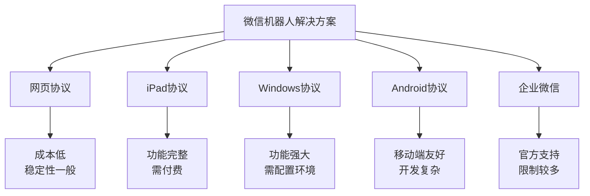

> 🤖 随着智能化办公和自动化需求的增长，微信机器人已成为提升工作效率的重要工具。本文深度对比了5大主流微信机器人解决方案，包括免费开源项目和商业化产品，帮你选择最适合的开发方案，快速构建属于自己的微信智能助手。

<!-- more -->

## 🔍 微信机器人技术概览

微信机器人是基于微信协议开发的自动化程序，能够模拟人工操作实现消息自动回复、群管理、客服接待等功能。根据实现原理不同，主要分为以下几种类型：


**选择建议**：初学者推荐从网页协议开始，商业项目建议选择付费的iPad协议或企业级解决方案。


## 🏆 五大主流解决方案详解

### 1. Wechaty - 最受欢迎的开源方案

**🔗 项目地址：** [https://github.com/wechaty/wechaty](https://github.com/wechaty/wechaty)

**⭐ GitHub Stars：** 19k+

#### 方案特点
- **用户基数最大**：拥有最活跃的社区和丰富的文档
- **多协议支持**：网页版（免费）、iPad版（付费）、企微版（付费）
- **语言支持广泛**：支持TypeScript、Python、Go、Java等多种语言
- **生态完善**：拥有丰富的插件和扩展

#### 版本对比

| 版本类型 | 价格 | 稳定性 | 功能完整度 | 推荐指数 |
|---------|------|--------|-----------|----------|
| **网页版** | 免费 | ⭐⭐⭐ | ⭐⭐⭐ | ⭐⭐⭐⭐ |
| **iPad版** | 付费 | ⭐⭐⭐⭐⭐ | ⭐⭐⭐⭐⭐ | ⭐⭐ |
| **企微版** | 付费 | ⭐⭐⭐⭐⭐ | ⭐⭐⭐⭐ | ⭐⭐⭐⭐ |


**重要提醒**：iPad付费版目前维护状态不佳，作者响应较慢，购买前请谨慎考虑。网页版适合学习和轻量级应用。


### 2. Gewechat - 个人开发的iPad免费方案

**🔗 项目地址：** [https://github.com/Devo919/Gewechat](https://github.com/Devo919/Gewechat)

**⭐ GitHub Stars：** 1k+

#### 方案特点
- **完全免费**：提供iPad协议的免费解决方案
- **API文档完整**：虽然用户较少，但文档清晰
- **个人项目**：由个人开发者维护，更新频率不定
- **轻量级**：代码简洁，易于理解和定制


**社区反馈**：虽然用户基数较小，但代码质量不错，适合有一定开发经验的用户。


### 3. WeChatApi - 企业级商业解决方案

**🔗 项目地址：** [https://github.com/WeChatAPIs/WeChatApi](https://github.com/WeChatAPIs/WeChatApi)

#### 方案特点
- **商业化产品**：提供专业的技术支持和服务保障
- **多协议支持**：Windows + Android 双协议
- **活跃维护**：持续更新，响应社区需求
- **企业级稳定性**：适合商业项目长期使用

根据社区用户反馈："比Wechaty开发稍微复杂点，需要自己搭建服务，如果功能不是很多的话，三五天也能接入完成"


**适用场景**：中小企业客服系统、营销自动化、大规模群管理等商业应用。


### 4. wechat-bot - AI集成的现代化方案

**🔗 项目地址：** [https://github.com/wangrongding/wechat-bot](https://github.com/wangrongding/wechat-bot)

**⭐ GitHub Stars：** 4k+

#### 方案特点
- **AI原生集成**：基于ChatGPT + Wechaty构建
- **开箱即用**：直接支持AI对话功能
- **现代化架构**：使用最新的技术栈
- **持续更新**：跟随AI技术发展趋势


**推荐理由**：如果你的项目需要AI对话功能，这是最直接的解决方案，无需额外集成AI服务。


### 5. wechat4u - 轻量级网页协议方案

**🔗 项目地址：** [https://github.com/nodeWechat/wechat4u](https://github.com/nodeWechat/wechat4u)

**⭐ GitHub Stars：** 3k+

#### 方案特点
- **纯网页协议**：基于微信网页版接口开发
- **轻量级设计**：代码简洁，占用资源少
- **持续维护**：项目仍在积极更新
- **学习友好**：代码结构清晰，适合学习

## 📊 方案对比矩阵

| 解决方案 | 开源程度 | 开发难度 | 稳定性 | 成本 | 社区活跃度 | 推荐场景 |
|---------|----------|----------|--------|------|------------|----------|
| **Wechaty** | ⭐⭐⭐⭐⭐ | ⭐⭐⭐ | ⭐⭐⭐⭐ | 免费/付费 | ⭐⭐⭐⭐⭐ | 通用开发 |
| **Gewechat** | ⭐⭐⭐⭐⭐ | ⭐⭐⭐ | ⭐⭐⭐ | 免费 | ⭐⭐ | 个人项目 |
| **WeChatApi** | ⭐⭐ | ⭐⭐⭐⭐ | ⭐⭐⭐⭐⭐ | 付费 | ⭐⭐⭐ | 企业应用 |
| **wechat-bot** | ⭐⭐⭐⭐⭐ | ⭐⭐ | ⭐⭐⭐⭐ | 免费 | ⭐⭐⭐⭐ | AI应用 |
| **wechat4u** | ⭐⭐⭐⭐⭐ | ⭐⭐ | ⭐⭐⭐ | 免费 | ⭐⭐⭐ | 轻量应用 |

## 🎯 选型建议

### 根据项目规模选择

**🏠 个人项目/学习用途**
- 首选：`wechat4u` 或 `Wechaty网页版`
- 优点：免费、简单、文档齐全
- 注意：功能相对基础，稳定性一般

**🏢 中小企业项目**
- 推荐：`Wechaty企微版` 或 `WeChatApi`
- 优点：功能完整、稳定性好、有技术支持
- 成本：需要一定的licensing费用

**🏭 大型商业项目**
- 建议：`WeChatApi` 或自研方案
- 优点：可定制、稳定可靠、专业支持
- 考虑：合规性、数据安全、长期维护

**🤖 AI集成需求**
- 直接选择：`wechat-bot`
- 优点：开箱即用的AI功能
- 适合：智能客服、AI助手项目

## ⚠️ 风险提醒与合规建议

### 技术风险
- **协议变更**：微信可能随时调整接口协议
- **账号封禁**：频繁操作可能导致账号受限
- **稳定性**：第三方方案存在不稳定因素

### 合规要求
- 遵守微信用户协议和使用规范
- 不得用于垃圾信息发送
- 保护用户隐私和数据安全
- 商业使用需考虑法律合规性


**重要声明**：微信机器人的使用需要严格遵守相关法律法规和平台规则，违规使用可能面临法律风险。建议优先考虑官方API或企业微信等合规方案。


## 📚 学习资源推荐

### 官方文档
- [Wechaty官方文档](https://wechaty.js.org/)
- [微信开放平台](https://developers.weixin.qq.com/)
- [企业微信API文档](https://developer.work.weixin.qq.com/)

### 社区资源
- [Wechaty中文社区](https://gitter.im/wechaty/wechaty-zh)
- [微信机器人开发交流群](https://github.com/wechaty/wechaty/discussions)

---


**🎉 总结**

微信机器人开发已经成为一个相对成熟的技术领域，无论是个人开发者还是企业用户，都能找到适合的解决方案。选择时要充分考虑项目需求、技术能力、预算成本和合规要求。

**关键建议**：
- 新手从免费方案开始学习
- 商业项目选择稳定的付费方案
- 重视数据安全和合规性
- 保持对技术发展的关注

希望本文能帮助你快速了解微信机器人开发的技术现状，选择最适合的解决方案，构建出色的智能应用！
