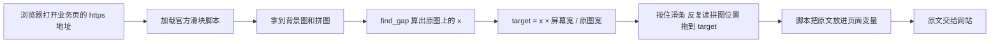
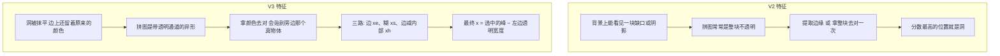
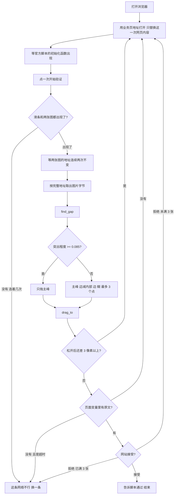
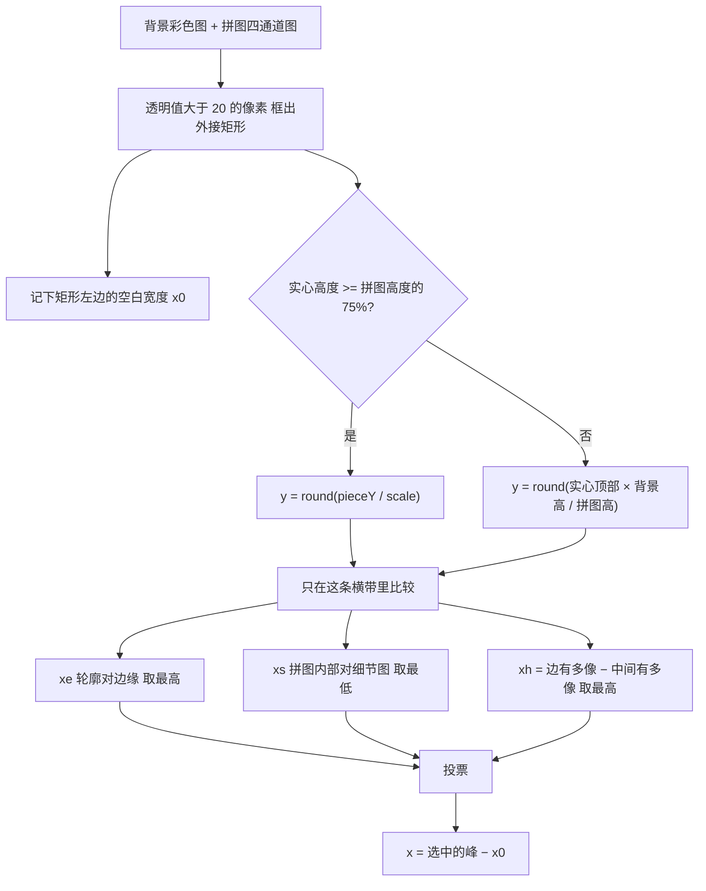
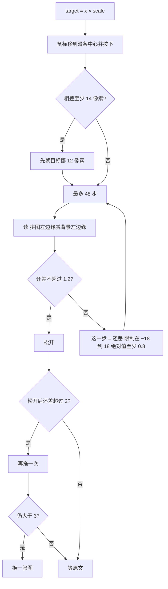

## 过滑块理论（以阿里云方案为例）

我们能看到的那种验证，基本是一张背景图，左边挂着一块拼图，底下有一条可拖拽的滑条。

<!-- more -->

## 1. 滑块是怎么出现的

这个图怎么出现、或者说怎么来的：页面里会加载阿里云的一段 JavaScript（如 `AliyunCaptcha.js`，名称不固定，但大体就是这类脚本）。脚本自己去下载背景图和拼图，用户拖动时它会计算你的位移差值，拖对了就给你一串密文。

所以写代码的话，核心就是两件事：

1. 算出缺口在哪；
2. 模拟真人拖动滑块，把拼图拖过去。

> `find_gap`、`piece_x` 这些命名不是固定的，看不懂就扔给 AI。



由此可以说明：所有那种纯 HTTP 本地解码的说法都是扯淡——除非是打码平台，那个确实可以做到。

另一种思路是：把所有的图片保存下来，一个一个去对比、标注清楚。否则就必须启动浏览器——因为要加载资源、加载环境。"补环境"这操作，其实就是不想启动浏览器才搞的。

*(PS：可能我有说得不对的地方，欢迎在评论区指出，给大家解惑。)*

## 2. V2 和 V3 的区别

区别在缺口的图，不在函数叫什么名字。



一句话总结：**V2 直接能看到边缘，拖进去就行；V3 就要注意像素值了。**

V2 的处理很简单：

```python
gray = cv2.cvtColor(bg, cv2.COLOR_BGR2GRAY)
blur = cv2.GaussianBlur(gray, (3, 3), 0)
edge = cv2.Canny(blur, 80, 160)
# piece_edge 是拼图外轮廓
score = cv2.matchTemplate(edge, piece_edge, cv2.TM_CCOEFF_NORMED)
_, _, _, peak = cv2.minMaxLoc(score)
x = peak[0]
```

V3 中，边的峰和糊的峰通常相差不超过 20 像素，投票时会取它们的平均。

依赖库就用 `opencv-python`、`numpy`（OpenCV 的 Python 模块）。

下面这些 id 一般都是官方脚本生成的：

| 元素                 | id                             |
| -------------------- | ------------------------------ |
| 背景                 | `aliyunCaptcha-img`            |
| 拼图                 | `aliyunCaptcha-puzzle`         |
| 滑条                 | `aliyunCaptcha-sliding-slider` |
| 要点一下才出现的区域 | `aliyunCaptcha-captcha-body`   |
| 换一张               | `aliyunCaptcha-btn-refresh`    |

## 3. 一般流程

下面是一般要注意的流程：



注意：点「开始验证」之前，页面上往往只有一个按钮，没有拼图。

## 4. 页面脚本

```javascript
const REGION = "cn";       // 换成你的
const PREFIX = "你的前缀";
const SCENE = "你的场景号";

window.AliyunCaptchaConfig = { region: REGION, prefix: PREFIX };
window.__cvp = "";        // 脚本给出的原文，只写第一次
window.__cerr = "";       // 失败原因
window.__cvDecision = ""; // 你告诉脚本：网站认了还是不认

function readParam(p) {
  if (typeof p === "string") return p;
  return (p && (p.captchaVerifyParam || p.CaptchaVerifyParam)) || JSON.stringify(p || {});
}

function boot() {
  initAliyunCaptcha({
    SceneId: SCENE,
    mode: "embed",
    region: REGION,
    prefix: PREFIX,
    language: "cn",
    element: "#captcha-box",
    button: "#captcha-btn",
    success(p) {
      if (!window.__cvp) window.__cvp = readParam(p);
    },
    captchaVerifyCallback(p) {
      window.__cvp = readParam(p);
      window.__cvDecision = "";
      return new Promise((resolve) => {
        const timer = setInterval(() => {
          if (window.__cvDecision === "ok") {
            clearInterval(timer);
            resolve({ captchaResult: true, bizResult: true });
          } else if (window.__cvDecision === "bad") {
            clearInterval(timer);
            resolve({ captchaResult: false, bizResult: false });
          }
        }, 200);
      });
    },
    fail(e) {
      window.__cerr = JSON.stringify(e || {});
    },
  });
}
```

脚本用官方地址加载，加载完再执行 `boot()`：

`https://o.alicdn.com/captcha-frontend/aliyunCaptcha/AliyunCaptcha.js`

这段代码跑在浏览器页面里，用来拉起阿里云官方滑块脚本，并留三个窗口变量，让外面的程序能拿走验证原文。

**三个变量**

* `__cvp`：脚本算出的验证原文。第一次成功回调只写一次，避免被后面的空值盖掉。
* `__cerr`：脚本自己报失败时，把原因存下来。
* `__cvDecision`：外面的程序写 `"ok"` 或 `"bad"`。脚本在等这个字，才决定这次验证算过还是算不过。

**`readParam`**

官方回调有时直接给字符串，有时给对象。这个函数统一取出里面的 `captchaVerifyParam`（大小写两种都认）。取不到就整段转成字符串，保证 `__cvp` 里始终是一段原文。

**`boot`**

调用官方的 `initAliyunCaptcha`，把滑块嵌进页面：

* `SceneId`、`region`、`prefix` 换成你自己的。
* `element` 是拼图容器，`button` 是「开始验证」按钮。
* `success`：脚本认为本地滑过了，若 `__cvp` 还空着，就把原文写进去。
* `captchaVerifyCallback`：用户松手后脚本会进这里。先把原文写入 `__cvp`，再每 200 毫秒看一次 `__cvDecision`。外面的程序拿这段原文去问网站，网站返回接受就写 `"ok"`，拒绝就写 `"bad"`。脚本收到后才结束这次验证。
* `fail`：脚本内部失败，原因进 `__cerr`。

## 5. 替换网页与取图

替换网页时只拦截 document，其它请求放行：

```python
def fulfill(route):
    if route.request.resource_type == "document":
        route.fulfill(status=200, content_type="text/html; charset=utf-8", body=html)
    else:
        route.continue_()

page.route("https://你的站点/**", fulfill)
page.goto("https://你的站点/出现滑块的那一页", referer="https://你的来源页/")
```

背景图、滑块图的判定标准：都加载完，地址不是空、不是同一张，而且同一对地址连续两次检查都没变。

```javascript
const key = bgUrl + "|" + pieceUrl;
if (lastKey !== key) {
  lastKey = key;
  stable = 0;
  return false;
}
stable += 1;
return stable >= 2;
```

从页面读取后面要用的数：

```javascript
const img = document.querySelector("#aliyunCaptcha-img");
const piece = document.querySelector("#aliyunCaptcha-puzzle");
const imgBox = img.getBoundingClientRect();
const pieceBox = piece.getBoundingClientRect();

const pieceX = pieceBox.x - imgBox.x;   // 拼图现在离背景左边多远，屏幕像素
const pieceY = pieceBox.y - imgBox.y;
const scale = imgBox.width / img.naturalWidth;  // 两个宽度都要大于 1
```

图片字节要用浏览器刚刚下载的那一份，键必须是带问号的完整地址。背景和拼图经常路径相同、只有问号后面不同，砍掉问号会拿到另一张图。

```python
raw = cache[full_url]  # 不要用 full_url.split("?")[0]
img = cv2.imdecode(np.frombuffer(raw, np.uint8), cv2.IMREAD_UNCHANGED)
```

`IMREAD_UNCHANGED` 用来保留透明通道。拼图变成普通彩色图后，后面的形状信息就没了。

## 6. 缺口怎么算



### 6.1 框出拼图形状

```python
alpha = piece[:, :, 3]
ys, xs = np.where(alpha > 20)
y0, y1 = int(ys.min()), int(ys.max()) + 1
x0, x1 = int(xs.min()), int(xs.max()) + 1   # x0 是左边透明有多宽
crop = piece[y0:y1, x0:x1]
mask = (crop[:, :, 3] > 20).astype(np.uint8) * 255
h, w = mask.shape
```

注意：拖的是整张拼图元素的左边缘，真正的形状在 `x0` 的右边。最后每个横坐标都要减一次 `x0`，不能减两次。

横带的上下位置：

```python
if (y1 - y0) >= piece.shape[0] * 0.75:
    y = int(round(piece_y / scale))
else:
    y = int(round(y0 * bg.shape[0] / piece.shape[0]))
if y < 0:
    y = 0
if y + h > bg.shape[0]:
    y = bg.shape[0] - h
```

搜索范围两端留出余量：

```python
pad = max(16, int(bg.shape[1] * 0.06))
right = bg.shape[1] - w - 6
```

宽度 300 的图，`0.06 × 300 = 18`，所以从第 18 列才开始找。

### 6.2 三路分算

横带切好以后，拼图从左往右扫，每一列打一个分。

```python
gray = cv2.cvtColor(bg, cv2.COLOR_BGR2GRAY)

# xe：背景先模糊再抽边，阈值 80 和 160。拼图外圈画成 1 像素的线。
edge = cv2.Canny(cv2.GaussianBlur(gray, (3, 3), 0), 80, 160)
sil = np.zeros((h, w), np.uint8)
cnts, _ = cv2.findContours(mask, cv2.RETR_EXTERNAL, cv2.CHAIN_APPROX_NONE)
cv2.drawContours(sil, cnts, -1, 255, 1)
xe_map = cv2.matchTemplate(edge[y:y + h], sil, cv2.TM_CCOEFF_NORMED)

# xs：用拼图内部去对这张细节图，最糊的地方分最低，取最低的那一列。
detail = cv2.absdiff(gray, cv2.GaussianBlur(gray, (0, 0), 2.2))
inner = cv2.erode(mask, np.ones((3, 3), np.uint8))
xs_map = cv2.matchTemplate(detail[y:y + h], np.zeros((h, w), np.uint8), cv2.TM_SQDIFF, mask=inner)

# xh：边有多像，减去中间有多像。洞在的那一列，这个差最大。
border = cv2.subtract(mask, inner)
color = bg[y:y + h]
like_border = cv2.matchTemplate(color, crop[:, :, :3], cv2.TM_CCORR_NORMED, mask=border)
like_inner = cv2.matchTemplate(color, crop[:, :, :3], cv2.TM_CCORR_NORMED, mask=inner)
xh_map = like_border - like_inner
```

`xe` 和 `xh` 取这一排里最高的那一列，`xs` 取最低的那一列。最高分如果贴在搜索范围的最左边或最右边，多半是边界，把那一头抹掉再找，最多再找两次。

还要看这个峰比旁边高出多少。把峰左右各挖掉一段，剩下的最高（`xs` 是剩下的最低）拿来比。挖掉的宽度是拼图短边的一半，最少 6 像素。差越大，这一列越站得住。

```python
rad = max(6, min(w, h) // 2)
margin = abs(peak - rival) / (abs(peak) + 1e-6)
```

`margin` 接近 0，说明旁边还有差不多高的峰。

### 6.3 三个峰合成一个 x

三路经常不指同一列。先看边和糊差多少。

```python
if abs(xe - xs) <= 20:
    agreed = round((xe + xs) / 2)
    if abs(agreed - xh) <= 16:
        best = round((agreed + xh) / 2)   # 三路都指到附近，取平均
    else:
        best = agreed                     # 边和糊已经对上，第三路先不用
    margin = max(edge_margin, smooth_margin)
elif w * h >= 4500:
    best = xs                             # 拼图很大，洞是一整片被涂平的，信糊
    margin = smooth_margin
else:
    best = xh                             # 对不上，就信边减内部
    margin = hole_margin

spread = max(xe, xs, xh) - min(xe, xs, xh)
if spread > 48:
    # 三列散开超过 48 像素，上面的投票可能投错
    # 第一名至少 0.055，并且比第二名高出 0.012，改用第一名
    if top_margin >= 0.055 and top_margin - second_margin >= 0.012:
        best = top_x
        margin = top_margin
```

投票逻辑：边和糊相差不超过 20 像素，取它们的中点。这个中点和第三路再相差不超过 16，三路一起平均。拼图宽乘高到了 4500，大块的洞是被涂平的，颜色会认成旁边的真东西，所以改信糊的那一列；面积没到，就用边减内部。

最后换算：

```python
x = best - x0
xe, xs, xh = xe - x0, xs - x0, xh - x0
margin = min(0.99, max(0.0, margin))
```

举例：峰在第 143 列，左边透明 8 像素，缺口是 `143 − 8 = 135`，这是原图上的列。页面上背景显示成 260 宽，原图是 300，比例 `scale = 260 / 300 ≈ 0.867`。鼠标要停的位置是 `135 × 0.867 ≈ 117`。拼图现在停在 4，还要再走 `117 − 4 = 113`。

记住：135 是原图上的列，117 才是屏幕上要停的位置。

突出程度不到 0.085 时，这一列不太稳，同一张图多备几个点。按主峰、边减内部、边、糊的顺序收。和已收下的点相差 10 像素以内，当成同一个。小于 12 或大于 290 的丢掉——滑条右边到不了那么远，最多留 3 个。290 是按常见滑轨写的，你的滑条更短就把 290 改小。

换下一个点之前，先把拼图拖回这一轮刚开始时的 `pieceX`，再从头拖。接着上次停的地方走，位置会对不上。

## 7. 模拟鼠标拖动



```python
def piece_x(page) -> float:
    # 拼图左边缘 − 背景左边缘，每次拖之前重新读
    ...

dest = gap_x * scale
start = piece_x(page)
if abs(dest - start) >= 14:
    mouse_dx = 12 if dest >= start else -12   # 滑条一开始常常拖不动

for _ in range(48):
    remain = dest - piece_x(page)
    if abs(remain) <= 1.2:
        break
    step = max(-18.0, min(18.0, remain))
    if abs(step) < 0.8:
        step = 0.8 if remain > 0 else -0.8
    mouse.move(step)
mouse.up()
```

## 8. 补充

以上基本上都是流程和逻辑。

始终记得：**人机验证现在一点都不难了，难的是风控机制。** 因为目前所有大厂都在增强风控——以前没有 AI，机器访问并不多，现在越来越多了，所以你会发现各大厂商都在接入人机验证。

关于风控机制，注意这几点：

- 浏览器环境
- IP
- 速率

https://github.com/miku8miku/slider-captcha-lab

阿里云滑块验证码（AliyunCaptcha）自动求解：YOLO 识别缺口 + 真人形态轨迹生成 + CDP 事件注入。

## 效果

单次通过率 78.4% → **90.9%**，风控拦截率 15.2% → **9.1%**（n=22）。


真人拖滑块不是平滑曲线。用 30 条真人轨迹对比合成轨迹训练分类器，
AUC=1.000 完美可分——教科书式的平滑曲线全是机器指纹：

| 指纹         | 真人                 | 平滑曲线          |
| ------------ | -------------------- | ----------------- |
| 峰值速度位置 | 75% 进度（末端甩鞭） | 5~20%（前载爆发） |
| 峰值速度     | ~9700 px/s           | ~1400 px/s        |
| y 路径漂移   | 38px（手臂线性漂移） | 2px（小幅振荡）   |
| 完全静止帧   | 4%                   | 0%                |
| 松手前微动作 | 0                    | 0.25（画蛇添足）  |

真人形态是「**慢逼近 → 谷底犹豫 → 末端甩鞭 → 收尾**」，
本生成器按此重构（细节见 轨迹形态理论.md与 `human_track.py` 注释）。

## 使用

```python
import asyncio
from playwright.async_api import async_playwright
from slider_cdp import solve, install_verdict_hook

async def main():
    async with async_playwright() as p:
        browser = await p.chromium.launch(headless=False)
        ctx = await browser.new_context()
        page = await ctx.new_page()
        cdp = await ctx.new_cdp_session(page)
        await install_verdict_hook(page)
        await page.goto("https://your-site-with-captcha.com")
        # ... 触发滑块弹出 ...
        passed, meta = await solve(ctx, page, cdp)

asyncio.run(main())
```

## 文件

| 文件                                               | 说明                                          |
| -------------------------------------------------- | --------------------------------------------- |
| `slider_cdp.py`                                    | 求解库：识别 → 轨迹 → 注入 → 判定             |
| `human_track.py`                                   | 轨迹生成器（核心算法）                        |
| `track_features.py`                                | 59 维形态特征                                 |
| `record_human_drag.py`                             | 真人轨迹采集                                  |
| `train_shape_scorer.py` / `shape_gap_diagnosis.py` | 人/机分类器诊断闭环                           |
| `calib_cdp.py`                                     | 位移响应模型标定（`piece.left = A·m + B·m²`） |

判定码：**T001** 通过 · **F001** 风控拦截 · **F015** 位置误差

## 安装

```bash
pip install -r requirements.txt
playwright install chromium
```

- `captcha-recognizer` 提供 YOLO 缺口识别（自带模型权重）
- 换站点时先用 `calib_cdp.py` 标定该站的位移响应系数（`slider_cdp.py` 顶部的 `A_CDP/B_CDP`）


