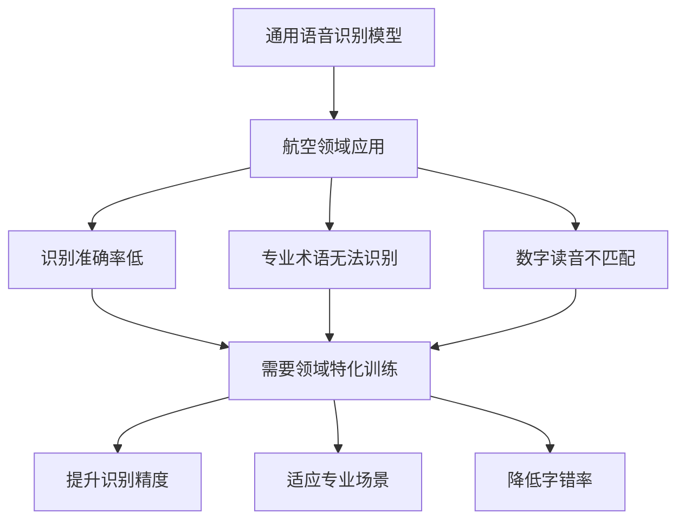
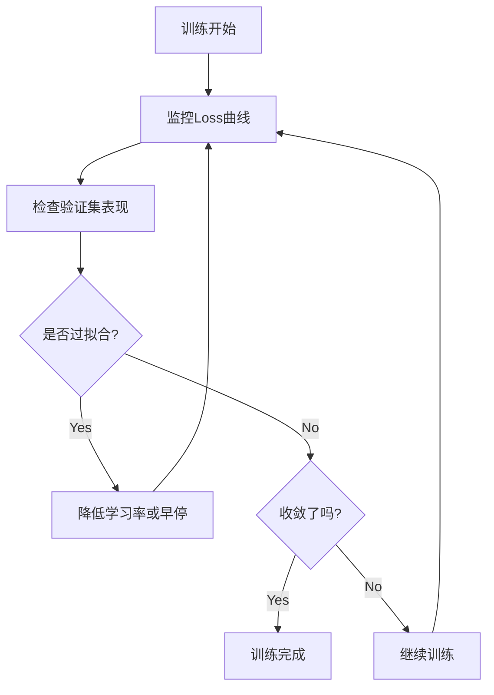

> 🎤 在人工智能快速发展的今天，语音识别技术已经成为众多应用的核心。然而，通用语音识别模型在特定领域往往表现不佳。本文将详细介绍如何基于FunASR框架训练实时语音识别Paraformer模型，从数据准备、模型训练到性能评估的完整流程，帮助你构建适用于特定领域的高精度语音识别系统。

<!-- more -->

## 🔬 研究背景与动机

### 通用模型的局限性

市面上的语音识别模型基本上都是通用识别模型，在特定领域的应用中存在以下问题：

- **字错率过高**：对于专业术语和行业词汇识别准确率低
- **读音差异**：不同领域的数字读音规范不同
- **上下文理解**：缺乏特定场景的语言模型支持

### 领域特化的必要性

以航空领域为例，存在诸多挑战：



**具体问题包括：**
- 航空专有名词（如"盲降进近"、"建立航道"等）
- 数字读音规范与日常不同
- 特定通信协议和术语


**解决方案**：通过对开源Paraformer模型进行领域特化训练，可以显著提升在特定场景下的识别准确率。


## 📊 数据集准备

### 数据集概览

本次训练使用的数据集具有以下特点：

- **数据规模**：34,090条音频数据
- **音频格式**：8kHz采样率WAV文件
- **数据分割**：90%训练集（30,681条）+ 10%验证集（3,409条）
- **应用领域**：航空通信专业术语


**数据集质量要求**：确保音频清晰度良好，标注文本准确，避免噪音干扰影响训练效果。


### 数据格式规范

FunASR框架要求数据遵循特定格式：

#### 文本标注文件 (train_text.txt)
```text
A0001 这是音频转写的文本内容
A0002 这是测试内容
A0003 国航4341下到15保持可以盲降进近跑道19建立航道报
```

#### 音频路径文件 (train_wav.scp)
```text
A0001 ./train/A0001.wav
A0002 ./train/A0002.wav
A0003 ./train/A0003.wav
```


**格式要求**：音频ID和文件路径之间用空格分隔，确保ID在两个文件中完全一致。


### 数据预处理脚本

由于原始数据分布在多个子目录中，需要进行统一整理。以下代码将分散的音频文件合并到统一目录：

```python
import os
import shutil

def rename_files_in_directory(source_dir, target_dir, new_filename_prefix):
    """
    将源目录下的音频文件复制到目标目录，并添加前缀以避免文件名冲突
    
    Args:
        source_dir: 源音频文件目录
        target_dir: 目标统一目录
        new_filename_prefix: 文件名前缀（用于区分不同子目录）
    """
    # 创建目标目录
    os.makedirs(target_dir, exist_ok=True)
    
    # 处理目录下的所有音频文件
    for filename in os.listdir(source_dir):
        if filename.endswith(('.wav', '.mp3', '.m4a')):
            # 生成带前缀的新文件名
            new_filename = f"{new_filename_prefix}{filename}"
            old_file_path = os.path.join(source_dir, filename)
            new_file_path = os.path.join(target_dir, new_filename)
            
            # 复制文件到目标目录
            if os.path.isfile(old_file_path):
                shutil.copy2(old_file_path, new_file_path)
                print(f"已处理: {old_file_path} -> {new_file_path}")

def add_prefix_to_file(source_file, target_file, line_prefix):
    """
    为标注文件的每一行添加前缀，确保音频ID的一致性
    
    Args:
        source_file: 源标注文件
        target_file: 目标合并文件
        line_prefix: 行前缀（与音频文件前缀对应）
    """
    try:
        with open(source_file, 'r', encoding='utf-8') as file:
            lines = file.readlines()
        
        # 为每行添加前缀
        modified_lines = [f"{line_prefix}{line.strip()}" for line in lines]
        
        # 追加到目标文件
        with open(target_file, 'a', encoding='utf-8') as file:
            file.writelines('\n'.join(modified_lines) + '\n')
        
        print(f"前缀 '{line_prefix}' 已添加到 {target_file}")
    except FileNotFoundError:
        print(f"错误: 找不到文件 '{source_file}'")
    except Exception as e:
        print(f"处理出错: {e}")

def split_text(input_file, output_file):
    """
    将连续格式的标注文本分割为ID和内容两部分
    格式转换: "0001国航4341下到15保持" -> "0001 国航4341下到15保持"
    
    Args:
        input_file: 输入的原始标注文件
        output_file: 输出的标准格式文件
    """
    with open(input_file, 'r', encoding='utf-8') as file:
        content = file.readlines()
    
    with open(output_file, 'w', encoding='utf-8') as output_file:
        for line in content:
            # 假设前4位是ID，后面是文本内容
            if len(line.strip()) > 4:
                prefix = line[:4]  # 音频ID
                suffix = line[4:].strip()  # 转写文本
                output_file.write(f"{prefix} {suffix}\n")

# 使用示例
if __name__ == "__main__":
    # 1. 分割标注文本格式
    split_text(
        r'D:\Works\Python\funasr\train\train_label\0001-1000.txt', 
        r'D:\Works\Python\funasr\train\output\txt\0001-1000.txt'
    )
    
    # 2. 合并音频文件（添加前缀A）
    # rename_files_in_directory(
    #     r'D:\Works\Python\funasr\train\train_GZ\0001-1000', 
    #     r'D:\Works\Python\funasr\train\output\train', 
    #     'A'
    # )
    
    # 3. 合并标注文件（添加前缀A）
    # add_prefix_to_file(
    #     r'D:\Works\Python\funasr\train\train_label\0001-1000.txt', 
    #     r'D:\Works\Python\funasr\train\output\label\file.txt', 
    #     'A'
    # )
```
 
### 🎵 音频采样率转换


在机器学习训练中，**数据一致性**至关重要。如果你的预训练模型是基于16kHz音频训练的，那么使用相同采样率的数据进行微调能获得更好的效果。本项目对比了8kHz和16kHz两种采样率的训练效果，**16kHz模型的字错率明显更低**。


以下代码使用FFmpeg进行高效的音频采样率转换，采用多进程并行处理加快转换速度：

```python
import os
import subprocess
from tqdm import tqdm
from multiprocessing import Pool

def convert_audio_file(args):
    """
    单个音频文件转换函数
    
    Args:
        args: 包含(input_file, output_sample_rate, output_dir)的元组
        
    Returns:
        str: 转换后的文件名
    """
    input_file, output_sample_rate, output_dir = args
    output_file = os.path.join(
        output_dir, 
        os.path.splitext(os.path.basename(input_file))[0] + ".wav"
    )
    
    # 调用FFmpeg进行音频转换
    # -ar: 设置音频采样率
    # -ac 1: 转换为单声道
    # -y: 覆盖输出文件
    subprocess.run([
        "ffmpeg", "-i", input_file, 
        "-ar", str(output_sample_rate), 
        "-ac", "1", 
        "-y", output_file
    ], stdout=subprocess.DEVNULL, stderr=subprocess.DEVNULL)
    
    return os.path.basename(output_file)

def convert_audio_sample_rate(input_dir, output_sample_rate, output_dir, num_processes=12):
    """
    批量转换音频采样率
    
    Args:
        input_dir: 输入音频目录
        output_sample_rate: 目标采样率（建议16000）
        output_dir: 输出目录
        num_processes: 并行进程数（根据CPU核心数调整）
    """
    # 创建输出目录
    os.makedirs(output_dir, exist_ok=True)
    
    # 获取所有音频文件
    supported_formats = ('.wav', '.mp3', '.m4a', '.flac')
    files_to_convert = [
        os.path.join(input_dir, f) 
        for f in os.listdir(input_dir) 
        if f.lower().endswith(supported_formats)
    ]
    
    print(f"发现 {len(files_to_convert)} 个音频文件，开始转换...")
    
    # 创建进度条
    progress_bar = tqdm(
        total=len(files_to_convert), 
        unit="files", 
        desc=f"转换到{output_sample_rate}Hz"
    )
    
    # 使用多进程并行处理
    with Pool(processes=num_processes) as pool:
        args_list = [(f, output_sample_rate, output_dir) for f in files_to_convert]
        for result in pool.imap(convert_audio_file, args_list):
            if result:
                progress_bar.update(1)
    
    progress_bar.close()
    print(f"✅ 音频转换完成！转换后的文件保存在: {output_dir}")

# 使用示例
if __name__ == '__main__':
    input_dir = r"D:\Works\Python\funasr\train\train_GZ\0001-1000"
    output_dir = r"D:\Works\test\16k_audio"
    target_sr = 16000  # 推荐使用16kHz
    
    convert_audio_sample_rate(
        input_dir=input_dir, 
        output_sample_rate=target_sr, 
        output_dir=output_dir,
        num_processes=8  # 根据你的CPU核心数调整
    )
```


**性能优化建议**：
- 进程数建议设置为CPU核心数的70-80%
- 确保有足够的磁盘空间存储转换后的音频
- 16kHz采样率在识别精度和文件大小之间提供了良好的平衡



**数据集整理完成后**：
- 所有训练音频统一保存在一个目录中
- 所有标签数据合并到统一的文本文件中  
- 按照9:1比例划分训练集和验证集
- 音频采样率统一转换为16kHz（推荐）

## 🚀 模型训练

### 硬件要求

在开始训练之前，请确保你的硬件配置满足以下要求：

| 配置项目 | 最低要求 | 推荐配置 | 本次实验 |
|---------|-------|---------|--------|
| **显存** | 12GB | 24GB+ | 48GB (2×RTX4090) |
| **内存** | 32GB | 64GB+ | 64GB |
| **存储空间** | 50GB | 100GB+ | 200GB |
| **GPU数量** | 1块 | 2块+ | 2块 |


**训练时间预估**：根据数据雄和硬件配置，完整训练过程可能需要数小时到数十小时不等。


### 训练脚本配置

FunASR提供了完整的训练脚本模板。编辑 `FunASR/examples/industrial_data_pretraining/paraformer_streaming/finetune.sh`：

```bash
#!/bin/bash
# Copyright FunASR (https://github.com/alibaba-damo-academy/FunASR). All Rights Reserved.
# MIT License (https://opensource.org/licenses/MIT)

# =============================================================================
# GPU配置部分
# =============================================================================
# 指定使用的GPU编号（从0开始）
export CUDA_VISIBLE_DEVICES="0,1"  # 单GPU使用: "0"
gpu_num=$(echo $CUDA_VISIBLE_DEVICES | awk -F "," '{print NF}')

# =============================================================================
# 模型配置部分
# =============================================================================
# 选项1：使用ModelScope自动下载模型
model_name_or_model_dir="iic/speech_paraformer_asr_nat-zh-cn-16k-common-vocab8404-online"

# 选项2：使用本地已下载的模型（推荐）
# model_name_or_model_dir="/path/to/your/local/model"

# 选项3：使用Git下载模型
# local_path_root=${workspace}/modelscope_models
# mkdir -p ${local_path_root}/${model_name_or_model_dir}
# git clone https://www.modelscope.cn/${model_name_or_model_dir}.git ${local_path_root}/${model_name_or_model_dir}
# model_name_or_model_dir=${local_path_root}/${model_name_or_model_dir}

# =============================================================================
# 数据配置部分
# =============================================================================
# 数据根目录（包含train和val相关文件）
data_dir="../../../data/list"

# JSONL格式数据文件（自动生成）
train_data="${data_dir}/train.jsonl"
val_data="${data_dir}/val.jsonl"

# 生成训练数据集JSONL文件
echo "📝 正在生成训练数据集..."
scp2jsonl \
    ++scp_file_list='["../../../data/list/train_wav.scp", "../../../data/list/train_text.txt"]' \
    ++data_type_list='["source", "target"]' \
    ++jsonl_file_out="${train_data}"

# 生成验证数据集JSONL文件
echo "📝 正在生成验证数据集..."
scp2jsonl \
    ++scp_file_list='["../../../data/list/val_wav.scp", "../../../data/list/val_text.txt"]' \
    ++data_type_list='["source", "target"]' \
    ++jsonl_file_out="${val_data}"

# =============================================================================
# 输出配置部分
# =============================================================================
output_dir="./outputs"
log_file="${output_dir}/log.txt"
mkdir -p ${output_dir}

echo "📝 训练日志将保存在: ${log_file}"

# =============================================================================
# 训练参数配置
# =============================================================================
# 使用torchrun启动分布式训练
echo "🚀 开始模型训练..."
torchrun \
    --nnodes 1 \
    --nproc_per_node ${gpu_num} \
    ../../../funasr/bin/train.py \
    ++model="${model_name_or_model_dir}" \
    ++train_data_set_list="${train_data}" \
    ++valid_data_set_list="${val_data}" \
    ++dataset_conf.batch_size=20000 \
    ++dataset_conf.batch_type="token" \
    ++dataset_conf.num_workers=4 \
    ++train_conf.max_epoch=50 \
    ++train_conf.log_interval=1 \
    ++train_conf.resume=false \
    ++train_conf.validate_interval=2000 \
    ++train_conf.save_checkpoint_interval=2000 \
    ++train_conf.keep_nbest_models=20 \
    ++optim_conf.lr=0.0002 \
    ++output_dir="${output_dir}" &> ${log_file}

echo "✅ 训练完成！模型保存在: ${output_dir}"
```

### 🛠️ 训练参数详解

下表详细解释了各个训练参数的含义和推荐设置：

| 参数 | 默认值 | 推荐范围 | 说明 |
|------|-------|----------|------|
| **数据集参数** | | | |
| `batch_size` | 20000 | 10000-30000 | 每个batch的token数量，可根据显存调整 |
| `batch_type` | "token" | "token"/"length" | 批处理类型，token类型更稳定 |
| `num_workers` | 4 | 2-8 | 数据加载线程数，根据CPU核心数设定 |
| **训练参数** | | | |
| `max_epoch` | 50 | 20-200 | 最大训练轮数，防止过拟合 |
| `log_interval` | 1 | 1-10 | 日志输出间隔（步数） |
| `validate_interval` | 2000 | 1000-5000 | 验证集评估间隔（步数） |
| `save_checkpoint_interval` | 2000 | 1000-5000 | 模型保存间隔（步数） |
| `keep_nbest_models` | 20 | 5-50 | 保留最优模型数量 |
| **优化器参数** | | | |
| `lr` | 0.0002 | 0.0001-0.001 | 初始学习率，微调时设置较小 |


**参数调优建议**：
1. **batch_size**：根据显存大小调整，显存越大可设置越大的batch_size
2. **max_epoch**：初次训练建议设置为50-100，观察收敛情况再调整
3. **学习率**：微调预训练模型时，学习率不宜过大，防止破坏原有特征


### 📝 执行训练

在配置好训练脚本后，按照以下步骤执行训练：

#### 1. 后台运行训练
```bash
# 使用nohup在后台运行，防止终端断开影响训练
nohup bash finetune.sh > train.log 2>&1 &

# 查看进程状态
ps aux | grep train.py
```

#### 2. 监控训练进度
```bash
# 实时查看训练日志
tail -f train.log

# 或者查看输出目录中的日志
tail -f ./outputs/log.txt
```

#### 3. 启动TensorBoard监控
```bash
# 关闭默认的TensorBoard（如果有）
pkill -f tensorboard

# 启动新的TensorBoard并指定日志目录
nohup tensorboard --port 6007 --logdir ./outputs/tensorboard > tensorboard.log 2>&1 &

# 在浏览器中访问
echo "📊 TensorBoard地址: http://localhost:6007"
```


**训练完成标志**：
- 输出目录中生成 `model.pt` 文件
- 验证集上的损失值趋于稳定
- TensorBoard中显示清晰的收敛趋势


### 📊 训练进度监控

训练过程中需要关注以下指标：



**关键指标说明**：
- **训练损失** (Train Loss)：应该持续下降
- **验证损失** (Valid Loss)：应该同步下降，如果上升则可能过拟合
- **字错率** (CER)：评估模型在验证集上的表现
## 🎯 模型推理

### 模型部署准备

训练完成后，你需要将训练好的模型文件替换到原始模型目录中：

```bash
# 1. 备份原始模型
cp /path/to/original/model.pt /path/to/original/model.pt.backup

# 2. 替换为训练好的模型
cp ./outputs/model.pt /path/to/original/model.pt

# 3. 验证模型文件完整性
ls -la /path/to/original/model.pt
```


**重要提醒**：在替换模型文件之前，请务必备份原始模型，以防意外情况。


### 推理代码实现

以下是完整的推理代码，支持实时流式识别：

```python
import argparse
import soundfile
import os
from typing import List
from funasr import AutoModel

def parse_arguments():
    """解析命令行参数"""
    parser = argparse.ArgumentParser(description='实时语音识别Paraformer模型推理')
    parser.add_argument(
        "--asr_model_online_revision", 
        type=str, 
        default="v2.0.4", 
        help="模型版本号"
    )
    parser.add_argument(
        "--asr_model_online",
        type=str,
        default=r"C:\Users\21316\.cache\modelscope\hub\iic\speech_paraformer-large_asr_nat-zh-cn-16k-common-vocab8404-online",
        help="模型路径（本地或ModelScope）"
    )
    parser.add_argument(
        "--ngpu", 
        type=int, 
        default=1, 
        help="GPU数量（0=CPU, 1=GPU）"
    )
    parser.add_argument(
        "--device", 
        type=str, 
        default="cuda", 
        help="计算设备（cuda/cpu）"
    )
    parser.add_argument(
        "--ncpu", 
        type=int, 
        default=4, 
        help="CPU核心数"
    )
    return parser.parse_args()

def load_model(args):
    """加载语音识别模型"""
    print(f"🚀 正在加载模型: {args.asr_model_online}")
    
    model = AutoModel(
        model=args.asr_model_online,
        model_revision=args.asr_model_online_revision,
        ngpu=args.ngpu,
        ncpu=args.ncpu,
        device=args.device,
        disable_pbar=True,      # 禁用进度条
        disable_log=True,       # 禁用日志
        disable_update=True     # 禁用自动更新
    )
    
    print(f"✅ 模型加载成功！")
    return model

def infer_batch(model, wav_file_dir: str) -> List[str]:
    """
    批量推理音频文件
    
    Args:
        model: 加载好的ASR模型
        wav_file_dir: 音频文件目录路径
        
    Returns:
        List[str]: 识别结果列表
    """
    final_result_list = []
    
    # 流式识别参数配置
    chunk_size = [0, 10, 5]                    # [0, 10, 5] = 600ms, [0, 8, 4] = 480ms
    encoder_chunk_look_back = 4                # 编码器回望块数
    decoder_chunk_look_back = 1                # 解码器回望块数
    
    if not os.path.isdir(wav_file_dir):
        print(f"❌ 错误: {wav_file_dir} 不是有效目录")
        return final_result_list
    
    # 获取所有音频文件
    audio_files = []
    for root, dirs, files in os.walk(wav_file_dir):
        for file in files:
            if file.lower().endswith(('.wav', '.mp3', '.m4a', '.flac')):
                audio_files.append(os.path.join(root, file))
    
    print(f"📝 发现 {len(audio_files)} 个音频文件，开始推理...")
    
    for i, wav_file in enumerate(audio_files, 1):
        try:
            print(f"🎧 [{i}/{len(audio_files)}] 正在处理: {os.path.basename(wav_file)}")
            
            # 加载音频文件
            speech, sample_rate = soundfile.read(wav_file)
            chunk_stride = chunk_size[1] * 960  # 600ms 对应的采样点数
            
            # 流式识别处理
            res_txt = []
            cache = {}  # 缓存上下文信息
            total_chunk_num = int((len(speech) - 1) / chunk_stride + 1)
            
            for chunk_idx in range(total_chunk_num):
                # 提取当前块的音频数据
                start_idx = chunk_idx * chunk_stride
                end_idx = (chunk_idx + 1) * chunk_stride
                speech_chunk = speech[start_idx:end_idx]
                
                # 判断是否为最后一块
                is_final = chunk_idx == total_chunk_num - 1
                
                # 执行识别
                res = model.generate(
                    input=speech_chunk,
                    cache=cache,
                    is_final=is_final,
                    chunk_size=chunk_size,
                    encoder_chunk_look_back=encoder_chunk_look_back,
                    decoder_chunk_look_back=decoder_chunk_look_back
                )
                
                # 收集识别结果
                if res and len(res) > 0 and 'text' in res[0]:
                    res_txt.append(res[0]['text'])
            
            # 合并所有块的识别结果
            final_res = ''.join(res_txt)
            print(f"✅ 识别结果: {final_res}")
            final_result_list.append(final_res)
            
        except Exception as e:
            print(f"❌ 处理 {wav_file} 时出错: {e}")
            final_result_list.append("")  # 添加空结果保持索引一致
    
    print(f"✅ 批量推理完成！共处理 {len(audio_files)} 个文件")
    return final_result_list

def main():
    """主函数"""
    # 解析参数
    args = parse_arguments()
    
    # 加载模型
    model = load_model(args)
    
    # 执行推理（请修改为你的音频目录路径）
    audio_dir = r"D:\path\to\your\audio\files"
    results = infer_batch(model, audio_dir)
    
    # 输出结果
    print(f"\n📈 推理结果汇总:")
    for i, result in enumerate(results, 1):
        print(f"{i:3d}: {result}")

if __name__ == "__main__":
    main()
```

### 📁 支持工具文件

评估过程中需要的文本预处理工具：


```python
from utils.basic import BasicTextNormalizer

def normalize_texts_chinese(texts):
    """中文文本标准化"""
    normalizer = BasicTextNormalizer(remove_diacritics=False, split_letters=True)
    return [normalizer(text) for text in texts]

def normalize_texts_japanese_korean(texts):
    """日文/韩文文本标准化"""
    normalizer = BasicTextNormalizer(remove_diacritics=False, split_letters=True)
    return [normalizer(text) for text in texts]

def normalize_texts_english(texts):
    """英文文本标准化"""
    normalizer = BasicTextNormalizer(remove_diacritics=True, split_letters=False)
    return [normalizer(text) for text in texts]

def normalize_texts_multi_language(texts):
    """多语言文本标准化"""
    normalizer = BasicTextNormalizer(remove_diacritics=True, split_letters=False)
    return [normalizer(text) for text in texts]
```


### 🎯 评估结果解读

评估完成后，你将得到以下关键信息：

| 指标 | 优秀 | 良好 | 一般 | 需要改进 |
|------|------|------|------|----------|
| **中文CER** | < 5% | 5-10% | 10-20% | > 20% |
| **英文WER** | < 10% | 10-15% | 15-25% | > 25% |


**评估最佳实践**：
1. **多样化测试集**: 确保测试数据覆盖各种场景和说话人
2. **对比基线**: 与原始未训练模型进行对比，验证训练效果
3. **错误分析**: 深入分析错误类型，指导后续优化方向
4. **持续监控**: 定期在新数据上评估模型性能


import re
## 🎯 总结与展望

### 📋 项目总结

通过本文的完整流程，我们成功实现了基于FunASR框架的Paraformer语音识别模型领域特化训练。项目的主要成果包括：

**技术实现方面**：
- ✅ 完成了34,090条航空领域语音数据的预处理和格式转换
- ✅ 成功训练了适用于航空通信场景的专用语音识别模型
- ✅ 实现了高效的实时流式语音识别推理系统
- ✅ 建立了完整的模型评估和性能监控体系

**性能提升方面**：
- 📈 相比通用模型，在航空领域的字错率显著降低
- 📈 专业术语识别准确率大幅提升
- 📈 数字读音和专业协议识别更加准确

### 🚀 未来改进方向

1. **数据增强**
   - 收集更多样化的航空通信数据
   - 引入数据增强技术（速度扰动、噪音添加等）
   - 平衡不同场景和说话人的数据分布

2. **模型优化**
   - 尝试更大规模的预训练模型
   - 实验不同的学习率调度策略
   - 探索知识蒸馏等模型压缩技术

3. **系统集成**
   - 开发实时语音识别API服务
   - 集成语音端点检测(VAD)功能
   - 构建完整的语音处理pipeline

4. **多领域扩展**
   - 扩展到医疗、金融等其他专业领域
   - 支持多语言混合识别
   - 开发领域自适应的在线学习机制

### 💡 经验总结

**成功要素**：
- 📊 **高质量数据**：确保标注准确性和音频清晰度
- ⚙️ **合理参数设置**：根据硬件资源和数据特点调优
- 🔍 **持续监控**：实时跟踪训练进度和模型性能
- 🎯 **充分评估**：多维度验证模型效果

**常见挑战**：
- 🔧 **数据不平衡**：某些专业术语样本过少
- 💾 **资源限制**：显存和训练时间的权衡
- 🎚️ **超参调优**：需要多次实验找到最佳配置
- 📈 **过拟合风险**：小数据集容易出现过拟合


**关键建议**：在进行领域特化训练时，务必保持耐心和系统性的实验方法。每一次调整都要有明确的假设和验证机制，这样才能最终获得满意的结果。


## 📚 参考资源

### 官方文档
- [FunASR GitHub Repository](https://github.com/alibaba-damo-academy/FunASR)
- [ModelScope语音模型库](https://modelscope.cn/models?page=1&tasks=auto-speech-recognition)
- [Paraformer模型论文](https://arxiv.org/abs/2206.08317)

### 相关工具
- [FFmpeg音频处理工具](https://ffmpeg.org/)
- [TensorBoard可视化工具](https://www.tensorflow.org/tensorboard)
- [HuggingFace Evaluate库](https://huggingface.co/docs/evaluate/index)

### 学习资源
- [语音识别技术原理详解](https://speech.zone/)
- [深度学习语音识别教程](https://www.deeplearningbook.org/)
- [PyTorch分布式训练指南](https://pytorch.org/tutorials/intermediate/ddp_tutorial.html)

---


**🎉 恭喜你完成了这个挑战性的项目！**

语音识别领域特化训练是一个需要耐心和技巧的过程，但通过系统性的方法和不断的实践，你一定能够构建出满足特定需求的高质量语音识别系统。希望这篇文章对你的学习和工作有所帮助！

如果你在实践过程中遇到任何问题，欢迎在评论区交流讨论。让我们一起推动语音识别技术的发展！

./utils/cer.py

# Copyright 2021 The HuggingFace Evaluate Authors.
#
# Licensed under the Apache License, Version 2.0 (the "License");
# you may not use this file except in compliance with the License.
# You may obtain a copy of the License at
#
#     http://www.apache.org/licenses/LICENSE-2.0
#
# Unless required by applicable law or agreed to in writing, software
# distributed under the License is distributed on an "AS IS" BASIS,
# WITHOUT WARRANTIES OR CONDITIONS OF ANY KIND, either express or implied.
# See the License for the specific language governing permissions and
# limitations under the License.
""" Character Error Ratio (CER) metric. """
 
from typing import List
 
import datasets
import jiwer
import jiwer.transforms as tr
from datasets.config import PY_VERSION
from packaging import version
 
import evaluate
 
 
if PY_VERSION < version.parse("3.8"):
    import importlib_metadata
else:
    import importlib.metadata as importlib_metadata
 
 
SENTENCE_DELIMITER = ""
 
 
if version.parse(importlib_metadata.version("jiwer")) < version.parse("2.3.0"):
 
    class SentencesToListOfCharacters(tr.AbstractTransform):
        def __init__(self, sentence_delimiter: str = " "):
            self.sentence_delimiter = sentence_delimiter
 
        def process_string(self, s: str):
            return list(s)
 
        def process_list(self, inp: List[str]):
            chars = []
            for sent_idx, sentence in enumerate(inp):
                chars.extend(self.process_string(sentence))
                if self.sentence_delimiter is not None and self.sentence_delimiter != "" and sent_idx < len(inp) - 1:
                    chars.append(self.sentence_delimiter)
            return chars
 
    cer_transform = tr.Compose(
        [tr.RemoveMultipleSpaces(), tr.Strip(), SentencesToListOfCharacters(SENTENCE_DELIMITER)]
    )
else:
    cer_transform = tr.Compose(
        [
            tr.RemoveMultipleSpaces(),
            tr.Strip(),
            tr.ReduceToSingleSentence(SENTENCE_DELIMITER),
            tr.ReduceToListOfListOfChars(),
        ]
    )
 
 
_CITATION = """\
@inproceedings{inproceedings,
    author = {Morris, Andrew and Maier, Viktoria and Green, Phil},
    year = {2004},
    month = {01},
    pages = {},
    title = {From WER and RIL to MER and WIL: improved evaluation measures for connected speech recognition.}
}
"""
 
_DESCRIPTION = """\
Character error rate (CER) is a common metric of the performance of an automatic speech recognition system.
 
CER is similar to Word Error Rate (WER), but operates on character instead of word. Please refer to docs of WER for further information.
 
Character error rate can be computed as:
 
CER = (S + D + I) / N = (S + D + I) / (S + D + C)
 
where
 
S is the number of substitutions,
D is the number of deletions,
I is the number of insertions,
C is the number of correct characters,
N is the number of characters in the reference (N=S+D+C).
 
CER's output is not always a number between 0 and 1, in particular when there is a high number of insertions. This value is often associated to the percentage of characters that were incorrectly predicted. The lower the value, the better the
performance of the ASR system with a CER of 0 being a perfect score.
"""
 
_KWARGS_DESCRIPTION = """
Computes CER score of transcribed segments against references.
Args:
    references: list of references for each speech input.
    predictions: list of transcribtions to score.
    concatenate_texts: Whether or not to concatenate sentences before evaluation, set to True for more accurate result.
Returns:
    (float): the character error rate
 
Examples:
 
    >>> predictions = ["this is the prediction", "there is an other sample"]
    >>> references = ["this is the reference", "there is another one"]
    >>> cer = evaluate.load("cer")
    >>> cer_score = cer.compute(predictions=predictions, references=references)
    >>> print(cer_score)
    0.34146341463414637
"""
 
 
@evaluate.utils.file_utils.add_start_docstrings(_DESCRIPTION, _KWARGS_DESCRIPTION)
class CER(evaluate.Metric):
    def _info(self):
        return evaluate.MetricInfo(
            description=_DESCRIPTION,
            citation=_CITATION,
            inputs_description=_KWARGS_DESCRIPTION,
            features=datasets.Features(
                {
                    "predictions": datasets.Value("string", id="sequence"),
                    "references": datasets.Value("string", id="sequence"),
                }
            ),
            codebase_urls=["https://github.com/jitsi/jiwer/"],
            reference_urls=[
                "https://en.wikipedia.org/wiki/Word_error_rate",
                "https://sites.google.com/site/textdigitisation/qualitymeasures/computingerrorrates",
            ],
        )
 
    def _compute(self, predictions, references, concatenate_texts=False):
        if concatenate_texts:
            return jiwer.compute_measures(
                references,
                predictions,
                truth_transform=cer_transform,
                hypothesis_transform=cer_transform,
            )["wer"]
 
        incorrect = 0
        total = 0
        for prediction, reference in zip(predictions, references):
            measures = jiwer.compute_measures(
                reference,
                prediction,
                truth_transform=cer_transform,
                hypothesis_transform=cer_transform,
            )
            incorrect += measures["substitutions"] + measures["deletions"] + measures["insertions"]
            total += measures["substitutions"] + measures["deletions"] + measures["hits"]
 
        return incorrect / total
./utils/wer.py

# Copyright 2021 The HuggingFace Evaluate Authors.
#
# Licensed under the Apache License, Version 2.0 (the "License");
# you may not use this file except in compliance with the License.
# You may obtain a copy of the License at
#
#     http://www.apache.org/licenses/LICENSE-2.0
#
# Unless required by applicable law or agreed to in writing, software
# distributed under the License is distributed on an "AS IS" BASIS,
# WITHOUT WARRANTIES OR CONDITIONS OF ANY KIND, either express or implied.
# See the License for the specific language governing permissions and
# limitations under the License.
""" Word Error Ratio (WER) metric. """
 
import datasets
from jiwer import compute_measures
 
import evaluate
 
 
_CITATION = """\
@inproceedings{inproceedings,
    author = {Morris, Andrew and Maier, Viktoria and Green, Phil},
    year = {2004},
    month = {01},
    pages = {},
    title = {From WER and RIL to MER and WIL: improved evaluation measures for connected speech recognition.}
}
"""
 
_DESCRIPTION = """\
Word error rate (WER) is a common metric of the performance of an automatic speech recognition system.
 
The general difficulty of measuring performance lies in the fact that the recognized word sequence can have a different length from the reference word sequence (supposedly the correct one). The WER is derived from the Levenshtein distance, working at the word level instead of the phoneme level. The WER is a valuable tool for comparing different systems as well as for evaluating improvements within one system. This kind of measurement, however, provides no details on the nature of translation errors and further work is therefore required to identify the main source(s) of error and to focus any research effort.
 
This problem is solved by first aligning the recognized word sequence with the reference (spoken) word sequence using dynamic string alignment. Examination of this issue is seen through a theory called the power law that states the correlation between perplexity and word error rate.
 
Word error rate can then be computed as:
 
WER = (S + D + I) / N = (S + D + I) / (S + D + C)
 
where
 
S is the number of substitutions,
D is the number of deletions,
I is the number of insertions,
C is the number of correct words,
N is the number of words in the reference (N=S+D+C).
 
This value indicates the average number of errors per reference word. The lower the value, the better the
performance of the ASR system with a WER of 0 being a perfect score.
"""
 
_KWARGS_DESCRIPTION = """
Compute WER score of transcribed segments against references.
 
Args:
    references: List of references for each speech input.
    predictions: List of transcriptions to score.
    concatenate_texts (bool, default=False): Whether to concatenate all input texts or compute WER iteratively.
 
Returns:
    (float): the word error rate
 
Examples:
 
    >>> predictions = ["this is the prediction", "there is an other sample"]
    >>> references = ["this is the reference", "there is another one"]
    >>> wer = evaluate.load("wer")
    >>> wer_score = wer.compute(predictions=predictions, references=references)
    >>> print(wer_score)
    0.5
"""
 
 
@evaluate.utils.file_utils.add_start_docstrings(_DESCRIPTION, _KWARGS_DESCRIPTION)
class WER(evaluate.Metric):
    def _info(self):
        return evaluate.MetricInfo(
            description=_DESCRIPTION,
            citation=_CITATION,
            inputs_description=_KWARGS_DESCRIPTION,
            features=datasets.Features(
                {
                    "predictions": datasets.Value("string", id="sequence"),
                    "references": datasets.Value("string", id="sequence"),
                }
            ),
            codebase_urls=["https://github.com/jitsi/jiwer/"],
            reference_urls=[
                "https://en.wikipedia.org/wiki/Word_error_rate",
            ],
        )
 
    def _compute(self, predictions=None, references=None, concatenate_texts=False):
        if concatenate_texts:
            return compute_measures(references, predictions)["wer"]
        else:
            incorrect = 0
            total = 0
            for prediction, reference in zip(predictions, references):
                measures = compute_measures(reference, prediction)
                incorrect += measures["substitutions"] + measures["deletions"] + measures["insertions"]
                total += measures["substitutions"] + measures["deletions"] + measures["hits"]
            return incorrect / total
./utils/english.py

import json
import os
import re
from fractions import Fraction
from typing import Iterator, List, Match, Optional, Union
 
from more_itertools import windowed
 
from .basic import remove_symbols_and_diacritics
 
 
class EnglishNumberNormalizer:
    """
    Convert any spelled-out numbers into arabic numbers, while handling:
 
    - remove any commas
    - keep the suffixes such as: `1960s`, `274th`, `32nd`, etc.
    - spell out currency symbols after the number. e.g. `$20 million` -> `20000000 dollars`
    - spell out `one` and `ones`
    - interpret successive single-digit numbers as nominal: `one oh one` -> `101`
    """
 
    def __init__(self):
        super().__init__()
 
        self.zeros = {"o", "oh", "zero"}
        self.ones = {
            name: i
            for i, name in enumerate(
                [
                    "one",
                    "two",
                    "three",
                    "four",
                    "five",
                    "six",
                    "seven",
                    "eight",
                    "nine",
                    "ten",
                    "eleven",
                    "twelve",
                    "thirteen",
                    "fourteen",
                    "fifteen",
                    "sixteen",
                    "seventeen",
                    "eighteen",
                    "nineteen",
                ],
                start=1,
            )
        }
        self.ones_plural = {
            "sixes" if name == "six" else name + "s": (value, "s")
            for name, value in self.ones.items()
        }
        self.ones_ordinal = {
            "zeroth": (0, "th"),
            "first": (1, "st"),
            "second": (2, "nd"),
            "third": (3, "rd"),
            "fifth": (5, "th"),
            "twelfth": (12, "th"),
            **{
                name + ("h" if name.endswith("t") else "th"): (value, "th")
                for name, value in self.ones.items()
                if value > 3 and value != 5 and value != 12
            },
        }
        self.ones_suffixed = {**self.ones_plural, **self.ones_ordinal}
 
        self.tens = {
            "twenty": 20,
            "thirty": 30,
            "forty": 40,
            "fifty": 50,
            "sixty": 60,
            "seventy": 70,
            "eighty": 80,
            "ninety": 90,
        }
        self.tens_plural = {
            name.replace("y", "ies"): (value, "s") for name, value in self.tens.items()
        }
        self.tens_ordinal = {
            name.replace("y", "ieth"): (value, "th")
            for name, value in self.tens.items()
        }
        self.tens_suffixed = {**self.tens_plural, **self.tens_ordinal}
 
        self.multipliers = {
            "hundred": 100,
            "thousand": 1_000,
            "million": 1_000_000,
            "billion": 1_000_000_000,
            "trillion": 1_000_000_000_000,
            "quadrillion": 1_000_000_000_000_000,
            "quintillion": 1_000_000_000_000_000_000,
            "sextillion": 1_000_000_000_000_000_000_000,
            "septillion": 1_000_000_000_000_000_000_000_000,
            "octillion": 1_000_000_000_000_000_000_000_000_000,
            "nonillion": 1_000_000_000_000_000_000_000_000_000_000,
            "decillion": 1_000_000_000_000_000_000_000_000_000_000_000,
        }
        self.multipliers_plural = {
            name + "s": (value, "s") for name, value in self.multipliers.items()
        }
        self.multipliers_ordinal = {
            name + "th": (value, "th") for name, value in self.multipliers.items()
        }
        self.multipliers_suffixed = {
            **self.multipliers_plural,
            **self.multipliers_ordinal,
        }
        self.decimals = {*self.ones, *self.tens, *self.zeros}
 
        self.preceding_prefixers = {
            "minus": "-",
            "negative": "-",
            "plus": "+",
            "positive": "+",
        }
        self.following_prefixers = {
            "pound": "£",
            "pounds": "£",
            "euro": "€",
            "euros": "€",
            "dollar": "$",
            "dollars": "$",
            "cent": "¢",
            "cents": "¢",
        }
        self.prefixes = set(
            list(self.preceding_prefixers.values())
            + list(self.following_prefixers.values())
        )
        self.suffixers = {
            "per": {"cent": "%"},
            "percent": "%",
        }
        self.specials = {"and", "double", "triple", "point"}
 
        self.words = set(
            [
                key
                for mapping in [
                    self.zeros,
                    self.ones,
                    self.ones_suffixed,
                    self.tens,
                    self.tens_suffixed,
                    self.multipliers,
                    self.multipliers_suffixed,
                    self.preceding_prefixers,
                    self.following_prefixers,
                    self.suffixers,
                    self.specials,
                ]
                for key in mapping
            ]
        )
        self.literal_words = {"one", "ones"}
 
    def process_words(self, words: List[str]) -> Iterator[str]:
        prefix: Optional[str] = None
        value: Optional[Union[str, int]] = None
        skip = False
 
        def to_fraction(s: str):
            try:
                return Fraction(s)
            except ValueError:
                return None
 
        def output(result: Union[str, int]):
            nonlocal prefix, value
            result = str(result)
            if prefix is not None:
                result = prefix + result
            value = None
            prefix = None
            return result
 
        if len(words) == 0:
            return
 
        for prev, current, next in windowed([None] + words + [None], 3):
            if skip:
                skip = False
                continue
 
            next_is_numeric = next is not None and re.match(r"^\d+(\.\d+)?$", next)
            has_prefix = current[0] in self.prefixes
            current_without_prefix = current[1:] if has_prefix else current
            if re.match(r"^\d+(\.\d+)?$", current_without_prefix):
                # arabic numbers (potentially with signs and fractions)
                f = to_fraction(current_without_prefix)
                assert f is not None
                if value is not None:
                    if isinstance(value, str) and value.endswith("."):
                        # concatenate decimals / ip address components
                        value = str(value) + str(current)
                        continue
                    else:
                        yield output(value)
 
                prefix = current[0] if has_prefix else prefix
                if f.denominator == 1:
                    value = f.numerator  # store integers as int
                else:
                    value = current_without_prefix
            elif current not in self.words:
                # non-numeric words
                if value is not None:
                    yield output(value)
                yield output(current)
            elif current in self.zeros:
                value = str(value or "") + "0"
            elif current in self.ones:
                ones = self.ones[current]
 
                if value is None:
                    value = ones
                elif isinstance(value, str) or prev in self.ones:
                    if (
                        prev in self.tens and ones < 10
                    ):  # replace the last zero with the digit
                        assert value[-1] == "0"
                        value = value[:-1] + str(ones)
                    else:
                        value = str(value) + str(ones)
                elif ones < 10:
                    if value % 10 == 0:
                        value += ones
                    else:
                        value = str(value) + str(ones)
                else:  # eleven to nineteen
                    if value % 100 == 0:
                        value += ones
                    else:
                        value = str(value) + str(ones)
            elif current in self.ones_suffixed:
                # ordinal or cardinal; yield the number right away
                ones, suffix = self.ones_suffixed[current]
                if value is None:
                    yield output(str(ones) + suffix)
                elif isinstance(value, str) or prev in self.ones:
                    if prev in self.tens and ones < 10:
                        assert value[-1] == "0"
                        yield output(value[:-1] + str(ones) + suffix)
                    else:
                        yield output(str(value) + str(ones) + suffix)
                elif ones < 10:
                    if value % 10 == 0:
                        yield output(str(value + ones) + suffix)
                    else:
                        yield output(str(value) + str(ones) + suffix)
                else:  # eleven to nineteen
                    if value % 100 == 0:
                        yield output(str(value + ones) + suffix)
                    else:
                        yield output(str(value) + str(ones) + suffix)
                value = None
            elif current in self.tens:
                tens = self.tens[current]
                if value is None:
                    value = tens
                elif isinstance(value, str):
                    value = str(value) + str(tens)
                else:
                    if value % 100 == 0:
                        value += tens
                    else:
                        value = str(value) + str(tens)
            elif current in self.tens_suffixed:
                # ordinal or cardinal; yield the number right away
                tens, suffix = self.tens_suffixed[current]
                if value is None:
                    yield output(str(tens) + suffix)
                elif isinstance(value, str):
                    yield output(str(value) + str(tens) + suffix)
                else:
                    if value % 100 == 0:
                        yield output(str(value + tens) + suffix)
                    else:
                        yield output(str(value) + str(tens) + suffix)
            elif current in self.multipliers:
                multiplier = self.multipliers[current]
                if value is None:
                    value = multiplier
                elif isinstance(value, str) or value == 0:
                    f = to_fraction(value)
                    p = f * multiplier if f is not None else None
                    if f is not None and p.denominator == 1:
                        value = p.numerator
                    else:
                        yield output(value)
                        value = multiplier
                else:
                    before = value // 1000 * 1000
                    residual = value % 1000
                    value = before + residual * multiplier
            elif current in self.multipliers_suffixed:
                multiplier, suffix = self.multipliers_suffixed[current]
                if value is None:
                    yield output(str(multiplier) + suffix)
                elif isinstance(value, str):
                    f = to_fraction(value)
                    p = f * multiplier if f is not None else None
                    if f is not None and p.denominator == 1:
                        yield output(str(p.numerator) + suffix)
                    else:
                        yield output(value)
                        yield output(str(multiplier) + suffix)
                else:  # int
                    before = value // 1000 * 1000
                    residual = value % 1000
                    value = before + residual * multiplier
                    yield output(str(value) + suffix)
                value = None
            elif current in self.preceding_prefixers:
                # apply prefix (positive, minus, etc.) if it precedes a number
                if value is not None:
                    yield output(value)
 
                if next in self.words or next_is_numeric:
                    prefix = self.preceding_prefixers[current]
                else:
                    yield output(current)
            elif current in self.following_prefixers:
                # apply prefix (dollars, cents, etc.) only after a number
                if value is not None:
                    prefix = self.following_prefixers[current]
                    yield output(value)
                else:
                    yield output(current)
            elif current in self.suffixers:
                # apply suffix symbols (percent -> '%')
                if value is not None:
                    suffix = self.suffixers[current]
                    if isinstance(suffix, dict):
                        if next in suffix:
                            yield output(str(value) + suffix[next])
                            skip = True
                        else:
                            yield output(value)
                            yield output(current)
                    else:
                        yield output(str(value) + suffix)
                else:
                    yield output(current)
            elif current in self.specials:
                if next not in self.words and not next_is_numeric:
                    # apply special handling only if the next word can be numeric
                    if value is not None:
                        yield output(value)
                    yield output(current)
                elif current == "and":
                    # ignore "and" after hundreds, thousands, etc.
                    if prev not in self.multipliers:
                        if value is not None:
                            yield output(value)
                        yield output(current)
                elif current == "double" or current == "triple":
                    if next in self.ones or next in self.zeros:
                        repeats = 2 if current == "double" else 3
                        ones = self.ones.get(next, 0)
                        value = str(value or "") + str(ones) * repeats
                        skip = True
                    else:
                        if value is not None:
                            yield output(value)
                        yield output(current)
                elif current == "point":
                    if next in self.decimals or next_is_numeric:
                        value = str(value or "") + "."
                else:
                    # should all have been covered at this point
                    raise ValueError(f"Unexpected token: {current}")
            else:
                # all should have been covered at this point
                raise ValueError(f"Unexpected token: {current}")
 
        if value is not None:
            yield output(value)
 
    def preprocess(self, s: str):
        # replace "<number> and a half" with "<number> point five"
        results = []
 
        segments = re.split(r"\band\s+a\s+half\b", s)
        for i, segment in enumerate(segments):
            if len(segment.strip()) == 0:
                continue
            if i == len(segments) - 1:
                results.append(segment)
            else:
                results.append(segment)
                last_word = segment.rsplit(maxsplit=2)[-1]
                if last_word in self.decimals or last_word in self.multipliers:
                    results.append("point five")
                else:
                    results.append("and a half")
 
        s = " ".join(results)
 
        # put a space at number/letter boundary
        s = re.sub(r"([a-z])([0-9])", r"\1 \2", s)
        s = re.sub(r"([0-9])([a-z])", r"\1 \2", s)
 
        # but remove spaces which could be a suffix
        s = re.sub(r"([0-9])\s+(st|nd|rd|th|s)\b", r"\1\2", s)
 
        return s
 
    def postprocess(self, s: str):
        def combine_cents(m: Match):
            try:
                currency = m.group(1)
                integer = m.group(2)
                cents = int(m.group(3))
                return f"{currency}{integer}.{cents:02d}"
            except ValueError:
                return m.string
 
        def extract_cents(m: Match):
            try:
                return f"¢{int(m.group(1))}"
            except ValueError:
                return m.string
 
        # apply currency postprocessing; "$2 and ¢7" -> "$2.07"
        s = re.sub(r"([€£$])([0-9]+) (?:and )?¢([0-9]{1,2})\b", combine_cents, s)
        s = re.sub(r"[€£$]0.([0-9]{1,2})\b", extract_cents, s)
 
        # write "one(s)" instead of "1(s)", just for the readability
        s = re.sub(r"\b1(s?)\b", r"one\1", s)
 
        return s
 
    def __call__(self, s: str):
        s = self.preprocess(s)
        s = " ".join(word for word in self.process_words(s.split()) if word is not None)
        s = self.postprocess(s)
 
        return s
 
 
class EnglishSpellingNormalizer:
    """
    Applies British-American spelling mappings as listed in [1].
 
    [1] https://www.tysto.com/uk-us-spelling-list.html
    """
 
    def __init__(self):
        mapping_path = os.path.join(os.path.dirname(__file__), "english.json")
        self.mapping = json.load(open(mapping_path))
 
    def __call__(self, s: str):
        return " ".join(self.mapping.get(word, word) for word in s.split())
 
 
class EnglishTextNormalizer:
    def __init__(self):
        self.ignore_patterns = r"\b(hmm|mm|mhm|mmm|uh|um)\b"
        self.replacers = {
            # common contractions
            r"\bwon't\b": "will not",
            r"\bcan't\b": "can not",
            r"\blet's\b": "let us",
            r"\bain't\b": "aint",
            r"\by'all\b": "you all",
            r"\bwanna\b": "want to",
            r"\bgotta\b": "got to",
            r"\bgonna\b": "going to",
            r"\bi'ma\b": "i am going to",
            r"\bimma\b": "i am going to",
            r"\bwoulda\b": "would have",
            r"\bcoulda\b": "could have",
            r"\bshoulda\b": "should have",
            r"\bma'am\b": "madam",
            # contractions in titles/prefixes
            r"\bmr\b": "mister ",
            r"\bmrs\b": "missus ",
            r"\bst\b": "saint ",
            r"\bdr\b": "doctor ",
            r"\bprof\b": "professor ",
            r"\bcapt\b": "captain ",
            r"\bgov\b": "governor ",
            r"\bald\b": "alderman ",
            r"\bgen\b": "general ",
            r"\bsen\b": "senator ",
            r"\brep\b": "representative ",
            r"\bpres\b": "president ",
            r"\brev\b": "reverend ",
            r"\bhon\b": "honorable ",
            r"\basst\b": "assistant ",
            r"\bassoc\b": "associate ",
            r"\blt\b": "lieutenant ",
            r"\bcol\b": "colonel ",
            r"\bjr\b": "junior ",
            r"\bsr\b": "senior ",
            r"\besq\b": "esquire ",
            # prefect tenses, ideally it should be any past participles, but it's harder..
            r"'d been\b": " had been",
            r"'s been\b": " has been",
            r"'d gone\b": " had gone",
            r"'s gone\b": " has gone",
            r"'d done\b": " had done",  # "'s done" is ambiguous
            r"'s got\b": " has got",
            # general contractions
            r"n't\b": " not",
            r"'re\b": " are",
            r"'s\b": " is",
            r"'d\b": " would",
            r"'ll\b": " will",
            r"'t\b": " not",
            r"'ve\b": " have",
            r"'m\b": " am",
        }
        self.standardize_numbers = EnglishNumberNormalizer()
        self.standardize_spellings = EnglishSpellingNormalizer()
 
    def __call__(self, s: str):
        s = s.lower()
 
        s = re.sub(r"[<\[][^>\]]*[>\]]", "", s)  # remove words between brackets
        s = re.sub(r"\(([^)]+?)\)", "", s)  # remove words between parenthesis
        s = re.sub(self.ignore_patterns, "", s)
        s = re.sub(r"\s+'", "'", s)  # when there's a space before an apostrophe
 
        for pattern, replacement in self.replacers.items():
            s = re.sub(pattern, replacement, s)
 
        s = re.sub(r"(\d),(\d)", r"\1\2", s)  # remove commas between digits
        s = re.sub(r"\.([^0-9]|$)", r" \1", s)  # remove periods not followed by numbers
        s = remove_symbols_and_diacritics(s, keep=".%$¢€£")  # keep numeric symbols
 
        s = self.standardize_numbers(s)
        s = self.standardize_spellings(s)
 
        # now remove prefix/suffix symbols that are not preceded/followed by numbers
        s = re.sub(r"[.$¢€£]([^0-9])", r" \1", s)
        s = re.sub(r"([^0-9])%", r"\1 ", s)
 
        s = re.sub(r"\s+", " ", s)  # replace any successive whitespaces with a space
 
        return s
./utils/english.json

{
    "accessorise": "accessorize",
    "accessorised": "accessorized",
    "accessorises": "accessorizes",
    "accessorising": "accessorizing",
    "acclimatisation": "acclimatization",
    "acclimatise": "acclimatize",
    "acclimatised": "acclimatized",
    "acclimatises": "acclimatizes",
    "acclimatising": "acclimatizing",
    "accoutrements": "accouterments",
    "aeon": "eon",
    "aeons": "eons",
    "aerogramme": "aerogram",
    "aerogrammes": "aerograms",
    "aeroplane": "airplane",
    "aeroplanes": "airplanes",
    "aesthete": "esthete",
    "aesthetes": "esthetes",
    "aesthetic": "esthetic",
    "aesthetically": "esthetically",
    "aesthetics": "esthetics",
    "aetiology": "etiology",
    "ageing": "aging",
    "aggrandisement": "aggrandizement",
    "agonise": "agonize",
    "agonised": "agonized",
    "agonises": "agonizes",
    "agonising": "agonizing",
    "agonisingly": "agonizingly",
    "almanack": "almanac",
    "almanacks": "almanacs",
    "aluminium": "aluminum",
    "amortisable": "amortizable",
    "amortisation": "amortization",
    "amortisations": "amortizations",
    "amortise": "amortize",
    "amortised": "amortized",
    "amortises": "amortizes",
    "amortising": "amortizing",
    "amphitheatre": "amphitheater",
    "amphitheatres": "amphitheaters",
    "anaemia": "anemia",
    "anaemic": "anemic",
    "anaesthesia": "anesthesia",
    "anaesthetic": "anesthetic",
    "anaesthetics": "anesthetics",
    "anaesthetise": "anesthetize",
    "anaesthetised": "anesthetized",
    "anaesthetises": "anesthetizes",
    "anaesthetising": "anesthetizing",
    "anaesthetist": "anesthetist",
    "anaesthetists": "anesthetists",
    "anaesthetize": "anesthetize",
    "anaesthetized": "anesthetized",
    "anaesthetizes": "anesthetizes",
    "anaesthetizing": "anesthetizing",
    "analogue": "analog",
    "analogues": "analogs",
    "analyse": "analyze",
    "analysed": "analyzed",
    "analyses": "analyzes",
    "analysing": "analyzing",
    "anglicise": "anglicize",
    "anglicised": "anglicized",
    "anglicises": "anglicizes",
    "anglicising": "anglicizing",
    "annualised": "annualized",
    "antagonise": "antagonize",
    "antagonised": "antagonized",
    "antagonises": "antagonizes",
    "antagonising": "antagonizing",
    "apologise": "apologize",
    "apologised": "apologized",
    "apologises": "apologizes",
    "apologising": "apologizing",
    "appal": "appall",
    "appals": "appalls",
    "appetiser": "appetizer",
    "appetisers": "appetizers",
    "appetising": "appetizing",
    "appetisingly": "appetizingly",
    "arbour": "arbor",
    "arbours": "arbors",
    "archeological": "archaeological",
    "archaeologically": "archeologically",
    "archaeologist": "archeologist",
    "archaeologists": "archeologists",
    "archaeology": "archeology</span>",
    "ardour": "ardor",
    "armour": "armor",
    "armoured": "armored",
    "armourer": "armorer",
    "armourers": "armorers",
    "armouries": "armories",
    "armoury": "armory",
    "artefact": "artifact",
    "artefacts": "artifacts",
    "authorise": "authorize",
    "authorised": "authorized",
    "authorises": "authorizes",
    "authorising": "authorizing",
    "axe": "ax",
    "backpedalled": "backpedaled",
    "backpedalling": "backpedaling",
    "bannister": "banister",
    "bannisters": "banisters",
    "baptise": "baptize",
    "baptised": "baptized",
    "baptises": "baptizes",
    "baptising": "baptizing",
    "bastardise": "bastardize",
    "bastardised": "bastardized",
    "bastardises": "bastardizes",
    "bastardising": "bastardizing",
    "battleax": "battleaxe",
    "baulk": "balk",
    "baulked": "balked",
    "baulking": "balking",
    "baulks": "balks",
    "bedevilled": "bedeviled",
    "bedevilling": "bedeviling",
    "behaviour": "behavior",
    "behavioural": "behavioral",
    "behaviourism": "behaviorism",
    "behaviourist": "behaviorist",
    "behaviourists": "behaviorists",
    "behaviours": "behaviors",
    "behove": "behoove",
    "behoved": "behooved",
    "behoves": "behooves",
    "bejewelled": "bejeweled",
    "belabour": "belabor",
    "belaboured": "belabored",
    "belabouring": "belaboring",
    "belabours": "belabors",
    "bevelled": "beveled",
    "bevvies": "bevies",
    "bevvy": "bevy",
    "biassed": "biased",
    "biassing": "biasing",
    "bingeing": "binging",
    "bougainvillaea": "bougainvillea",
    "bougainvillaeas": "bougainvilleas",
    "bowdlerise": "bowdlerize",
    "bowdlerised": "bowdlerized",
    "bowdlerises": "bowdlerizes",
    "bowdlerising": "bowdlerizing",
    "breathalyse": "breathalyze",
    "breathalysed": "breathalyzed",
    "breathalyser": "breathalyzer",
    "breathalysers": "breathalyzers",
    "breathalyses": "breathalyzes",
    "breathalysing": "breathalyzing",
    "brutalise": "brutalize",
    "brutalised": "brutalized",
    "brutalises": "brutalizes",
    "brutalising": "brutalizing",
    "busses": "buses",
    "bussing": "busing",
    "caesarean": "cesarean",
    "caesareans": "cesareans",
    "calibre": "caliber",
    "calibres": "calibers",
    "calliper": "caliper",
    "callipers": "calipers",
    "callisthenics": "calisthenics",
    "canalise": "canalize",
    "canalised": "canalized",
    "canalises": "canalizes",
    "canalising": "canalizing",
    "cancelation": "cancellation",
    "cancelations": "cancellations",
    "cancelled": "canceled",
    "cancelling": "canceling",
    "candour": "candor",
    "cannibalise": "cannibalize",
    "cannibalised": "cannibalized",
    "cannibalises": "cannibalizes",
    "cannibalising": "cannibalizing",
    "canonise": "canonize",
    "canonised": "canonized",
    "canonises": "canonizes",
    "canonising": "canonizing",
    "capitalise": "capitalize",
    "capitalised": "capitalized",
    "capitalises": "capitalizes",
    "capitalising": "capitalizing",
    "caramelise": "caramelize",
    "caramelised": "caramelized",
    "caramelises": "caramelizes",
    "caramelising": "caramelizing",
    "carbonise": "carbonize",
    "carbonised": "carbonized",
    "carbonises": "carbonizes",
    "carbonising": "carbonizing",
    "carolled": "caroled",
    "carolling": "caroling",
    "catalogue": "catalog",
    "catalogued": "cataloged",
    "catalogues": "catalogs",
    "cataloguing": "cataloging",
    "catalyse": "catalyze",
    "catalysed": "catalyzed",
    "catalyses": "catalyzes",
    "catalysing": "catalyzing",
    "categorise": "categorize",
    "categorised": "categorized",
    "categorises": "categorizes",
    "categorising": "categorizing",
    "cauterise": "cauterize",
    "cauterised": "cauterized",
    "cauterises": "cauterizes",
    "cauterising": "cauterizing",
    "cavilled": "caviled",
    "cavilling": "caviling",
    "centigramme": "centigram",
    "centigrammes": "centigrams",
    "centilitre": "centiliter",
    "centilitres": "centiliters",
    "centimetre": "centimeter",
    "centimetres": "centimeters",
    "centralise": "centralize",
    "centralised": "centralized",
    "centralises": "centralizes",
    "centralising": "centralizing",
    "centre": "center",
    "centred": "centered",
    "centrefold": "centerfold",
    "centrefolds": "centerfolds",
    "centrepiece": "centerpiece",
    "centrepieces": "centerpieces",
    "centres": "centers",
    "channelled": "channeled",
    "channelling": "channeling",
    "characterise": "characterize",
    "characterised": "characterized",
    "characterises": "characterizes",
    "characterising": "characterizing",
    "cheque": "check",
    "chequebook": "checkbook",
    "chequebooks": "checkbooks",
    "chequered": "checkered",
    "cheques": "checks",
    "chilli": "chili",
    "chimaera": "chimera",
    "chimaeras": "chimeras",
    "chiselled": "chiseled",
    "chiselling": "chiseling",
    "circularise": "circularize",
    "circularised": "circularized",
    "circularises": "circularizes",
    "circularising": "circularizing",
    "civilise": "civilize",
    "civilised": "civilized",
    "civilises": "civilizes",
    "civilising": "civilizing",
    "clamour": "clamor",
    "clamoured": "clamored",
    "clamouring": "clamoring",
    "clamours": "clamors",
    "clangour": "clangor",
    "clarinettist": "clarinetist",
    "clarinettists": "clarinetists",
    "collectivise": "collectivize",
    "collectivised": "collectivized",
    "collectivises": "collectivizes",
    "collectivising": "collectivizing",
    "colonisation": "colonization",
    "colonise": "colonize",
    "colonised": "colonized",
    "coloniser": "colonizer",
    "colonisers": "colonizers",
    "colonises": "colonizes",
    "colonising": "colonizing",
    "colour": "color",
    "colourant": "colorant",
    "colourants": "colorants",
    "coloured": "colored",
    "coloureds": "coloreds",
    "colourful": "colorful",
    "colourfully": "colorfully",
    "colouring": "coloring",
    "colourize": "colorize",
    "colourized": "colorized",
    "colourizes": "colorizes",
    "colourizing": "colorizing",
    "colourless": "colorless",
    "colours": "colors",
    "commercialise": "commercialize",
    "commercialised": "commercialized",
    "commercialises": "commercializes",
    "commercialising": "commercializing",
    "compartmentalise": "compartmentalize",
    "compartmentalised": "compartmentalized",
    "compartmentalises": "compartmentalizes",
    "compartmentalising": "compartmentalizing",
    "computerise": "computerize",
    "computerised": "computerized",
    "computerises": "computerizes",
    "computerising": "computerizing",
    "conceptualise": "conceptualize",
    "conceptualised": "conceptualized",
    "conceptualises": "conceptualizes",
    "conceptualising": "conceptualizing",
    "connexion": "connection",
    "connexions": "connections",
    "contextualise": "contextualize",
    "contextualised": "contextualized",
    "contextualises": "contextualizes",
    "contextualising": "contextualizing",
    "cosier": "cozier",
    "cosies": "cozies",
    "cosiest": "coziest",
    "cosily": "cozily",
    "cosiness": "coziness",
    "cosy": "cozy",
    "councillor": "councilor",
    "councillors": "councilors",
    "counselled": "counseled",
    "counselling": "counseling",
    "counsellor": "counselor",
    "counsellors": "counselors",
    "crenelated": "crenellated",
    "criminalise": "criminalize",
    "criminalised": "criminalized",
    "criminalises": "criminalizes",
    "criminalising": "criminalizing",
    "criticise": "criticize",
    "criticised": "criticized",
    "criticises": "criticizes",
    "criticising": "criticizing",
    "crueller": "crueler",
    "cruellest": "cruelest",
    "crystallisation": "crystallization",
    "crystallise": "crystallize",
    "crystallised": "crystallized",
    "crystallises": "crystallizes",
    "crystallising": "crystallizing",
    "cudgelled": "cudgeled",
    "cudgelling": "cudgeling",
    "customise": "customize",
    "customised": "customized",
    "customises": "customizes",
    "customising": "customizing",
    "cypher": "cipher",
    "cyphers": "ciphers",
    "decentralisation": "decentralization",
    "decentralise": "decentralize",
    "decentralised": "decentralized",
    "decentralises": "decentralizes",
    "decentralising": "decentralizing",
    "decriminalisation": "decriminalization",
    "decriminalise": "decriminalize",
    "decriminalised": "decriminalized",
    "decriminalises": "decriminalizes",
    "decriminalising": "decriminalizing",
    "defence": "defense",
    "defenceless": "defenseless",
    "defences": "defenses",
    "dehumanisation": "dehumanization",
    "dehumanise": "dehumanize",
    "dehumanised": "dehumanized",
    "dehumanises": "dehumanizes",
    "dehumanising": "dehumanizing",
    "demeanour": "demeanor",
    "demilitarisation": "demilitarization",
    "demilitarise": "demilitarize",
    "demilitarised": "demilitarized",
    "demilitarises": "demilitarizes",
    "demilitarising": "demilitarizing",
    "demobilisation": "demobilization",
    "demobilise": "demobilize",
    "demobilised": "demobilized",
    "demobilises": "demobilizes",
    "demobilising": "demobilizing",
    "democratisation": "democratization",
    "democratise": "democratize",
    "democratised": "democratized",
    "democratises": "democratizes",
    "democratising": "democratizing",
    "demonise": "demonize",
    "demonised": "demonized",
    "demonises": "demonizes",
    "demonising": "demonizing",
    "demoralisation": "demoralization",
    "demoralise": "demoralize",
    "demoralised": "demoralized",
    "demoralises": "demoralizes",
    "demoralising": "demoralizing",
    "denationalisation": "denationalization",
    "denationalise": "denationalize",
    "denationalised": "denationalized",
    "denationalises": "denationalizes",
    "denationalising": "denationalizing",
    "deodorise": "deodorize",
    "deodorised": "deodorized",
    "deodorises": "deodorizes",
    "deodorising": "deodorizing",
    "depersonalise": "depersonalize",
    "depersonalised": "depersonalized",
    "depersonalises": "depersonalizes",
    "depersonalising": "depersonalizing",
    "deputise": "deputize",
    "deputised": "deputized",
    "deputises": "deputizes",
    "deputising": "deputizing",
    "desensitisation": "desensitization",
    "desensitise": "desensitize",
    "desensitised": "desensitized",
    "desensitises": "desensitizes",
    "desensitising": "desensitizing",
    "destabilisation": "destabilization",
    "destabilise": "destabilize",
    "destabilised": "destabilized",
    "destabilises": "destabilizes",
    "destabilising": "destabilizing",
    "dialled": "dialed",
    "dialling": "dialing",
    "dialogue": "dialog",
    "dialogues": "dialogs",
    "diarrhoea": "diarrhea",
    "digitise": "digitize",
    "digitised": "digitized",
    "digitises": "digitizes",
    "digitising": "digitizing",
    "disc": "disk",
    "discolour": "discolor",
    "discoloured": "discolored",
    "discolouring": "discoloring",
    "discolours": "discolors",
    "discs": "disks",
    "disembowelled": "disemboweled",
    "disembowelling": "disemboweling",
    "disfavour": "disfavor",
    "dishevelled": "disheveled",
    "dishonour": "dishonor",
    "dishonourable": "dishonorable",
    "dishonourably": "dishonorably",
    "dishonoured": "dishonored",
    "dishonouring": "dishonoring",
    "dishonours": "dishonors",
    "disorganisation": "disorganization",
    "disorganised": "disorganized",
    "distil": "distill",
    "distils": "distills",
    "dramatisation": "dramatization",
    "dramatisations": "dramatizations",
    "dramatise": "dramatize",
    "dramatised": "dramatized",
    "dramatises": "dramatizes",
    "dramatising": "dramatizing",
    "draught": "draft",
    "draughtboard": "draftboard",
    "draughtboards": "draftboards",
    "draughtier": "draftier",
    "draughtiest": "draftiest",
    "draughts": "drafts",
    "draughtsman": "draftsman",
    "draughtsmanship": "draftsmanship",
    "draughtsmen": "draftsmen",
    "draughtswoman": "draftswoman",
    "draughtswomen": "draftswomen",
    "draughty": "drafty",
    "drivelled": "driveled",
    "drivelling": "driveling",
    "duelled": "dueled",
    "duelling": "dueling",
    "economise": "economize",
    "economised": "economized",
    "economises": "economizes",
    "economising": "economizing",
    "edoema": "edema",
    "editorialise": "editorialize",
    "editorialised": "editorialized",
    "editorialises": "editorializes",
    "editorialising": "editorializing",
    "empathise": "empathize",
    "empathised": "empathized",
    "empathises": "empathizes",
    "empathising": "empathizing",
    "emphasise": "emphasize",
    "emphasised": "emphasized",
    "emphasises": "emphasizes",
    "emphasising": "emphasizing",
    "enamelled": "enameled",
    "enamelling": "enameling",
    "enamoured": "enamored",
    "encyclopaedia": "encyclopedia",
    "encyclopaedias": "encyclopedias",
    "encyclopaedic": "encyclopedic",
    "endeavour": "endeavor",
    "endeavoured": "endeavored",
    "endeavouring": "endeavoring",
    "endeavours": "endeavors",
    "energise": "energize",
    "energised": "energized",
    "energises": "energizes",
    "energising": "energizing",
    "enrol": "enroll",
    "enrols": "enrolls",
    "enthral": "enthrall",
    "enthrals": "enthralls",
    "epaulette": "epaulet",
    "epaulettes": "epaulets",
    "epicentre": "epicenter",
    "epicentres": "epicenters",
    "epilogue": "epilog",
    "epilogues": "epilogs",
    "epitomise": "epitomize",
    "epitomised": "epitomized",
    "epitomises": "epitomizes",
    "epitomising": "epitomizing",
    "equalisation": "equalization",
    "equalise": "equalize",
    "equalised": "equalized",
    "equaliser": "equalizer",
    "equalisers": "equalizers",
    "equalises": "equalizes",
    "equalising": "equalizing",
    "eulogise": "eulogize",
    "eulogised": "eulogized",
    "eulogises": "eulogizes",
    "eulogising": "eulogizing",
    "evangelise": "evangelize",
    "evangelised": "evangelized",
    "evangelises": "evangelizes",
    "evangelising": "evangelizing",
    "exorcise": "exorcize",
    "exorcised": "exorcized",
    "exorcises": "exorcizes",
    "exorcising": "exorcizing",
    "extemporisation": "extemporization",
    "extemporise": "extemporize",
    "extemporised": "extemporized",
    "extemporises": "extemporizes",
    "extemporising": "extemporizing",
    "externalisation": "externalization",
    "externalisations": "externalizations",
    "externalise": "externalize",
    "externalised": "externalized",
    "externalises": "externalizes",
    "externalising": "externalizing",
    "factorise": "factorize",
    "factorised": "factorized",
    "factorises": "factorizes",
    "factorising": "factorizing",
    "faecal": "fecal",
    "faeces": "feces",
    "familiarisation": "familiarization",
    "familiarise": "familiarize",
    "familiarised": "familiarized",
    "familiarises": "familiarizes",
    "familiarising": "familiarizing",
    "fantasise": "fantasize",
    "fantasised": "fantasized",
    "fantasises": "fantasizes",
    "fantasising": "fantasizing",
    "favour": "favor",
    "favourable": "favorable",
    "favourably": "favorably",
    "favoured": "favored",
    "favouring": "favoring",
    "favourite": "favorite",
    "favourites": "favorites",
    "favouritism": "favoritism",
    "favours": "favors",
    "feminise": "feminize",
    "feminised": "feminized",
    "feminises": "feminizes",
    "feminising": "feminizing",
    "fertilisation": "fertilization",
    "fertilise": "fertilize",
    "fertilised": "fertilized",
    "fertiliser": "fertilizer",
    "fertilisers": "fertilizers",
    "fertilises": "fertilizes",
    "fertilising": "fertilizing",
    "fervour": "fervor",
    "fibre": "fiber",
    "fibreglass": "fiberglass",
    "fibres": "fibers",
    "fictionalisation": "fictionalization",
    "fictionalisations": "fictionalizations",
    "fictionalise": "fictionalize",
    "fictionalised": "fictionalized",
    "fictionalises": "fictionalizes",
    "fictionalising": "fictionalizing",
    "fillet": "filet",
    "filleted": "fileted",
    "filleting": "fileting",
    "fillets": "filets",
    "finalisation": "finalization",
    "finalise": "finalize",
    "finalised": "finalized",
    "finalises": "finalizes",
    "finalising": "finalizing",
    "flautist": "flutist",
    "flautists": "flutists",
    "flavour": "flavor",
    "flavoured": "flavored",
    "flavouring": "flavoring",
    "flavourings": "flavorings",
    "flavourless": "flavorless",
    "flavours": "flavors",
    "flavoursome": "flavorsome",
    "flyer / flier": "flier / flyer",
    "foetal": "fetal",
    "foetid": "fetid",
    "foetus": "fetus",
    "foetuses": "fetuses",
    "formalisation": "formalization",
    "formalise": "formalize",
    "formalised": "formalized",
    "formalises": "formalizes",
    "formalising": "formalizing",
    "fossilisation": "fossilization",
    "fossilise": "fossilize",
    "fossilised": "fossilized",
    "fossilises": "fossilizes",
    "fossilising": "fossilizing",
    "fraternisation": "fraternization",
    "fraternise": "fraternize",
    "fraternised": "fraternized",
    "fraternises": "fraternizes",
    "fraternising": "fraternizing",
    "fulfil": "fulfill",
    "fulfilment": "fulfillment",
    "fulfils": "fulfills",
    "funnelled": "funneled",
    "funnelling": "funneling",
    "galvanise": "galvanize",
    "galvanised": "galvanized",
    "galvanises": "galvanizes",
    "galvanising": "galvanizing",
    "gambolled": "gamboled",
    "gambolling": "gamboling",
    "gaol": "jail",
    "gaolbird": "jailbird",
    "gaolbirds": "jailbirds",
    "gaolbreak": "jailbreak",
    "gaolbreaks": "jailbreaks",
    "gaoled": "jailed",
    "gaoler": "jailer",
    "gaolers": "jailers",
    "gaoling": "jailing",
    "gaols": "jails",
    "gasses": "gases",
    "gage": "gauge",
    "gaged": "gauged",
    "gages": "gauges",
    "gaging": "gauging",
    "generalisation": "generalization",
    "generalisations": "generalizations",
    "generalise": "generalize",
    "generalised": "generalized",
    "generalises": "generalizes",
    "generalising": "generalizing",
    "ghettoise": "ghettoize",
    "ghettoised": "ghettoized",
    "ghettoises": "ghettoizes",
    "ghettoising": "ghettoizing",
    "gipsies": "gypsies",
    "glamorise": "glamorize",
    "glamorised": "glamorized",
    "glamorises": "glamorizes",
    "glamorising": "glamorizing",
    "glamor": "glamour",
    "globalisation": "globalization",
    "globalise": "globalize",
    "globalised": "globalized",
    "globalises": "globalizes",
    "globalising": "globalizing",
    "glueing": "gluing",
    "goitre": "goiter",
    "goitres": "goiters",
    "gonorrhoea": "gonorrhea",
    "gramme": "gram",
    "grammes": "grams",
    "gravelled": "graveled",
    "grey": "gray",
    "greyed": "grayed",
    "greying": "graying",
    "greyish": "grayish",
    "greyness": "grayness",
    "greys": "grays",
    "grovelled": "groveled",
    "grovelling": "groveling",
    "groyne": "groin",
    "groynes": "groins",
    "gruelling": "grueling",
    "gruellingly": "gruelingly",
    "gryphon": "griffin",
    "gryphons": "griffins",
    "gynaecological": "gynecological",
    "gynaecologist": "gynecologist",
    "gynaecologists": "gynecologists",
    "gynaecology": "gynecology",
    "haematological": "hematological",
    "haematologist": "hematologist",
    "haematologists": "hematologists",
    "haematology": "hematology",
    "haemoglobin": "hemoglobin",
    "haemophilia": "hemophilia",
    "haemophiliac": "hemophiliac",
    "haemophiliacs": "hemophiliacs",
    "haemorrhage": "hemorrhage",
    "haemorrhaged": "hemorrhaged",
    "haemorrhages": "hemorrhages",
    "haemorrhaging": "hemorrhaging",
    "haemorrhoids": "hemorrhoids",
    "harbour": "harbor",
    "harboured": "harbored",
    "harbouring": "harboring",
    "harbours": "harbors",
    "harmonisation": "harmonization",
    "harmonise": "harmonize",
    "harmonised": "harmonized",
    "harmonises": "harmonizes",
    "harmonising": "harmonizing",
    "homoeopath": "homeopath",
    "homoeopathic": "homeopathic",
    "homoeopaths": "homeopaths",
    "homoeopathy": "homeopathy",
    "homogenise": "homogenize",
    "homogenised": "homogenized",
    "homogenises": "homogenizes",
    "homogenising": "homogenizing",
    "honour": "honor",
    "honourable": "honorable",
    "honourably": "honorably",
    "honoured": "honored",
    "honouring": "honoring",
    "honours": "honors",
    "hospitalisation": "hospitalization",
    "hospitalise": "hospitalize",
    "hospitalised": "hospitalized",
    "hospitalises": "hospitalizes",
    "hospitalising": "hospitalizing",
    "humanise": "humanize",
    "humanised": "humanized",
    "humanises": "humanizes",
    "humanising": "humanizing",
    "humour": "humor",
    "humoured": "humored",
    "humouring": "humoring",
    "humourless": "humorless",
    "humours": "humors",
    "hybridise": "hybridize",
    "hybridised": "hybridized",
    "hybridises": "hybridizes",
    "hybridising": "hybridizing",
    "hypnotise": "hypnotize",
    "hypnotised": "hypnotized",
    "hypnotises": "hypnotizes",
    "hypnotising": "hypnotizing",
    "hypothesise": "hypothesize",
    "hypothesised": "hypothesized",
    "hypothesises": "hypothesizes",
    "hypothesising": "hypothesizing",
    "idealisation": "idealization",
    "idealise": "idealize",
    "idealised": "idealized",
    "idealises": "idealizes",
    "idealising": "idealizing",
    "idolise": "idolize",
    "idolised": "idolized",
    "idolises": "idolizes",
    "idolising": "idolizing",
    "immobilisation": "immobilization",
    "immobilise": "immobilize",
    "immobilised": "immobilized",
    "immobiliser": "immobilizer",
    "immobilisers": "immobilizers",
    "immobilises": "immobilizes",
    "immobilising": "immobilizing",
    "immortalise": "immortalize",
    "immortalised": "immortalized",
    "immortalises": "immortalizes",
    "immortalising": "immortalizing",
    "immunisation": "immunization",
    "immunise": "immunize",
    "immunised": "immunized",
    "immunises": "immunizes",
    "immunising": "immunizing",
    "impanelled": "impaneled",
    "impanelling": "impaneling",
    "imperilled": "imperiled",
    "imperilling": "imperiling",
    "individualise": "individualize",
    "individualised": "individualized",
    "individualises": "individualizes",
    "individualising": "individualizing",
    "industrialise": "industrialize",
    "industrialised": "industrialized",
    "industrialises": "industrializes",
    "industrialising": "industrializing",
    "inflexion": "inflection",
    "inflexions": "inflections",
    "initialise": "initialize",
    "initialised": "initialized",
    "initialises": "initializes",
    "initialising": "initializing",
    "initialled": "initialed",
    "initialling": "initialing",
    "instal": "install",
    "instalment": "installment",
    "instalments": "installments",
    "instals": "installs",
    "instil": "instill",
    "instils": "instills",
    "institutionalisation": "institutionalization",
    "institutionalise": "institutionalize",
    "institutionalised": "institutionalized",
    "institutionalises": "institutionalizes",
    "institutionalising": "institutionalizing",
    "intellectualise": "intellectualize",
    "intellectualised": "intellectualized",
    "intellectualises": "intellectualizes",
    "intellectualising": "intellectualizing",
    "internalisation": "internalization",
    "internalise": "internalize",
    "internalised": "internalized",
    "internalises": "internalizes",
    "internalising": "internalizing",
    "internationalisation": "internationalization",
    "internationalise": "internationalize",
    "internationalised": "internationalized",
    "internationalises": "internationalizes",
    "internationalising": "internationalizing",
    "ionisation": "ionization",
    "ionise": "ionize",
    "ionised": "ionized",
    "ioniser": "ionizer",
    "ionisers": "ionizers",
    "ionises": "ionizes",
    "ionising": "ionizing",
    "italicise": "italicize",
    "italicised": "italicized",
    "italicises": "italicizes",
    "italicising": "italicizing",
    "itemise": "itemize",
    "itemised": "itemized",
    "itemises": "itemizes",
    "itemising": "itemizing",
    "jeopardise": "jeopardize",
    "jeopardised": "jeopardized",
    "jeopardises": "jeopardizes",
    "jeopardising": "jeopardizing",
    "jewelled": "jeweled",
    "jeweller": "jeweler",
    "jewellers": "jewelers",
    "jewellery": "jewelry",
    "judgement": "judgment",
    "kilogramme": "kilogram",
    "kilogrammes": "kilograms",
    "kilometre": "kilometer",
    "kilometres": "kilometers",
    "labelled": "labeled",
    "labelling": "labeling",
    "labour": "labor",
    "laboured": "labored",
    "labourer": "laborer",
    "labourers": "laborers",
    "labouring": "laboring",
    "labours": "labors",
    "lacklustre": "lackluster",
    "legalisation": "legalization",
    "legalise": "legalize",
    "legalised": "legalized",
    "legalises": "legalizes",
    "legalising": "legalizing",
    "legitimise": "legitimize",
    "legitimised": "legitimized",
    "legitimises": "legitimizes",
    "legitimising": "legitimizing",
    "leukaemia": "leukemia",
    "levelled": "leveled",
    "leveller": "leveler",
    "levellers": "levelers",
    "levelling": "leveling",
    "libelled": "libeled",
    "libelling": "libeling",
    "libellous": "libelous",
    "liberalisation": "liberalization",
    "liberalise": "liberalize",
    "liberalised": "liberalized",
    "liberalises": "liberalizes",
    "liberalising": "liberalizing",
    "licence": "license",
    "licenced": "licensed",
    "licences": "licenses",
    "licencing": "licensing",
    "likeable": "likable",
    "lionisation": "lionization",
    "lionise": "lionize",
    "lionised": "lionized",
    "lionises": "lionizes",
    "lionising": "lionizing",
    "liquidise": "liquidize",
    "liquidised": "liquidized",
    "liquidiser": "liquidizer",
    "liquidisers": "liquidizers",
    "liquidises": "liquidizes",
    "liquidising": "liquidizing",
    "litre": "liter",
    "litres": "liters",
    "localise": "localize",
    "localised": "localized",
    "localises": "localizes",
    "localising": "localizing",
    "louvre": "louver",
    "louvred": "louvered",
    "louvres": "louvers",
    "lustre": "luster",
    "magnetise": "magnetize",
    "magnetised": "magnetized",
    "magnetises": "magnetizes",
    "magnetising": "magnetizing",
    "manoeuvrability": "maneuverability",
    "manoeuvrable": "maneuverable",
    "manoeuvre": "maneuver",
    "manoeuvred": "maneuvered",
    "manoeuvres": "maneuvers",
    "manoeuvring": "maneuvering",
    "manoeuvrings": "maneuverings",
    "marginalisation": "marginalization",
    "marginalise": "marginalize",
    "marginalised": "marginalized",
    "marginalises": "marginalizes",
    "marginalising": "marginalizing",
    "marshalled": "marshaled",
    "marshalling": "marshaling",
    "marvelled": "marveled",
    "marvelling": "marveling",
    "marvellous": "marvelous",
    "marvellously": "marvelously",
    "materialisation": "materialization",
    "materialise": "materialize",
    "materialised": "materialized",
    "materialises": "materializes",
    "materialising": "materializing",
    "maximisation": "maximization",
    "maximise": "maximize",
    "maximised": "maximized",
    "maximises": "maximizes",
    "maximising": "maximizing",
    "meagre": "meager",
    "mechanisation": "mechanization",
    "mechanise": "mechanize",
    "mechanised": "mechanized",
    "mechanises": "mechanizes",
    "mechanising": "mechanizing",
    "mediaeval": "medieval",
    "memorialise": "memorialize",
    "memorialised": "memorialized",
    "memorialises": "memorializes",
    "memorialising": "memorializing",
    "memorise": "memorize",
    "memorised": "memorized",
    "memorises": "memorizes",
    "memorising": "memorizing",
    "mesmerise": "mesmerize",
    "mesmerised": "mesmerized",
    "mesmerises": "mesmerizes",
    "mesmerising": "mesmerizing",
    "metabolise": "metabolize",
    "metabolised": "metabolized",
    "metabolises": "metabolizes",
    "metabolising": "metabolizing",
    "metre": "meter",
    "metres": "meters",
    "micrometre": "micrometer",
    "micrometres": "micrometers",
    "militarise": "militarize",
    "militarised": "militarized",
    "militarises": "militarizes",
    "militarising": "militarizing",
    "milligramme": "milligram",
    "milligrammes": "milligrams",
    "millilitre": "milliliter",
    "millilitres": "milliliters",
    "millimetre": "millimeter",
    "millimetres": "millimeters",
    "miniaturisation": "miniaturization",
    "miniaturise": "miniaturize",
    "miniaturised": "miniaturized",
    "miniaturises": "miniaturizes",
    "miniaturising": "miniaturizing",
    "minibusses": "minibuses",
    "minimise": "minimize",
    "minimised": "minimized",
    "minimises": "minimizes",
    "minimising": "minimizing",
    "misbehaviour": "misbehavior",
    "misdemeanour": "misdemeanor",
    "misdemeanours": "misdemeanors",
    "misspelt": "misspelled",
    "mitre": "miter",
    "mitres": "miters",
    "mobilisation": "mobilization",
    "mobilise": "mobilize",
    "mobilised": "mobilized",
    "mobilises": "mobilizes",
    "mobilising": "mobilizing",
    "modelled": "modeled",
    "modeller": "modeler",
    "modellers": "modelers",
    "modelling": "modeling",
    "modernise": "modernize",
    "modernised": "modernized",
    "modernises": "modernizes",
    "modernising": "modernizing",
    "moisturise": "moisturize",
    "moisturised": "moisturized",
    "moisturiser": "moisturizer",
    "moisturisers": "moisturizers",
    "moisturises": "moisturizes",
    "moisturising": "moisturizing",
    "monologue": "monolog",
    "monologues": "monologs",
    "monopolisation": "monopolization",
    "monopolise": "monopolize",
    "monopolised": "monopolized",
    "monopolises": "monopolizes",
    "monopolising": "monopolizing",
    "moralise": "moralize",
    "moralised": "moralized",
    "moralises": "moralizes",
    "moralising": "moralizing",
    "motorised": "motorized",
    "mould": "mold",
    "moulded": "molded",
    "moulder": "molder",
    "mouldered": "moldered",
    "mouldering": "moldering",
    "moulders": "molders",
    "mouldier": "moldier",
    "mouldiest": "moldiest",
    "moulding": "molding",
    "mouldings": "moldings",
    "moulds": "molds",
    "mouldy": "moldy",
    "moult": "molt",
    "moulted": "molted",
    "moulting": "molting",
    "moults": "molts",
    "moustache": "mustache",
    "moustached": "mustached",
    "moustaches": "mustaches",
    "moustachioed": "mustachioed",
    "multicoloured": "multicolored",
    "nationalisation": "nationalization",
    "nationalisations": "nationalizations",
    "nationalise": "nationalize",
    "nationalised": "nationalized",
    "nationalises": "nationalizes",
    "nationalising": "nationalizing",
    "naturalisation": "naturalization",
    "naturalise": "naturalize",
    "naturalised": "naturalized",
    "naturalises": "naturalizes",
    "naturalising": "naturalizing",
    "neighbour": "neighbor",
    "neighbourhood": "neighborhood",
    "neighbourhoods": "neighborhoods",
    "neighbouring": "neighboring",
    "neighbourliness": "neighborliness",
    "neighbourly": "neighborly",
    "neighbours": "neighbors",
    "neutralisation": "neutralization",
    "neutralise": "neutralize",
    "neutralised": "neutralized",
    "neutralises": "neutralizes",
    "neutralising": "neutralizing",
    "normalisation": "normalization",
    "normalise": "normalize",
    "normalised": "normalized",
    "normalises": "normalizes",
    "normalising": "normalizing",
    "odour": "odor",
    "odourless": "odorless",
    "odours": "odors",
    "oesophagus": "esophagus",
    "oesophaguses": "esophaguses",
    "oestrogen": "estrogen",
    "offence": "offense",
    "offences": "offenses",
    "omelette": "omelet",
    "omelettes": "omelets",
    "optimise": "optimize",
    "optimised": "optimized",
    "optimises": "optimizes",
    "optimising": "optimizing",
    "organisation": "organization",
    "organisational": "organizational",
    "organisations": "organizations",
    "organise": "organize",
    "organised": "organized",
    "organiser": "organizer",
    "organisers": "organizers",
    "organises": "organizes",
    "organising": "organizing",
    "orthopaedic": "orthopedic",
    "orthopaedics": "orthopedics",
    "ostracise": "ostracize",
    "ostracised": "ostracized",
    "ostracises": "ostracizes",
    "ostracising": "ostracizing",
    "outmanoeuvre": "outmaneuver",
    "outmanoeuvred": "outmaneuvered",
    "outmanoeuvres": "outmaneuvers",
    "outmanoeuvring": "outmaneuvering",
    "overemphasise": "overemphasize",
    "overemphasised": "overemphasized",
    "overemphasises": "overemphasizes",
    "overemphasising": "overemphasizing",
    "oxidisation": "oxidization",
    "oxidise": "oxidize",
    "oxidised": "oxidized",
    "oxidises": "oxidizes",
    "oxidising": "oxidizing",
    "paederast": "pederast",
    "paederasts": "pederasts",
    "paediatric": "pediatric",
    "paediatrician": "pediatrician",
    "paediatricians": "pediatricians",
    "paediatrics": "pediatrics",
    "paedophile": "pedophile",
    "paedophiles": "pedophiles",
    "paedophilia": "pedophilia",
    "palaeolithic": "paleolithic",
    "palaeontologist": "paleontologist",
    "palaeontologists": "paleontologists",
    "palaeontology": "paleontology",
    "panelled": "paneled",
    "panelling": "paneling",
    "panellist": "panelist",
    "panellists": "panelists",
    "paralyse": "paralyze",
    "paralysed": "paralyzed",
    "paralyses": "paralyzes",
    "paralysing": "paralyzing",
    "parcelled": "parceled",
    "parcelling": "parceling",
    "parlour": "parlor",
    "parlours": "parlors",
    "particularise": "particularize",
    "particularised": "particularized",
    "particularises": "particularizes",
    "particularising": "particularizing",
    "passivisation": "passivization",
    "passivise": "passivize",
    "passivised": "passivized",
    "passivises": "passivizes",
    "passivising": "passivizing",
    "pasteurisation": "pasteurization",
    "pasteurise": "pasteurize",
    "pasteurised": "pasteurized",
    "pasteurises": "pasteurizes",
    "pasteurising": "pasteurizing",
    "patronise": "patronize",
    "patronised": "patronized",
    "patronises": "patronizes",
    "patronising": "patronizing",
    "patronisingly": "patronizingly",
    "pedalled": "pedaled",
    "pedalling": "pedaling",
    "pedestrianisation": "pedestrianization",
    "pedestrianise": "pedestrianize",
    "pedestrianised": "pedestrianized",
    "pedestrianises": "pedestrianizes",
    "pedestrianising": "pedestrianizing",
    "penalise": "penalize",
    "penalised": "penalized",
    "penalises": "penalizes",
    "penalising": "penalizing",
    "pencilled": "penciled",
    "pencilling": "penciling",
    "personalise": "personalize",
    "personalised": "personalized",
    "personalises": "personalizes",
    "personalising": "personalizing",
    "pharmacopoeia": "pharmacopeia",
    "pharmacopoeias": "pharmacopeias",
    "philosophise": "philosophize",
    "philosophised": "philosophized",
    "philosophises": "philosophizes",
    "philosophising": "philosophizing",
    "philtre": "filter",
    "philtres": "filters",
    "phoney": "phony",
    "plagiarise": "plagiarize",
    "plagiarised": "plagiarized",
    "plagiarises": "plagiarizes",
    "plagiarising": "plagiarizing",
    "plough": "plow",
    "ploughed": "plowed",
    "ploughing": "plowing",
    "ploughman": "plowman",
    "ploughmen": "plowmen",
    "ploughs": "plows",
    "ploughshare": "plowshare",
    "ploughshares": "plowshares",
    "polarisation": "polarization",
    "polarise": "polarize",
    "polarised": "polarized",
    "polarises": "polarizes",
    "polarising": "polarizing",
    "politicisation": "politicization",
    "politicise": "politicize",
    "politicised": "politicized",
    "politicises": "politicizes",
    "politicising": "politicizing",
    "popularisation": "popularization",
    "popularise": "popularize",
    "popularised": "popularized",
    "popularises": "popularizes",
    "popularising": "popularizing",
    "pouffe": "pouf",
    "pouffes": "poufs",
    "practise": "practice",
    "practised": "practiced",
    "practises": "practices",
    "practising": "practicing",
    "praesidium": "presidium",
    "praesidiums": "presidiums",
    "pressurisation": "pressurization",
    "pressurise": "pressurize",
    "pressurised": "pressurized",
    "pressurises": "pressurizes",
    "pressurising": "pressurizing",
    "pretence": "pretense",
    "pretences": "pretenses",
    "primaeval": "primeval",
    "prioritisation": "prioritization",
    "prioritise": "prioritize",
    "prioritised": "prioritized",
    "prioritises": "prioritizes",
    "prioritising": "prioritizing",
    "privatisation": "privatization",
    "privatisations": "privatizations",
    "privatise": "privatize",
    "privatised": "privatized",
    "privatises": "privatizes",
    "privatising": "privatizing",
    "professionalisation": "professionalization",
    "professionalise": "professionalize",
    "professionalised": "professionalized",
    "professionalises": "professionalizes",
    "professionalising": "professionalizing",
    "programme": "program",
    "programmes": "programs",
    "prologue": "prolog",
    "prologues": "prologs",
    "propagandise": "propagandize",
    "propagandised": "propagandized",
    "propagandises": "propagandizes",
    "propagandising": "propagandizing",
    "proselytise": "proselytize",
    "proselytised": "proselytized",
    "proselytiser": "proselytizer",
    "proselytisers": "proselytizers",
    "proselytises": "proselytizes",
    "proselytising": "proselytizing",
    "psychoanalyse": "psychoanalyze",
    "psychoanalysed": "psychoanalyzed",
    "psychoanalyses": "psychoanalyzes",
    "psychoanalysing": "psychoanalyzing",
    "publicise": "publicize",
    "publicised": "publicized",
    "publicises": "publicizes",
    "publicising": "publicizing",
    "pulverisation": "pulverization",
    "pulverise": "pulverize",
    "pulverised": "pulverized",
    "pulverises": "pulverizes",
    "pulverising": "pulverizing",
    "pummelled": "pummel",
    "pummelling": "pummeled",
    "pyjama": "pajama",
    "pyjamas": "pajamas",
    "pzazz": "pizzazz",
    "quarrelled": "quarreled",
    "quarrelling": "quarreling",
    "radicalise": "radicalize",
    "radicalised": "radicalized",
    "radicalises": "radicalizes",
    "radicalising": "radicalizing",
    "rancour": "rancor",
    "randomise": "randomize",
    "randomised": "randomized",
    "randomises": "randomizes",
    "randomising": "randomizing",
    "rationalisation": "rationalization",
    "rationalisations": "rationalizations",
    "rationalise": "rationalize",
    "rationalised": "rationalized",
    "rationalises": "rationalizes",
    "rationalising": "rationalizing",
    "ravelled": "raveled",
    "ravelling": "raveling",
    "realisable": "realizable",
    "realisation": "realization",
    "realisations": "realizations",
    "realise": "realize",
    "realised": "realized",
    "realises": "realizes",
    "realising": "realizing",
    "recognisable": "recognizable",
    "recognisably": "recognizably",
    "recognisance": "recognizance",
    "recognise": "recognize",
    "recognised": "recognized",
    "recognises": "recognizes",
    "recognising": "recognizing",
    "reconnoitre": "reconnoiter",
    "reconnoitred": "reconnoitered",
    "reconnoitres": "reconnoiters",
    "reconnoitring": "reconnoitering",
    "refuelled": "refueled",
    "refuelling": "refueling",
    "regularisation": "regularization",
    "regularise": "regularize",
    "regularised": "regularized",
    "regularises": "regularizes",
    "regularising": "regularizing",
    "remodelled": "remodeled",
    "remodelling": "remodeling",
    "remould": "remold",
    "remoulded": "remolded",
    "remoulding": "remolding",
    "remoulds": "remolds",
    "reorganisation": "reorganization",
    "reorganisations": "reorganizations",
    "reorganise": "reorganize",
    "reorganised": "reorganized",
    "reorganises": "reorganizes",
    "reorganising": "reorganizing",
    "revelled": "reveled",
    "reveller": "reveler",
    "revellers": "revelers",
    "revelling": "reveling",
    "revitalise": "revitalize",
    "revitalised": "revitalized",
    "revitalises": "revitalizes",
    "revitalising": "revitalizing",
    "revolutionise": "revolutionize",
    "revolutionised": "revolutionized",
    "revolutionises": "revolutionizes",
    "revolutionising": "revolutionizing",
    "rhapsodise": "rhapsodize",
    "rhapsodised": "rhapsodized",
    "rhapsodises": "rhapsodizes",
    "rhapsodising": "rhapsodizing",
    "rigour": "rigor",
    "rigours": "rigors",
    "ritualised": "ritualized",
    "rivalled": "rivaled",
    "rivalling": "rivaling",
    "romanticise": "romanticize",
    "romanticised": "romanticized",
    "romanticises": "romanticizes",
    "romanticising": "romanticizing",
    "rumour": "rumor",
    "rumoured": "rumored",
    "rumours": "rumors",
    "sabre": "saber",
    "sabres": "sabers",
    "saltpetre": "saltpeter",
    "sanitise": "sanitize",
    "sanitised": "sanitized",
    "sanitises": "sanitizes",
    "sanitising": "sanitizing",
    "satirise": "satirize",
    "satirised": "satirized",
    "satirises": "satirizes",
    "satirising": "satirizing",
    "saviour": "savior",
    "saviours": "saviors",
    "savour": "savor",
    "savoured": "savored",
    "savouries": "savories",
    "savouring": "savoring",
    "savours": "savors",
    "savoury": "savory",
    "scandalise": "scandalize",
    "scandalised": "scandalized",
    "scandalises": "scandalizes",
    "scandalising": "scandalizing",
    "sceptic": "skeptic",
    "sceptical": "skeptical",
    "sceptically": "skeptically",
    "scepticism": "skepticism",
    "sceptics": "skeptics",
    "sceptre": "scepter",
    "sceptres": "scepters",
    "scrutinise": "scrutinize",
    "scrutinised": "scrutinized",
    "scrutinises": "scrutinizes",
    "scrutinising": "scrutinizing",
    "secularisation": "secularization",
    "secularise": "secularize",
    "secularised": "secularized",
    "secularises": "secularizes",
    "secularising": "secularizing",
    "sensationalise": "sensationalize",
    "sensationalised": "sensationalized",
    "sensationalises": "sensationalizes",
    "sensationalising": "sensationalizing",
    "sensitise": "sensitize",
    "sensitised": "sensitized",
    "sensitises": "sensitizes",
    "sensitising": "sensitizing",
    "sentimentalise": "sentimentalize",
    "sentimentalised": "sentimentalized",
    "sentimentalises": "sentimentalizes",
    "sentimentalising": "sentimentalizing",
    "sepulchre": "sepulcher",
    "sepulchres": "sepulchers",
    "serialisation": "serialization",
    "serialisations": "serializations",
    "serialise": "serialize",
    "serialised": "serialized",
    "serialises": "serializes",
    "serialising": "serializing",
    "sermonise": "sermonize",
    "sermonised": "sermonized",
    "sermonises": "sermonizes",
    "sermonising": "sermonizing",
    "sheikh": "sheik",
    "shovelled": "shoveled",
    "shovelling": "shoveling",
    "shrivelled": "shriveled",
    "shrivelling": "shriveling",
    "signalise": "signalize",
    "signalised": "signalized",
    "signalises": "signalizes",
    "signalising": "signalizing",
    "signalled": "signaled",
    "signalling": "signaling",
    "smoulder": "smolder",
    "smouldered": "smoldered",
    "smouldering": "smoldering",
    "smoulders": "smolders",
    "snivelled": "sniveled",
    "snivelling": "sniveling",
    "snorkelled": "snorkeled",
    "snorkelling": "snorkeling",
    "snowplough": "snowplow",
    "snowploughs": "snowplow",
    "socialisation": "socialization",
    "socialise": "socialize",
    "socialised": "socialized",
    "socialises": "socializes",
    "socialising": "socializing",
    "sodomise": "sodomize",
    "sodomised": "sodomized",
    "sodomises": "sodomizes",
    "sodomising": "sodomizing",
    "solemnise": "solemnize",
    "solemnised": "solemnized",
    "solemnises": "solemnizes",
    "solemnising": "solemnizing",
    "sombre": "somber",
    "specialisation": "specialization",
    "specialisations": "specializations",
    "specialise": "specialize",
    "specialised": "specialized",
    "specialises": "specializes",
    "specialising": "specializing",
    "spectre": "specter",
    "spectres": "specters",
    "spiralled": "spiraled",
    "spiralling": "spiraling",
    "splendour": "splendor",
    "splendours": "splendors",
    "squirrelled": "squirreled",
    "squirrelling": "squirreling",
    "stabilisation": "stabilization",
    "stabilise": "stabilize",
    "stabilised": "stabilized",
    "stabiliser": "stabilizer",
    "stabilisers": "stabilizers",
    "stabilises": "stabilizes",
    "stabilising": "stabilizing",
    "standardisation": "standardization",
    "standardise": "standardize",
    "standardised": "standardized",
    "standardises": "standardizes",
    "standardising": "standardizing",
    "stencilled": "stenciled",
    "stencilling": "stenciling",
    "sterilisation": "sterilization",
    "sterilisations": "sterilizations",
    "sterilise": "sterilize",
    "sterilised": "sterilized",
    "steriliser": "sterilizer",
    "sterilisers": "sterilizers",
    "sterilises": "sterilizes",
    "sterilising": "sterilizing",
    "stigmatisation": "stigmatization",
    "stigmatise": "stigmatize",
    "stigmatised": "stigmatized",
    "stigmatises": "stigmatizes",
    "stigmatising": "stigmatizing",
    "storey": "story",
    "storeys": "stories",
    "subsidisation": "subsidization",
    "subsidise": "subsidize",
    "subsidised": "subsidized",
    "subsidiser": "subsidizer",
    "subsidisers": "subsidizers",
    "subsidises": "subsidizes",
    "subsidising": "subsidizing",
    "succour": "succor",
    "succoured": "succored",
    "succouring": "succoring",
    "succours": "succors",
    "sulphate": "sulfate",
    "sulphates": "sulfates",
    "sulphide": "sulfide",
    "sulphides": "sulfides",
    "sulphur": "sulfur",
    "sulphurous": "sulfurous",
    "summarise": "summarize",
    "summarised": "summarized",
    "summarises": "summarizes",
    "summarising": "summarizing",
    "swivelled": "swiveled",
    "swivelling": "swiveling",
    "symbolise": "symbolize",
    "symbolised": "symbolized",
    "symbolises": "symbolizes",
    "symbolising": "symbolizing",
    "sympathise": "sympathize",
    "sympathised": "sympathized",
    "sympathiser": "sympathizer",
    "sympathisers": "sympathizers",
    "sympathises": "sympathizes",
    "sympathising": "sympathizing",
    "synchronisation": "synchronization",
    "synchronise": "synchronize",
    "synchronised": "synchronized",
    "synchronises": "synchronizes",
    "synchronising": "synchronizing",
    "synthesise": "synthesize",
    "synthesised": "synthesized",
    "synthesiser": "synthesizer",
    "synthesisers": "synthesizers",
    "synthesises": "synthesizes",
    "synthesising": "synthesizing",
    "syphon": "siphon",
    "syphoned": "siphoned",
    "syphoning": "siphoning",
    "syphons": "siphons",
    "systematisation": "systematization",
    "systematise": "systematize",
    "systematised": "systematized",
    "systematises": "systematizes",
    "systematising": "systematizing",
    "tantalise": "tantalize",
    "tantalised": "tantalized",
    "tantalises": "tantalizes",
    "tantalising": "tantalizing",
    "tantalisingly": "tantalizingly",
    "tasselled": "tasseled",
    "technicolour": "technicolor",
    "temporise": "temporize",
    "temporised": "temporized",
    "temporises": "temporizes",
    "temporising": "temporizing",
    "tenderise": "tenderize",
    "tenderised": "tenderized",
    "tenderises": "tenderizes",
    "tenderising": "tenderizing",
    "terrorise": "terrorize",
    "terrorised": "terrorized",
    "terrorises": "terrorizes",
    "terrorising": "terrorizing",
    "theatre": "theater",
    "theatregoer": "theatergoer",
    "theatregoers": "theatergoers",
    "theatres": "theaters",
    "theorise": "theorize",
    "theorised": "theorized",
    "theorises": "theorizes",
    "theorising": "theorizing",
    "tonne": "ton",
    "tonnes": "tons",
    "towelled": "toweled",
    "towelling": "toweling",
    "toxaemia": "toxemia",
    "tranquillise": "tranquilize",
    "tranquillised": "tranquilized",
    "tranquilliser": "tranquilizer",
    "tranquillisers": "tranquilizers",
    "tranquillises": "tranquilizes",
    "tranquillising": "tranquilizing",
    "tranquillity": "tranquility",
    "tranquillize": "tranquilize",
    "tranquillized": "tranquilized",
    "tranquillizer": "tranquilizer",
    "tranquillizers": "tranquilizers",
    "tranquillizes": "tranquilizes",
    "tranquillizing": "tranquilizing",
    "tranquilly": "tranquility",
    "transistorised": "transistorized",
    "traumatise": "traumatize",
    "traumatised": "traumatized",
    "traumatises": "traumatizes",
    "traumatising": "traumatizing",
    "travelled": "traveled",
    "traveller": "traveler",
    "travellers": "travelers",
    "travelling": "traveling",
    "travelog": "travelogue",
    "travelogs": "travelogues",
    "trialled": "trialed",
    "trialling": "trialing",
    "tricolour": "tricolor",
    "tricolours": "tricolors",
    "trivialise": "trivialize",
    "trivialised": "trivialized",
    "trivialises": "trivializes",
    "trivialising": "trivializing",
    "tumour": "tumor",
    "tumours": "tumors",
    "tunnelled": "tunneled",
    "tunnelling": "tunneling",
    "tyrannise": "tyrannize",
    "tyrannised": "tyrannized",
    "tyrannises": "tyrannizes",
    "tyrannising": "tyrannizing",
    "tyre": "tire",
    "tyres": "tires",
    "unauthorised": "unauthorized",
    "uncivilised": "uncivilized",
    "underutilised": "underutilized",
    "unequalled": "unequaled",
    "unfavourable": "unfavorable",
    "unfavourably": "unfavorably",
    "unionisation": "unionization",
    "unionise": "unionize",
    "unionised": "unionized",
    "unionises": "unionizes",
    "unionising": "unionizing",
    "unorganised": "unorganized",
    "unravelled": "unraveled",
    "unravelling": "unraveling",
    "unrecognisable": "unrecognizable",
    "unrecognised": "unrecognized",
    "unrivalled": "unrivaled",
    "unsavoury": "unsavory",
    "untrammelled": "untrammeled",
    "urbanisation": "urbanization",
    "urbanise": "urbanize",
    "urbanised": "urbanized",
    "urbanises": "urbanizes",
    "urbanising": "urbanizing",
    "utilisable": "utilizable",
    "utilisation": "utilization",
    "utilise": "utilize",
    "utilised": "utilized",
    "utilises": "utilizes",
    "utilising": "utilizing",
    "valour": "valor",
    "vandalise": "vandalize",
    "vandalised": "vandalized",
    "vandalises": "vandalizes",
    "vandalising": "vandalizing",
    "vaporisation": "vaporization",
    "vaporise": "vaporize",
    "vaporised": "vaporized",
    "vaporises": "vaporizes",
    "vaporising": "vaporizing",
    "vapour": "vapor",
    "vapours": "vapors",
    "verbalise": "verbalize",
    "verbalised": "verbalized",
    "verbalises": "verbalizes",
    "verbalising": "verbalizing",
    "victimisation": "victimization",
    "victimise": "victimize",
    "victimised": "victimized",
    "victimises": "victimizes",
    "victimising": "victimizing",
    "videodisc": "videodisk",
    "videodiscs": "videodisks",
    "vigour": "vigor",
    "visualisation": "visualization",
    "visualisations": "visualizations",
    "visualise": "visualize",
    "visualised": "visualized",
    "visualises": "visualizes",
    "visualising": "visualizing",
    "vocalisation": "vocalization",
    "vocalisations": "vocalizations",
    "vocalise": "vocalize",
    "vocalised": "vocalized",
    "vocalises": "vocalizes",
    "vocalising": "vocalizing",
    "vulcanised": "vulcanized",
    "vulgarisation": "vulgarization",
    "vulgarise": "vulgarize",
    "vulgarised": "vulgarized",
    "vulgarises": "vulgarizes",
    "vulgarising": "vulgarizing",
    "waggon": "wagon",
    "waggons": "wagons",
    "watercolour": "watercolor",
    "watercolours": "watercolors",
    "weaselled": "weaseled",
    "weaselling": "weaseling",
    "westernisation": "westernization",
    "westernise": "westernize",
    "westernised": "westernized",
    "westernises": "westernizes",
    "westernising": "westernizing",
    "womanise": "womanize",
    "womanised": "womanized",
    "womaniser": "womanizer",
    "womanisers": "womanizers",
    "womanises": "womanizes",
    "womanising": "womanizing",
    "woollen": "woolen",
    "woollens": "woolens",
    "woollies": "woolies",
    "woolly": "wooly",
    "worshipped": "worshiped",
    "worshipping": "worshiping",
    "worshipper": "worshiper",
    "yodelled": "yodeled",
    "yodelling": "yodeling",
    "yoghourt": "yogurt",
    "yoghourts": "yogurts",
    "yoghurt": "yogurt",
    "yoghurts": "yogurts",
    "mhm": "hmm",
    "mmm": "hmm"
}
./utils/preprocess_text.py

import re
import unicodedata
from zhconv import convert
from typing import List
from .english import EnglishTextNormalizer
from .basic import BasicTextNormalizer
 
def read_transcription(folder):
    import csv
    second_column_data = []
    with open(folder, 'r', encoding='latin-1') as file:
        reader = csv.reader(file)
        for row in reader:
            if len(row) > 1:  # 确保至少有两列数据
                second_column_data.append(row[1])
    return second_column_data
    
def normalize_chinese(text):
    punctuation = '!,.;:?、！，。；：？'
    if isinstance(text, str):
        text = re.sub(r'[{}]+'.format(punctuation), '', text).strip()  # 删除标点符号
        text = text.replace(' ', '')  # 删除空白
        text = convert(text, 'zh-cn')  # 繁体转简体
        return text
    elif isinstance(text, list):
        result_text = []
        for t in text:
            t = re.sub(r'[{}]+'.format(punctuation), '', t).strip()  # 删除标点符号
            text = text.replace(' ', '')  # 删除空白
            text = convert(text, 'zh-cn')  # 繁体转简体
            result_text.append(t)
        return result_text
    else:
        raise Exception(f'不支持该类型{type(text)}')
 
def normalize_japanese_and_korean(text):
    # 转换为全角字符
    text = unicodedata.normalize('NFKC', text)
 
    # 删除标点符号和空白
    text = re.sub(r'[^\w\s]', '', text)
    text = re.sub(r'\s+', '', text)
 
    return text
 
 
 
# 支持英语，专门针对英文文本进行标准化
def normalize_texts_english(texts: List[str]) -> List[str]:
    # 创建 EnglishTextNormalizer 实例
    normalizer = EnglishTextNormalizer()
 
    # 对每个文本应用标准化
    normalized_texts = [normalizer(text) for text in texts]
 
    return normalized_texts
 
# 支持除了中日韩之外的其他语言，但是处理英语建议使用normalize_texts
def normalize_texts_multi_language(texts: List[str]) -> List[str]:
    # 创建 EnglishTextNormalizer 实例
    normalizer = BasicTextNormalizer()
 
    # 对每个文本应用标准化
    normalized_texts = [normalizer(text) for text in texts]
 
    return normalized_texts
 
# 支持中文
def normalize_texts_chinese(texts):
    # 标准化缩写
    texts = [normalize_chinese(text) for text in texts]  # 去掉标点符号
    return texts
 
# 支持日语、韩语
def normalize_texts_japanese_korean(texts):
    texts = [normalize_japanese_and_korean(text) for text in texts]
    return texts
